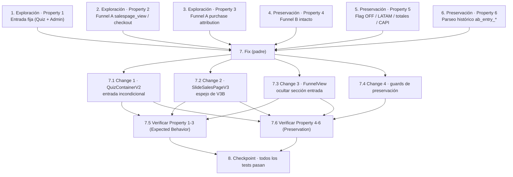

# Plan de Implementación

> Metodología bug-condition-first: primero escribimos tests de exploración que
> **fallan sobre el código SIN corregir** (confirman los bugs), luego tests de
> preservación que **pasan sobre el código SIN corregir** (fijan el baseline a
> conservar), y recién después aplicamos el fix y validamos.
>
> Framework: **Vitest** (`npm run test` → `vitest --run`), `@testing-library/react`
> para componentes y **fast-check** para property-based testing.
>
> **RECORDATORIO CRÍTICO:** Escribí los tests de exploración ANTES de tocar el
> código de producción y ejecutalos sobre el código SIN corregir para entender
> el bug. No intentes "arreglar" el test cuando falla en la fase de exploración —
> esa falla es la evidencia del bug.

## Task Dependency Graph

**Orden de ejecución:** Tareas 1–6 (exploración + preservación) pueden escribirse
en paralelo, pero TODAS deben completarse antes de la Tarea 7 (fix). Dentro de la
Tarea 7, las sub-tareas de implementación (7.1–7.4) preceden a las de verificación
(7.5–7.6). La Tarea 8 cierra cuando toda la suite pasa.

---

- [x] 1. Escribir test de exploración de la condición de bug — entrada fija
  - **Property 1: Bug Condition** - Entrada fija e incondicional en el hook normal (B)
  - **IMPORTANTE**: Escribir este test property-based ANTES de implementar el fix.
  - **CRÍTICO**: Este test DEBE FALLAR sobre el código sin corregir — la falla confirma el bug. NO intentes arreglar el test ni el código en esta fase.
  - **NOTA**: Este test codifica el comportamiento esperado; validará el fix cuando pase tras la implementación.
  - **GOAL**: Exponer contraejemplos que demuestren que la entrada de AR se asigna/randomiza (o se fija condicionalmente) en vez de ser `SlideLandingHook` (B) incondicional, y que la variante A sigue visible en el admin.
  - **Enfoque PBT acotado**: generar estados iniciales de `localStorage` variados (sin variante, con `ab_entry='A'`, `'C'`, flag full-funnel ON/OFF) y montar `QuizContainerV2` en `quiz_version='ar'`; afirmar que el slide `landing_hook` SIEMPRE renderiza `SlideLandingHook` y que NO se emiten eventos `ab_entry_*` para tráfico nuevo.
  - Añadir caso concreto de admin: construir `variantBreakdown` con eventos históricos y montar `FunnelView`; afirmar que NO se renderiza la `SectionCard` "Test A/B/C — pantalla de entrada" (hoy sí se renderiza con la fila A "Descartada").
  - Archivos objetivo: `components/quiz-v2/QuizContainerV2.tsx`, `app/admin/funnel/FunnelView.tsx`.
  - Ejecutar sobre el código SIN corregir con `npm run test`.
  - **RESULTADO ESPERADO**: Test FALLA (prueba que el bug existe).
  - Documentar contraejemplos hallados (p. ej. "la entrada renderiza `SlideLandingDirect`/`SlideLandingHookLite` según variante, o emite `ab_entry_landing`; la sección de entrada aparece en el admin").
  - Marcar la tarea como completa cuando el test esté escrito, ejecutado y la falla documentada.
  - _Requirements: 1.1, 1.2, 1.3_

- [x] 2. Escribir test de exploración de la condición de bug — eventos de venta del Funnel A
  - **Property 2: Bug Condition** - Funnel A emite los pasos de venta del embudo
  - **IMPORTANTE**: Escribir este test property-based ANTES de implementar el fix.
  - **CRÍTICO**: Este test DEBE FALLAR sobre el código sin corregir. NO lo arregles en esta fase.
  - **GOAL**: Demostrar que `SlideSalesPageV3` (Funnel A) NO emite `af_A_salespage_view` al montar ni `af_A_checkout` al click, ni adjunta el cart attribute `funnel_variant`.
  - **Enfoque PBT acotado**: mockear `peekFunnelVariant()` para devolver `'A'` (experimento ON, AR) y `fetch`/`/api/track`; montar `SlideSalesPageV3` y disparar el CTA de compra. Afirmar que se emiten `funnelEventName('A','salespage_view')` (`af_A_salespage_view`) al montar y `funnelEventName('A','checkout')` (`af_A_checkout`) al click, y que el checkout adjunta `funnel_variant='A'` como cart attribute.
  - Comparar contra `SlideSalesPageV3B` (Funnel B) como referencia del patrón correcto.
  - Archivo objetivo: `components/quiz-v2/SlideSalesPageV3.tsx`.
  - Ejecutar sobre el código SIN corregir con `npm run test`.
  - **RESULTADO ESPERADO**: Test FALLA (no hay `af_A_*` ni cart attribute `funnel_variant`; hoy adjunta `ab_entry`).
  - Documentar contraejemplos (p. ej. "salespage usa el vocabulario `ab_entry` en vez de `af_` y no lee `peekFunnelVariant()`").
  - Marcar completa cuando el test esté escrito, ejecutado y la falla documentada.
  - _Requirements: 1.4, 1.5_

- [x] 3. Escribir test de exploración de la condición de bug — atribución de compra del Funnel A
  - **Property 3: Bug Condition** - Funnel A atribuye la compra vía el puente por email
  - **IMPORTANTE**: Escribir este test ANTES de implementar el fix.
  - **CRÍTICO**: Este test DEBE FALLAR sobre el código sin corregir. NO lo arregles en esta fase.
  - **GOAL**: Demostrar que, como el flujo del control nunca propaga `funnel_variant='A'`, una compra del Funnel A NO se atribuye como `af_A_purchase`.
  - **Enfoque acotado**: dado que el defecto está en el origen (la sales page no propaga la variante), escribir un test de integración de flujo del control: montar `SlideSalesPageV3` con variante 'A' y flag ON, capturar los cart attributes propagados al checkout, y afirmar que incluyen `funnel_variant='A'`. Complementariamente, verificar (con mocks del store por email) que `/api/track` (Purchase) atribuiría `af_A_purchase` solo si el lead trae `funnel_variant='A'`.
  - **NOTA de alcance**: `/api/track` y `/api/shopify-webhook` YA soportan `V ∈ {A,B}`; el test debe fijar que la falla está en que el control NO emite el dato, no en el puente.
  - Ejecutar sobre el código SIN corregir con `npm run test`.
  - **RESULTADO ESPERADO**: Test FALLA (el checkout del control no lleva `funnel_variant='A'`, por lo que la compra no es atribuible).
  - Documentar el contraejemplo.
  - Marcar completa cuando el test esté escrito, ejecutado y la falla documentada.
  - _Requirements: 1.6_

- [x] 4. Escribir tests de preservación — Funnel B intacto (ANTES del fix)
  - **Property 4: Preservation** - El Funnel B queda inalterado
  - **IMPORTANTE**: Seguir la metodología observation-first.
  - Observar sobre el código SIN corregir: `SlideSalesPageV3B` emite `af_B_salespage_view` al montar y `af_B_checkout` al click, y adjunta `funnel_variant='B'` como cart attribute; ambas variantes cuentan `af_<V>_quiz_start` / `af_<V>_quiz_complete`.
  - Escribir tests property-based que, para cualquier secuencia de montaje/click del Funnel B (variante 'B', flag ON), afirmen la misma salida de eventos + cart attribute que el código original; y que ambas variantes sigan contando inicios/completes.
  - Ejecutar sobre el código SIN corregir con `npm run test`.
  - **RESULTADO ESPERADO**: Tests PASAN (fijan el baseline del Funnel B a preservar).
  - Marcar completa cuando los tests estén escritos, ejecutados y pasando sobre el código sin corregir.
  - _Requirements: 3.1, 3.2_

- [x] 5. Escribir tests de preservación — flag OFF / LATAM / totales / Meta CAPI (ANTES del fix)
  - **Property 5: Preservation** - Kill switch OFF, LATAM, totales generales y Meta CAPI
  - **IMPORTANTE**: Metodología observation-first.
  - Observar sobre el código SIN corregir: con `NEXT_PUBLIC_AB_FUNNEL_ENABLED` != 'true' o `quiz_version !== 'ar'`, `peekFunnelVariant()` es `null` y no se emite ningún `af_*`; los totales generales (`QuizProgress`, `ViewContent`, `InitiateCheckout`, `Purchase`) y el reenvío a Meta CAPI no cambian; los demás desgloses del admin (embudo por slide, UTM/campaña, país y la comparación full-funnel A vs B) se muestran igual.
  - Escribir tests property-based: para cualquier input con flag OFF o LATAM, `SlideSalesPageV3` no emite ningún `af_*`; y tests que fijen que los payloads de totales/CAPI y las demás secciones del admin quedan idénticos.
  - Ejecutar sobre el código SIN corregir con `npm run test`.
  - **RESULTADO ESPERADO**: Tests PASAN (baseline a preservar).
  - Marcar completa cuando estén escritos, ejecutados y pasando sobre el código sin corregir.
  - _Requirements: 3.3, 3.4, 3.5_

- [x] 6. Escribir tests de preservación — parseo histórico `ab_entry_*` (ANTES del fix)
  - **Property 6: Preservation** - La data histórica `ab_entry_A_*` sigue parseando
  - **IMPORTANTE**: Metodología observation-first.
  - Observar sobre el código SIN corregir el resultado de `parseAbEntryEvent('ab_entry_A_landing')`, `parseAbEntryEvent('ab_entry_B_start')`, `parseAbEntryEvent('ab_entry_C_complete')` y de `buildVariantBreakdown(...)` sobre data histórica.
  - Escribir test property-based: para cualquier `ab_entry_{A,B,C}_{step}`, `parseAbEntryEvent` devuelve un resultado válido (no lanza) y `buildVariantBreakdown` no lanza; se preservan el tipo `EntryVariant`, `ENTRY_VARIANT_LABEL` y el campo `FunnelData.variantBreakdown`.
  - Archivos objetivo: `lib/quiz-v2/abEntry.ts`, `lib/admin/store.ts`.
  - Ejecutar sobre el código SIN corregir con `npm run test`.
  - **RESULTADO ESPERADO**: Tests PASAN (baseline del parseo histórico).
  - Marcar completa cuando estén escritos, ejecutados y pasando sobre el código sin corregir.
  - _Requirements: 3.6_

- [x] 7. Fix del tracking/entrada de los tests A/B/C y full-funnel de AR

  - [x] 7.1 Change 1 — Desactivar la entrada A/B/C de forma incondicional en `QuizContainerV2`
    - Archivo: `components/quiz-v2/QuizContainerV2.tsx`
    - Eliminar el estado/refs de la variante de entrada y la lógica de asignación del `useEffect` de init: quitar `getEntryVariant()` y el pin condicional `peekEntryVariant() ?? AB_ENTRY_PINNED_DEFAULT`.
    - Reemplazar la ramificación del render de `landing_hook` (`variant === 'A' ? SlideLandingDirect : variant === 'C' ? SlideLandingHookLite : SlideLandingHook`) por render directo e incondicional de `<SlideLandingHook onNext={next} />`.
    - Eliminar `fireAbEntry` y sus invocaciones (`landing`, `start`, `complete`) — dejar de emitir `ab_entry_*` para tráfico nuevo.
    - Quitar `ab_variant` del `custom` de los eventos `QuizProgress`.
    - Limpiar imports no usados de `abEntry` (`getEntryVariant`, `peekEntryVariant`, `abEntryEventName`, `EntryVariant`, `EntryStep`) y `AB_ENTRY_PINNED_DEFAULT`.
    - NO tocar la resolución del test full-funnel (`getFunnelVariant('ar')`, `fireFunnelEvent`, `chooseRender`, `FunnelBTheme`) ni el render A vs B de la sales page.
    - _Bug_Condition: isBugCondition(input) con input.surface='entry' AND quizVersion='ar' (entrada asignada/randomizada)_
    - _Expected_Behavior: Property 1 — entrada SIEMPRE SlideLandingHook (B), sin asignar ni emitir ab_entry_*_
    - _Preservation: full-funnel intacto (Property 4/5); totales generales sin cambios (Property 5)_
    - _Requirements: 2.1, 2.2, 2.3_

  - [x] 7.2 Change 2 — Instrumentar `SlideSalesPageV3` como espejo de `SlideSalesPageV3B`
    - Archivo: `components/quiz-v2/SlideSalesPageV3.tsx`
    - Imports: reemplazar `{ peekEntryVariant, abEntryEventName } from '@/lib/quiz-v2/abEntry'` por `{ peekFunnelVariant, funnelEventName } from '@/lib/quiz-v2/funnelVariant'`.
    - En el `useEffect` de tracking (el que dispara `ViewContent`): leer `const variant = peekFunnelVariant()` y, si hay variante, emitir `funnelEventName(variant, 'salespage_view')` a `/api/track`; incluir `funnel_variant` en el `custom` del `ViewContent` y del evento `af_*`.
    - En `handleCheckout`: reemplazar `peekEntryVariant()` + `abEntryEventName(variant,'checkout')` por `peekFunnelVariant()` + `funnelEventName(variant,'checkout')`; incluir `funnel_variant` en el `custom` del `InitiateCheckout`; mantener `src: 'quiz_v3'`.
    - Reemplazar el cart attribute `ab_entry` por `funnel_variant` (`if (variant) cartAttrs.funnel_variant = variant;`).
    - Gating: como `peekFunnelVariant()` devuelve `null` con flag OFF / LATAM, no se emite ningún `af_*` en esos casos (preserva Req 3.3).
    - NO cambiar contenido comercial, copy, precios ni estructura visual; solo la capa de eventos internos del test.
    - _Bug_Condition: isBugCondition(input) con surface ∈ {salespage_view, checkout, purchase}, quizVersion='ar', funnelExperimentEnabled=true, funnelVariant='A'_
    - _Expected_Behavior: Property 2 y 3 — emitir af_A_salespage_view / af_A_checkout y propagar funnel_variant='A' para atribuir af_A_purchase_
    - _Preservation: Funnel B sin cambios (Property 4); flag OFF/LATAM sin af_* (Property 5)_
    - _Requirements: 2.4, 2.5, 2.6_

  - [x] 7.3 Change 3 — Ocultar la sección del test de entrada en `FunnelView`
    - Archivo: `app/admin/funnel/FunnelView.tsx`
    - Eliminar por completo la `SectionCard` "Test A/B/C — pantalla de entrada" (todo el bloque `{data.variantBreakdown && data.variantBreakdown.length > 0 && (...)}`), incluyendo la tabla por variante y su nota al pie.
    - Quitar los valores derivados que solo alimentaban esa sección: `bestStartRate`, `bestCompletionRate`, `bestSalesRate` (el `useMemo` sobre `data.variantBreakdown`).
    - Limpiar imports no usados: `ENTRY_VARIANT_LABEL` y `ENTRY_DISCARDED_VARIANTS` de `@/lib/quiz-v2/abEntry`, y el tipo `VariantBreakdownRow` si queda sin referencias.
    - Conservar intacta la sección "Test full-funnel — Argentina (A vs B)" y todos los demás desgloses.
    - _Bug_Condition: isBugCondition(input) con surface='entry' (variante A fantasma en el admin)_
    - _Expected_Behavior: Property 1 — la sección del test de entrada no se muestra_
    - _Preservation: demás desgloses del admin intactos (Property 5)_
    - _Requirements: 2.3, 3.5_

  - [x] 7.4 Change 4 — Guards de preservación (sin cambios funcionales)
    - Archivos: `lib/quiz-v2/abEntry.ts`, `lib/admin/store.ts`
    - Verificar (y NO eliminar) `EntryVariant`, `ENTRY_VARIANT_LABEL`, `parseAbEntryEvent`, `isAbEntryEvent`, `buildVariantBreakdown` ni el campo `variantBreakdown` de `FunnelData`: se conservan para que la data histórica `ab_entry_*` siga parseándose.
    - Confirmar que NO se requieren cambios en `/api/track` (Purchase bridge) ni en `/api/shopify-webhook`: ambos ya atribuyen `af_<V>_purchase` para `V ∈ {A,B}`.
    - _Bug_Condition: N/A — tarea de guarda de preservación_
    - _Preservation: Property 6 (parseo histórico) y Property 3 (puente de compra intacto)_
    - _Requirements: 3.6_

  - [x] 7.5 Verificar que los tests de exploración ahora pasan
    - **Property 1: Expected Behavior** - Entrada fija en el hook normal (B)
    - **Property 2: Expected Behavior** - Funnel A emite salespage_view / checkout
    - **Property 3: Expected Behavior** - Funnel A atribuye la compra (funnel_variant='A' propagado)
    - **IMPORTANTE**: Re-ejecutar los MISMOS tests de las tareas 1, 2 y 3 — NO escribir tests nuevos.
    - Ejecutar `npm run test`.
    - **RESULTADO ESPERADO**: Los tests de exploración PASAN (confirma que los bugs están corregidos).
    - _Requirements: 2.1, 2.2, 2.3, 2.4, 2.5, 2.6_

  - [x] 7.6 Verificar que los tests de preservación siguen pasando
    - **Property 4: Preservation** - El Funnel B queda inalterado
    - **Property 5: Preservation** - Flag OFF / LATAM / totales / Meta CAPI
    - **Property 6: Preservation** - Parseo histórico `ab_entry_*`
    - **IMPORTANTE**: Re-ejecutar los MISMOS tests de las tareas 4, 5 y 6 — NO escribir tests nuevos.
    - Ejecutar `npm run test`.
    - **RESULTADO ESPERADO**: Los tests de preservación PASAN (confirma que no hay regresiones).
    - _Requirements: 3.1, 3.2, 3.3, 3.4, 3.5, 3.6_

- [x] 8. Checkpoint — Asegurar que toda la suite pasa
  - Ejecutar `npm run test` y confirmar que exploración + preservación + integración pasan.
  - Ejecutar `npm run lint` para confirmar que no quedaron imports sin usar tras la limpieza.
  - Verificación de integración manual/automatizada: recorrido completo del Funnel A (AR, flag ON) confirmando la secuencia `af_A_quiz_start → af_A_quiz_complete → af_A_salespage_view → af_A_checkout` y, vía puente por email/cart attribute, `af_A_purchase`; recorrido del Funnel B idéntico; y el dashboard `/admin/funnel` sin la sección de entrada y con "% venta"/"% click"/"% compró" para el control.
  - Si surgen dudas, consultar al usuario.
