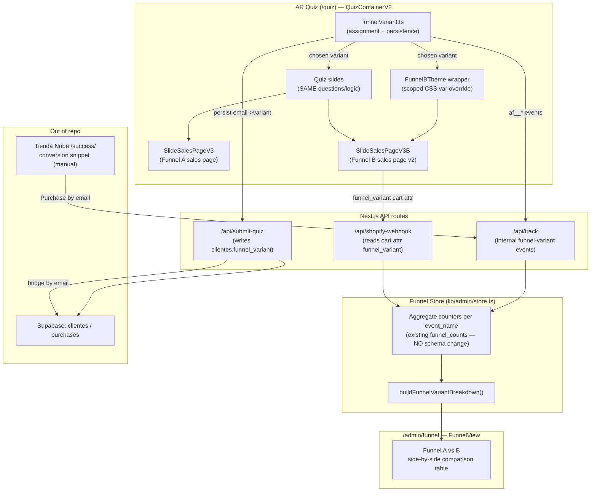
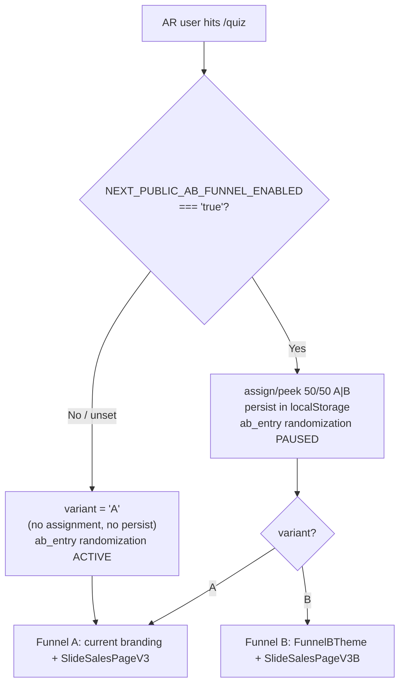

# Design Document: Argentina Full-Funnel A/B Test

## Overview

This feature introduces a **full-funnel A/B test for Argentina traffic only**, comparing the current funnel (**Funnel A / control**) against a fully rebranded variant (**Funnel B / variant**). The goal is to measure which *entire* funnel — quiz branding + sales page — converts better, end to end, from quiz start through purchase.

Funnel A is the current Argentina experience, completely untouched. Funnel B reuses the **exact same quiz questions and logic** but applies a **scoped pink/feminine ("mujer") theme** (colors, typography, copy tone) and swaps the final sales-page slide for a **new conversion-optimized v2** written for the Argentine audience (local slang, "vos" treatment). Logo, product name, pricing, currency, payment methods and testimonials are **reused as-is**.

The experiment is built as **isolated, reusable modules** that mirror the repo's existing `ab_entry` pattern (`lib/quiz-v2/abEntry.ts`): a dedicated assignment module, dedicated funnel-variant tracking events that flow through the existing aggregate counter store (no `funnel_counts` schema change), a new side-by-side comparison section in the admin, and an **additive** `clientes` field for purchase attribution. A single **environment-variable kill switch** (`NEXT_PUBLIC_AB_FUNNEL_ENABLED`) turns the whole thing on or off; when OFF, **all** Argentina traffic sees Funnel A and the system behaves exactly as it does today. LATAM is never touched.

A key coexistence rule: when this experiment is **ON**, the legacy entry-hook test (`ab_entry`, variants A/B/C on slide 0) randomization is **paused** (pinned to its current default) so the only experimental variable is Funnel A vs B. Historical `ab_entry` data and the existing webhook attribution code remain intact.

---

## Architecture

### System context



### Assignment → consistency → tracking → comparison flow

```mermaid
sequenceDiagram
    participant U as AR User
    participant Q as QuizContainerV2
    participant FV as funnelVariant.ts
    participant LS as localStorage
    participant T as /api/track
    participant SQ as /api/submit-quiz
    participant ST as Funnel Store

    U->>Q: Loads /quiz (AR)
    Q->>FV: getFunnelVariant() (in useEffect)
    alt Experiment OFF (flag unset/false)
        FV-->>Q: 'A' (forced, not persisted as experiment)
    else Experiment ON
        FV->>LS: read ab_funnel_v1
        alt already assigned
            LS-->>FV: stored variant
        else new visitor
            FV->>FV: 50/50 random
            FV->>LS: persist variant
        end
        FV-->>Q: 'A' | 'B'
    end
    Q->>T: af_<V>_quiz_start (internal event)
    Note over Q: SAME quiz slides; if B, wrap in FunnelBTheme
    Q->>T: af_<V>_quiz_complete (reached sales slide)
    Q->>SQ: submit-quiz {..., funnel_variant}
    SQ->>ST: persist clientes.funnel_variant (email bridge)
    U->>Q: views sales page (A or B by variant)
    Q->>T: af_<V>_salespage_view
    U->>Q: clicks CTA
    Q->>T: af_<V>_checkout (+ cart attr funnel_variant)
    Note over T,ST: Purchase attributed server-side<br/>(Tienda Nube email bridge / Shopify cart attr)
    ST->>ST: buildFunnelVariantBreakdown()
```

### Kill-switch / toggle flow



### Isolation guarantees

| Surface | Funnel A (control) | LATAM | Mechanism |
|---|---|---|---|
| Quiz questions/logic | unchanged | unchanged | Same `slidesV3` / `slidesV3Latam`; B reuses `slidesV3` |
| Branding | unchanged (terracotta tokens) | unchanged | B applies a *scoped* theme wrapper that only redefines CSS vars inside its subtree |
| Sales page | `SlideSalesPageV3` unchanged | N/A (no AR sales slide) | B renders a new `SlideSalesPageV3B`, chosen at runtime |
| Assignment | only when flag ON | never assigned | `getFunnelVariant()` returns `'A'` for `quiz_version !== 'ar'` and when flag OFF |
| Tracking | existing events untouched | existing events untouched | New `af_*` events are additive, internal-only |
| DB | additive column only | unaffected | Non-breaking Supabase migration |

---

## Components and Interfaces

### Component 1: `lib/quiz-v2/funnelVariant.ts` (new, isolated module)

**Purpose**: Single source of truth for full-funnel variant assignment, persistence, the on/off flag, and the dedicated event-name vocabulary. Mirrors `abEntry.ts` so it is familiar and reviewable.

**Responsibilities**:
- Expose the enabled flag derived from `NEXT_PUBLIC_AB_FUNNEL_ENABLED`.
- Assign a 50/50 variant once per browser, persisted in `localStorage` (key `ab_funnel_v1`), with `?af=A|B` querystring override for QA.
- SSR-safe `peek` (read-only) for later funnel steps (sales page, checkout) without creating late assignments.
- Build/parse dedicated funnel-variant event names (`af_<V>_<step>`).
- Be a no-op (always `'A'`) when the flag is OFF, guaranteeing zero behavior change.

**Interface**:
```typescript
export type FunnelVariant = 'A' | 'B';

export type FunnelStep =
  | 'quiz_start'      // reached the first real question (denominator for the test)
  | 'quiz_complete'   // reached the sales-page slide
  | 'salespage_view'  // sales page actually rendered/viewed
  | 'checkout'        // clicked the buy CTA
  | 'purchase';       // confirmed sale (attributed server-side)

/** Human-readable labels for the admin comparison table. */
export const FUNNEL_VARIANT_LABEL: Record<FunnelVariant, string>;

/** true when NEXT_PUBLIC_AB_FUNNEL_ENABLED === 'true' (kill switch). */
export function isFunnelExperimentEnabled(): boolean;

/**
 * Returns the assigned full-funnel variant for this browser, assigning it
 * 50/50 if needed. SSR-safe (returns 'A' on the server, does not persist).
 * Call ONLY inside a client useEffect to avoid hydration mismatch.
 *
 * Contract:
 *  - flag OFF  -> always 'A' (no persistence, no randomization)
 *  - quizVersion !== 'ar' -> always 'A' (LATAM never assigned)
 *  - ?af=A|B querystring -> forces + persists that variant (QA, flag ON only)
 *  - ?af_preview=A|B (AR) -> previews that variant BEFORE the flag check,
 *    independent of the kill switch, WITHOUT persisting (see QA Preview below)
 */
export function getFunnelVariant(quizVersion: 'ar' | 'latam'): FunnelVariant;

/**
 * Read the flag-independent QA preview override from `?af_preview=A|B`
 * (case-insensitive). SSR-safe (returns null on the server). AR-only callers.
 * Returns null when the param is absent or not a valid variant.
 */
export function readPreviewOverride(): FunnelVariant | null;

/**
 * Read-only peek of the already-assigned variant, or null if none.
 * Never assigns. Used by later steps (sales page / checkout / webhook helpers).
 */
export function peekFunnelVariant(): FunnelVariant | null;

/** Event name for a variant + step, e.g. af_B_checkout. */
export function funnelEventName(variant: FunnelVariant, step: FunnelStep): string;

/** true if the event name is an internal full-funnel-test event (af_*). */
export function isFunnelVariantEvent(eventName: string): boolean;

/** Parse af_<V>_<step> -> { variant, step } or null. Used by the store. */
export function parseFunnelVariantEvent(
  eventName: string,
): { variant: FunnelVariant; step: FunnelStep } | null;
```

### Component 1b: QA preview override (`af_preview`) — flag-independent

**Purpose**: Let a person preview Funnel B (and A) by visiting the AR quiz with an explicit querystring, **even when the kill switch is OFF** and without setting `NEXT_PUBLIC_AB_FUNNEL_ENABLED`. This is a manual-QA verification mechanism, fully separate from the experiment-scoped `?af` override.

**Preview URLs**:
- `/quiz?af_preview=B` → preview Funnel B (rebrand)
- `/quiz?af_preview=A` → preview Funnel A (control)

The value is **case-insensitive** (`A`/`a`/`B`/`b`); anything else is ignored.

**Design rules** (all must hold):
1. **AR-only.** The preview activates only for `quizVersion === 'ar'`. For LATAM it is ignored, preserving the "LATAM never assigned" invariant.
2. **Normal traffic unaffected.** Any visitor *without* the `af_preview` param, with the flag OFF, still always gets Funnel A — the "OFF ⇒ Funnel A for normal traffic" guarantee is intact.
3. **No events / no metric pollution.** The preview fires no `af_*` events. `fireFunnelEvent()` stays gated on `isFunnelExperimentEnabled()` exactly as before, so with the flag OFF no `af_*` events fire even during a preview.
4. **Session-wide consistency, no persistence.** The param is read in **both** variant-resolving paths so branding + sales page + checkout stay consistent for the whole single-page AR session (the entry querystring persists in `window.location.search`):
   - `getFunnelVariant('ar')`: if a valid `af_preview` is present, return it **before** the kill-switch/flag check. It is **not** persisted to `ab_funnel_v1` (avoids stale mis-tagging of later normal sessions on the same QA browser).
   - `peekFunnelVariant()`: also checks `af_preview` first (SSR-safe) and returns it before reading localStorage, keeping `SlideSalesPageV3B`, the Shopify cart attribute, and the submit-quiz body consistent with the previewed variant.
5. **Separate from `?af`.** The existing `?af=A|B` experiment override (only active when the flag is ON, and which persists) is unchanged. `af_preview` is a distinct, flag-independent QA mechanism that never persists.

### Component 2: `components/quiz-v2/FunnelBTheme.tsx` (new)

**Purpose**: Scoped visual rebrand for Funnel B. Wraps its children in an element that redefines the design-token CSS custom properties to a pink/feminine palette. Because Funnel A and all existing components consume `var(--terracotta)` etc., overriding the variables on a wrapper re-themes the subtree **without editing any existing component or `globals.css` token defaults**.

**Responsibilities**:
- Provide a `data-funnel="b"` wrapper (or `.funnel-b` class) that scopes the override.
- Redefine the palette/typography tokens (terracotta family, fonts, shadows that reference the brand color) to the "mujer" theme.
- Be a transparent pass-through (`<>{children}</>`) for Funnel A so A renders identically to today.

**Interface**:
```typescript
export function FunnelBTheme(props: { children: React.ReactNode }): JSX.Element;
```

The token override lives in a new scoped CSS block (added to `app/globals.css` under a clearly delimited section, or a co-located CSS module) — **only adding** a new selector, never changing `:root` defaults:
```css
/* Scoped Funnel B theme — pink/feminine. Only active inside [data-funnel="b"]. */
[data-funnel="b"] {
  --terracotta:       #D6336C;  /* pink primary */
  --terracotta-soft:  #FFF0F6;
  --terracotta-dark:  #A61E4D;
  --terracotta-light: #F06595;
  --warm:             #FFF7FB;
  --warm-border:      #F7E3EC;
  --font-heading: 'DM Serif Display', 'Georgia', serif; /* or new feminine serif */
  /* shadows that reference the brand color are recomputed for pink */
  --shadow-cta: 0 4px 20px rgba(214, 51, 108, 0.35);
}
```
> Note: a small number of hardcoded hex values exist (e.g. `news-card__header #C62828`). These are catalogued in the Tasks phase; Funnel B parity for hardcoded values is handled by adding scoped overrides under `[data-funnel="b"]` for those specific selectors, never by editing the shared rule.

### Component 3: `components/quiz-v2/SlideSalesPageV3B.tsx` (new)

**Purpose**: The Funnel B sales page (v2), rebuilt for conversion for the Argentine audience. Visually matches the Funnel B branding (rendered inside `FunnelBTheme`). Reuses all content/config single-sources-of-truth.

**Responsibilities**:
- Reuse pricing/checkout from `lib/quiz-v2/config.ts` (`PRICING`, `TIENDANUBE_*`, `CHECKOUT_URL`) — **no new pricing**.
- Reuse the **same testimonials** content (do not modify).
- Reuse `useQuizStore` answers + helpers (`calcularDiagnostico`, etc.) for the personalized report.
- Adapt copy to Argentine conversion best practices: "vos" treatment, local language, sharpened value proposition, social proof framing.
- Fire the **funnel-variant** tracking events (`salespage_view`, `checkout`) in addition to the existing `ViewContent` / `InitiateCheckout` Meta events.
- Attach `funnel_variant` as a cart attribute on Shopify checkout (mirroring the existing `ab_entry` cart-attribute pattern) so upsell/downsell purchases carry the variant.

**Interface**:
```typescript
export function SlideSalesPageV3B(): JSX.Element;
```

#### CRO rework (Argentine-market best practices) — Requirement 18

Beyond reusing config/testimonials, `SlideSalesPageV3B` is a genuinely conversion-optimized page (not a pink re-skin of Funnel A). The CRO behaviors below satisfy Requirement 18; the price, testimonial content, and payment methods are explicitly preserved.

**Section order (mobile-first):**
1. **Sticky mobile buy-bar** (`md:hidden`, `fixed bottom-0`): **gated on the price being seen** (Req 18.4) — it stays hidden (`translate-y-full` + `aria-hidden`) until the price `<section>` (tracked via a `priceRef` + `IntersectionObserver`) enters the viewport at least once, preserving curiosity (the visitor consumes the value stack without knowing the price). Once `hasSeenPrice` flips true, the bar slides in (`translate-y-0`) and acts as a reminder. It shows price + per-day and an accessible `<button aria-label>` that calls the same `handleCheckout`. The button stays mounted in the DOM (only the `translate-y` class toggles) so it is testable and accessible. A scroll-position fallback against the price section's `offsetTop` is used if `IntersectionObserver` is unavailable. The root container carries `pb-24` so the bar never overlaps the footer/legal text.
2. **Hero (above the fold)**: expert credibility line (Lic. Natalia Reyes · MN 9283) + benefit-led headline promising **early results within the 30-day plan** without claiming a "7-day plan" ("en los primeros días … vas a empezar a deshincharte"), and who it's for (mujeres argentinas que se sienten hinchadas); a top social-proof line ("+3.000 mujeres ya empezaron") and one **existing** testimonial (Anabela — content unchanged) moved higher as social proof.
3. Informe personalizado → Proyección → El método → Value stack (reused; the "Protocolo de 30 días personalizado" item frames the plan as 30 days).
4. **Price box**: opens with a **real-world cost price-anchor** (nutritionist consult, `NUTRI_ANCHOR = 30000` rendered via `formatArs`, soft "arranca en ~$30.000" wording) placed right before the price reveal to build expectation of an expensive alternative; then honest urgency (countdown + "precio promo solo hoy", "después vuelve a $51.000"); struck-through "valor total $51.000" anchor + **derived `% OFF` badge**; price from `PRICING.front.display`; **derived per-day ARS line (30-day plan basis) with the final total price beside it** ("~$260 por día · $7.790 en total"); benefit CTA ("EMPEZAR A DESHINCHARME →"); repeated social proof; a **compact 7-day guarantee** next to the CTA (risk reversal); payment trust row identical to Funnel A. The anchoring sequence is coherent: real-world cost (nutritionist ~$30.000) → bundle "valor total $51.000" → real price $7.790 (~$260/día).
5. Testimonios (all three, content unchanged) → **Elevated guarantee** section → FAQ → Final CTA (honest urgency + social proof) → Footer.

**Derived price-framing logic (no hardcoded numbers):**
```typescript
const FRONT_AMOUNT = PRICING.front.amount;          // ARS (e.g. 7790 — shared single-source)
const VALOR_TOTAL_AMOUNT = 51000;                   // anchor "valor total"
const PROTOCOL_DAYS = 30;                           // 30-day plan (Argentina has no upsell)
const PER_DAY = Math.round(FRONT_AMOUNT / PROTOCOL_DAYS); // 30-day basis (e.g. 260)
const DISCOUNT_PCT = Math.round((1 - FRONT_AMOUNT / VALOR_TOTAL_AMOUNT) * 100); // e.g. 85
const NUTRI_ANCHOR_AMOUNT = 30000;                  // real-world cost anchor
// formatArs(n) inserts "." thousands separators → "$7.790", "$260", "$30.000".
```
`PER_DAY`, `DISCOUNT_PCT`, and the displayed price are all computed from `PRICING.front.amount`, so they stay correct automatically if the price changes in `config.ts`. Because Argentina has **no upsell**, the front product is positioned as a complete **30-day plan**, so the per-day cost is divided over a **30-day basis** (not 7 days), and the **final total price is rendered beside the per-day** figure: `~$<perDay> por día · $<front> en total — menos que un café ☕`, with a tasteful local comparison (alfajor / SUBE). The money-back **guarantee is 7 days** across all references (compact block, elevated section, FAQ, final-CTA badge). These copy/framing changes apply to **Funnel B**; aligning **Funnel A** is a separate decision.

> **Shared single-source price + out-of-repo note:** `PRICING.front` is consumed by BOTH Funnel A (`SlideSalesPageV3`) and Funnel B (`SlideSalesPageV3B`). Changing it in `config.ts` (e.g. `$8.000 → $7.790`) intentionally updates the displayed price on *both* funnels (Funnel A's structure/logic is otherwise unchanged) and the Meta intent-tracking value; the LATAM funnel uses a separate `PRICING_LATAM` (USD) and is untouched. The **real charged price** must also be updated out-of-repo in **Tienda Nube / Shopify** (product configuration); the repo only controls the displayed price and Meta tracking value.

**Hard constraints honored:**
- **No price change**: every displayed price reads from `PRICING.front.*`.
- **No "cuotas"/installments**: the payment row stays exactly `Visa · Mastercard · MercadoPago` (single payment); no invented payment methods.
- **Testimonials unchanged**: the `TESTIMONIOS` array (text/author/age/city) is byte-identical to Funnel A; only repositioned (Anabela surfaced in the hero, all three repeated in the testimonials section).
- **Tracking intact**: `af_<V>_salespage_view` on mount, `af_<V>_checkout` on every CTA (inline and sticky) via `peekFunnelVariant()` + `funnelEventName`, plus Meta `ViewContent`/`InitiateCheckout` and the `funnel_variant` cart attribute. The Tienda Nube vs Shopify branching is unchanged.

### Component 4: `QuizContainerV2.tsx` (modified, AR only)

**Purpose**: Choose and apply the funnel variant at runtime, consistently across the quiz and the sales slide, and pause `ab_entry` randomization when the experiment is ON.

**Responsibilities**:
- In the init `useEffect`, resolve the funnel variant via `getFunnelVariant('ar')`.
- When the experiment is ON, **pin** the entry-hook variant to the current default instead of calling `getEntryVariant()` (pause randomization) — see Algorithmic Pseudocode.
- Fire `af_<V>_quiz_start` / `af_<V>_quiz_complete` alongside existing events.
- Wrap the rendered tree in `FunnelBTheme` when variant is B.
- Render `SlideSalesPageV3B` instead of `SlideSalesPageV3` when variant is B.

> `QuizContainerLatam` is **not** modified. `app/quiz/page.tsx` route is unchanged (single route; variant chosen at runtime).

### Component 5: `lib/admin/store.ts` (modified, additive)

**Purpose**: Aggregate the new `af_*` events into a Funnel A vs B breakdown, reusing the existing counter pipeline. No `funnel_counts` schema change — events flow through the same `event_name` counters as `ab_entry_*`.

**Responsibilities**:
- Add `buildFunnelVariantBreakdown(rows)` (mirrors `buildVariantBreakdown`).
- Add `funnelVariantBreakdown: FunnelVariantBreakdownRow[]` to `FunnelData`.
- Treat `af_*` events as internal (recorded in the store; not forwarded to Meta CAPI) — handled in `/api/track`.

### Component 6: `/api/track` (modified, additive)

**Purpose**: Record `af_*` events in the funnel store and short-circuit before Meta CAPI, exactly like `ab_entry_*`.

```typescript
// after the existing isAbEntryEvent short-circuit:
if (isFunnelVariantEvent(eventName)) {
  return NextResponse.json({ ok: true, internal: true });
}
```

### Component 7: `/api/submit-quiz` + `clientes` migration (modified, additive)

**Purpose**: Persist the assigned funnel variant on the lead so the Tienda Nube front purchase (bridged by email) can be attributed to Funnel A vs B.

- Client sends `funnel_variant` in the submit-quiz body (read via `peekFunnelVariant()`).
- Route writes it to the additive `clientes.funnel_variant` column.
- New migration `011_add_funnel_variant_to_clientes.sql` (additive, nullable, non-breaking).

### Component 8: `/api/shopify-webhook` (modified, additive)

**Purpose**: Attribute upsell/downsell purchases to the funnel variant via the `funnel_variant` cart attribute, mirroring the existing `orderEntryVariant` / `orderSalesVariant` helpers.

---

## Data Models

### Model 1: `FunnelVariantBreakdownRow` (new public type in `lib/admin/store.ts`)

```typescript
export type FunnelVariantBreakdownRow = {
  /** 'A' (control) | 'B' (rebranded). */
  variant: FunnelVariant;
  /** Reached the first real question (started the quiz). Denominator. */
  quizStarts: number;
  /** Reached the sales-page slide (completed the quiz). */
  quizCompletes: number;
  /** Sales page actually viewed. */
  salesViews: number;
  /** Clicked the buy CTA. */
  checkouts: number;
  /** Confirmed purchases (attributed server-side). */
  purchases: number;
  /** quizCompletes / quizStarts * 100. */
  completionRate: number;
  /** salesViews / quizCompletes * 100. */
  salesViewRate: number;
  /** checkouts / salesViews * 100. */
  checkoutRate: number;
  /** purchases / checkouts * 100. */
  purchaseRate: number;
  /** purchases / quizStarts * 100 — TOTAL funnel conversion (the headline KPI). */
  totalConversionRate: number;
};
```

**Validation rules**:
- All counts are non-negative integers.
- Every rate is `0` when its denominator is `0` (no division by zero).
- Rates are in `[0, 100]`.

### Model 2: Event vocabulary

| Event name | Fired by | Meaning |
|---|---|---|
| `af_A_quiz_start` / `af_B_quiz_start` | `QuizContainerV2` | Reached first question |
| `af_<V>_quiz_complete` | `QuizContainerV2` | Reached sales slide |
| `af_<V>_salespage_view` | `SlideSalesPageV3` / `V3B` | Sales page viewed |
| `af_<V>_checkout` | sales page CTA handler | Clicked buy |
| `af_<V>_purchase` | `/api/track` (Tienda Nube bridge) and `/api/shopify-webhook` (cart attr) | Confirmed sale |

> Prefix `af_` ("AR funnel") is deliberately distinct from `ab_entry_` and `sp_` so the three tests never collide in the counter keyspace or in the parsers.

### Model 3: `clientes.funnel_variant` (additive column)

```sql
-- supabase/migrations/011_add_funnel_variant_to_clientes.sql
-- Additive, nullable, non-breaking. Stores the AR full-funnel variant ('A'|'B')
-- assigned to the lead, for purchase attribution of the Tienda Nube front sale
-- (bridged by email in /api/track).
ALTER TABLE clientes
  ADD COLUMN IF NOT EXISTS funnel_variant text;

COMMENT ON COLUMN clientes.funnel_variant IS
  'AR full-funnel A/B test variant (A=control, B=rebranded). NULL for pre-test/LATAM leads.';
```

### Model 4: Persistence (localStorage)

| Key | Owner | Value | Purpose |
|---|---|---|---|
| `ab_funnel_v1` | `funnelVariant.ts` | `'A'` \| `'B'` | Session-stable variant across quiz + sales page |
| `ab_entry_v1` | `abEntry.ts` (existing) | `'A'`/`'B'`/`'C'` | Untouched; pinned (not randomized) while experiment ON |

---

## Algorithmic Pseudocode

### Assignment with kill switch and LATAM guard

```typescript
function getFunnelVariant(quizVersion: 'ar' | 'latam'): FunnelVariant {
  // SSR-safe default.
  if (typeof window === 'undefined') return 'A';

  // QA PREVIEW (flag-independent): ?af_preview=A|B for AR previews Funnel A|B
  // BEFORE the kill switch, without persisting. Ignored for LATAM.
  if (quizVersion === 'ar') {
    const preview = readPreviewOverride(); // 'A' | 'B' | null (case-insensitive)
    if (preview) return preview;           // no persist, no events
  }

  // Kill switch: OFF => everyone (without preview) sees Funnel A, nothing persisted.
  if (!isFunnelExperimentEnabled()) return 'A';

  // LATAM never participates.
  if (quizVersion !== 'ar') return 'A';

  // QA override: ?af=A|B forces + persists.
  const forced = readQuerystringOverride('af'); // 'A' | 'B' | null
  if (forced) { safeSetLocalStorage('ab_funnel_v1', forced); return forced; }

  // Stable assignment.
  const existing = safeGetLocalStorage('ab_funnel_v1');
  if (existing === 'A' || existing === 'B') return existing;

  // New visitor: 50/50.
  const assigned: FunnelVariant = Math.random() < 0.5 ? 'A' : 'B';
  safeSetLocalStorage('ab_funnel_v1', assigned);
  return assigned;
}
```

> Implementation note: the kill-switch / LATAM / `?af` / stable-assignment logic lives in the injectable pure core `assignFunnelVariant(rand, storage, flag, version, override)`; the `af_preview` check is resolved in the SSR-safe wrapper `getFunnelVariant` *before* delegating to that core, and `peekFunnelVariant()` checks `af_preview` before reading localStorage. The pure core itself has no notion of `af_preview` (which is why property P3 below is stated for normal traffic — no preview param).

**Preconditions**: called inside a client `useEffect` (post-mount); `quizVersion` is `'ar'` or `'latam'`.
**Postconditions**: returns `'A'` or `'B'`; persists only when flag ON, version is `'ar'`, and storage is writable; never throws (storage access wrapped in try/catch).
**Loop invariants**: N/A.

### Pause `ab_entry` randomization when the experiment is ON

```typescript
// Inside QuizContainerV2 init useEffect (AR only):
const funnelVariant = getFunnelVariant('ar');

let entryVariant: EntryVariant;
if (isFunnelExperimentEnabled()) {
  // PAUSE ab_entry randomization: pin to the current production default so the
  // only experimental variable is Funnel A vs B. Historical ab_entry data and
  // webhook attribution remain intact (we simply stop assigning new splits).
  entryVariant = peekEntryVariant() ?? AB_ENTRY_PINNED_DEFAULT; // e.g. 'B'
} else {
  entryVariant = getEntryVariant(); // existing behavior unchanged
}
```

**Preconditions**: AR quiz mounted.
**Postconditions**: when experiment ON, no new `ab_entry` randomization occurs; when OFF, `getEntryVariant()` behaves exactly as today.

### Consistent rendering across quiz + sales page

```typescript
// Render: variant chosen once, applied to BOTH branding and sales slide.
const body = (
  <>
    {/* ...all existing quiz slides, unchanged... */}
    {slide.type === 'sales_page' &&
      (funnelVariant === 'B' ? <SlideSalesPageV3B /> : <SlideSalesPageV3 />)}
  </>
);

return funnelVariant === 'B'
  ? <FunnelBTheme>{body}</FunnelBTheme>
  : body;
```

**Invariant (consistency)**: the same `funnelVariant` value drives both the theme wrapper and the sales-slide selection within a single mount; therefore a user assigned B always sees quiz B branding *and* sales page B (and likewise for A).

### Breakdown aggregation (store)

```typescript
export function buildFunnelVariantBreakdown(
  rows: Array<{ event_name: string; count: number }>,
): FunnelVariantBreakdownRow[] {
  const acc: Record<FunnelVariant, Counts> = {
    A: zeroCounts(), B: zeroCounts(),
  };
  let any = false;
  for (const row of rows) {
    const parsed = parseFunnelVariantEvent(row.event_name);
    if (!parsed) continue;
    any = true;
    addToBucket(acc[parsed.variant], parsed.step, row.count);
  }
  if (!any) return [];
  return (['A', 'B'] as FunnelVariant[]).map((variant) =>
    toRowWithSafeRates(variant, acc[variant])); // rates guard denominator===0
}
```

**Preconditions**: `rows` are the same filtered counter rows already used for `buildVariantBreakdown`.
**Postconditions**: returns `[]` when no `af_*` events exist (admin section hidden); otherwise one row per variant with all rates computed safely.

---

## Example Usage

```typescript
// QuizContainerV2 — assignment (in init useEffect)
const v = getFunnelVariant('ar');
funnelVariantRef.current = v;
fireFunnelEvent('quiz_start'); // POSTs af_<v>_quiz_start to /api/track

// Sales page B — CTA handler reuses existing pricing + adds variant attribution
const variant = peekFunnelVariant();          // read-only
fetch('/api/track', { method: 'POST', body: JSON.stringify({
  event: funnelEventName(variant!, 'checkout'),
  custom: { quiz_version: 'ar', funnel_variant: variant },
})});
const cartAttrs: Record<string,string> = {};
if (variant) cartAttrs.funnel_variant = variant; // Shopify upsell/downsell carries it

// submit-quiz body now includes the variant for the email bridge
fetch('/api/submit-quiz', { method: 'POST', body: JSON.stringify({
  ...answers, email, funnel_variant: peekFunnelVariant(),
})});

// Shopify webhook — attribute purchase to the funnel variant
const fv = orderFunnelVariant(order); // 'A' | 'B' | null
if (fv) await getStore().track(`af_${fv}_purchase`, { utms, quizVersion: 'ar', country });
```

---

## Correctness Properties (Property-Based Testing — fast-check)

The repo already uses **Vitest + fast-check**. The following properties are pure-function testable against `funnelVariant.ts`, `funnelEventName`/`parseFunnelVariantEvent`, and `buildFunnelVariantBreakdown`.

> Because `getFunnelVariant` reads `window`/`localStorage`/`Math.random`, tests will inject a mock storage and seed randomness (or call the pure assignment core extracted as `assignFunnelVariant(rand, storage, flag, version, override)`), keeping the property pure.

**P1 — 50/50 distribution.** Over many fresh assignments with the flag ON and version `'ar'`, the proportion assigned `'B'` converges to ~0.5 (within a statistical tolerance, e.g. |p − 0.5| < 0.05 for n ≥ 10k). Each outcome is exactly `'A'` or `'B'`.

```typescript
// ∀ seeds: count(B)/n ≈ 0.5  ∧  result ∈ {'A','B'}
```

**P2 — Variant stability across the session.** Once assigned, repeated calls to `getFunnelVariant('ar')` / `peekFunnelVariant()` with the same storage return the **same** variant. No call mutates an already-set value.

```typescript
// ∀ storage with ab_funnel_v1 = X ∈ {'A','B'}: getFunnelVariant('ar') === X
```

**P3 — OFF flag (no preview) ⇒ always Funnel A.** For any storage state, any random seed, and any version, when `isFunnelExperimentEnabled()` is false **and no `af_preview` param is present**, the result is `'A'` and nothing is persisted. (Modeled against the pure core `assignFunnelVariant`, which has no notion of `af_preview`; the preview path is covered by P11.)

```typescript
// ∀ inputs: flag=false ∧ no af_preview ⇒ getFunnelVariant(v) === 'A' ∧ storage unchanged
```

**P4 — LATAM never assigned a variant.** For `quizVersion === 'latam'`, the result is always `'A'` and `ab_funnel_v1` is never written, regardless of flag or seed.

```typescript
// ∀ inputs: version='latam' ⇒ result === 'A' ∧ storage['ab_funnel_v1'] untouched
```

**P5 — Variant consistency between quiz and sales page.** Given a single resolved variant `v`, the renderer selects the matching theme and sales slide: `v==='B'` ⇒ (FunnelBTheme wrapper ∧ SlideSalesPageV3B); `v==='A'` ⇒ (no wrapper ∧ SlideSalesPageV3). Modeled as a pure `chooseRender(v)` function.

```typescript
// ∀ v: chooseRender(v) = (v==='B') ? {theme:'b', sales:'B'} : {theme:'none', sales:'A'}
```

**P6 — Event name round-trip.** For all `variant ∈ {A,B}` and `step ∈ FunnelStep`, `parseFunnelVariantEvent(funnelEventName(variant, step))` equals `{ variant, step }`. For arbitrary non-`af_` strings, `parseFunnelVariantEvent` returns `null` and `isFunnelVariantEvent` returns false.

```typescript
// ∀ v,s: parse(name(v,s)) === {variant:v, step:s}
// ∀ x not starting with 'af_': parse(x) === null
```

**P7 — Namespace isolation.** No `af_*` event name is ever classified as an `ab_entry_*` or `sp_*` event, and vice versa (`isFunnelVariantEvent` and `isAbEntryEvent` are mutually exclusive for all generated names).

**P8 — Breakdown safety & monotonicity.** For arbitrary multisets of `af_*` events, every rate in `buildFunnelVariantBreakdown` is in `[0,100]`, denominators of zero yield rate `0` (never NaN/Infinity), and counts equal the sum of input counts per (variant, step).

**P9 — `?af` override forces + persists.** For override `∈ {'A','B'}` with flag ON and version `'ar'`, the result equals the override and `ab_funnel_v1` is set to it.

**P10 — Override ignored when OFF / LATAM.** When flag OFF or version `'latam'`, the `?af` override does not change the `'A'` result and does not persist (reinforces P3/P4). This concerns the experiment-scoped `?af` override only, which is distinct from `af_preview` (P11).

**P11 — `af_preview` QA override (flag-independent, AR-only, no-persist).** For any flag state and any storage, when `quizVersion === 'ar'` and `af_preview ∈ {A,B}` (case-insensitive), `getFunnelVariant` and `peekFunnelVariant` return exactly that previewed value and never write the `ab_funnel_v1` assignment key. When `quizVersion === 'latam'`, the `af_preview` param is ignored (result is `'A'`, nothing persisted), preserving the "LATAM never assigned" invariant.

```typescript
// ∀ flag, ∀ storage: version='ar' ∧ af_preview=X∈{A,B}
//   ⇒ getFunnelVariant('ar') === X ∧ peekFunnelVariant() === X ∧ ab_funnel_v1 untouched
// ∀ flag: version='latam' ∧ af_preview=X∈{A,B} ⇒ getFunnelVariant('latam') === 'A' ∧ ab_funnel_v1 untouched
```

---

## Error Handling

### Scenario 1: `localStorage` unavailable (strict incognito)
**Condition**: `localStorage` read/write throws.
**Response**: All access is wrapped in try/catch; on failure assignment falls back to an in-memory `Math.random()` result for that mount.
**Recovery**: Variant may not persist across reloads in that locked-down session (acceptable, matches `abEntry.ts` behavior). Tracking still fires for whichever variant was rendered.

### Scenario 2: `/api/track` network failure
**Condition**: `fetch` to `/api/track` rejects.
**Response**: All tracking calls are fire-and-forget (`.catch(() => {})`, `keepalive: true`). Funnel progression is never blocked.
**Recovery**: Event is lost (best-effort analytics); user experience unaffected.

### Scenario 3: Tienda Nube `/success/` snippet not yet updated (manual step)
**Condition**: The out-of-repo conversion snippet does not forward `funnel_variant`.
**Response**: `/api/track` still attributes the purchase by email via the `clientes` bridge, reading `clientes.funnel_variant`. **Therefore front-sale variant attribution works without the snippet change** — the snippet update is only needed if we ever want the variant passed inline.
**Recovery**: Documented as a manual checklist item; if `funnel_variant` is NULL on the lead, the purchase counts toward overall totals but not toward a specific variant.

### Scenario 4: Supabase migration not yet run
**Condition**: `clientes.funnel_variant` column missing.
**Response**: `submit-quiz` upsert must tolerate the missing column (write guarded / column added before deploy). Since the column is additive and nullable, running the migration first is the standard order.
**Recovery**: Until migrated, front-sale variant attribution is unavailable; everything else (events, admin breakdown for quiz/sales/checkout steps) works.

### Scenario 5: Flag flipped OFF mid-experiment with users mid-funnel
**Condition**: A user assigned `'B'` (persisted) reloads after the flag goes OFF.
**Response**: `getFunnelVariant` returns `'A'` immediately when OFF (flag check precedes storage read), so the user sees Funnel A.
**Recovery**: Consistent "OFF ⇒ Funnel A" guarantee honored. Stale `ab_funnel_v1` is harmless (ignored while OFF).

---

## Testing Strategy

### Unit testing
- `funnelVariant.ts`: flag parsing, LATAM guard, override, persistence, peek vs assign.
- `funnelEventName` / `parseFunnelVariantEvent` / `isFunnelVariantEvent`: round-trip + rejection of foreign names.
- `buildFunnelVariantBreakdown`: rate math, zero-denominator guards, empty input ⇒ `[]`.
- `/api/track`: `af_*` events recorded then short-circuited before CAPI (mirror existing `ab_entry` test in `route.test.ts`).
- Shopify webhook `orderFunnelVariant` parsing from note_attributes + landing_site.

### Property-based testing (fast-check)
Implement P1–P10 above. Extract a pure `assignFunnelVariant(...)` core so randomness/storage are injected, enabling deterministic property runs.

### Integration testing
- AR quiz mount with flag ON: variant resolved, `af_<V>_quiz_start` fired, `ab_entry` not re-randomized.
- AR quiz mount with flag OFF: identical to current behavior (snapshot of A render), no `af_*` events, `ab_entry` randomization active.
- LATAM mount: no `af_*` events, no `ab_funnel_v1` write.
- Admin `/admin/funnel`: comparison section appears only when `af_*` data exists.

### Regression guardrails
- Snapshot/visual check that Funnel A render is byte-identical with flag OFF.
- Confirm LATAM funnel store breakdowns unchanged.

---

## Admin Comparison (FunnelView)

A new `SectionCard` ("Test full-funnel — Argentina (A vs B)") renders `data.funnelVariantBreakdown` as a side-by-side table, mirroring the existing `ab_entry` comparison section. Columns:

| Variante | Inicios | % completó | % vio venta | % click | % compró | **CVR total** |
|---|---|---|---|---|---|---|
| A — Control (actual) | quizStarts | completionRate | salesViewRate | checkoutRate | purchaseRate | **totalConversionRate** |
| B — Rebrand (mujer) | … | … | … | … | … | … |

The **CVR total** (`totalConversionRate = purchases / quizStarts`) is the headline metric highlighting which entire funnel performs best; the winning variant's total is badge-highlighted (reuse `bestSalesRate` highlighting pattern). The section is hidden when `funnelVariantBreakdown` is empty.

---

## Security Considerations

- No PII added to events; `funnel_variant` is a single-letter, non-sensitive label.
- The `clientes.funnel_variant` column is non-PII and additive; existing RLS/service-role access patterns are unchanged.
- `af_*` events are internal-only (never sent to Meta CAPI), avoiding catalog inflation — consistent with `ab_entry`.
- The QA `?af=` override only affects the requesting browser's localStorage; it cannot affect other users or aggregate integrity beyond that one session.
- The QA `?af_preview=` override is flag-independent but is **read-only**: it never persists to `ab_funnel_v1` and never fires `af_*` events, so it cannot pollute experiment metrics or affect any other user or later session.

---

## Dependencies

- **Existing, reused (no new packages)**: Next.js 14 App Router, React, TypeScript, Zustand (persisted), Framer Motion, Tailwind + CSS custom properties, Vitest + fast-check, Supabase client, existing `lib/admin/store.ts`, `lib/quiz-v2/abEntry.ts` (as the pattern reference), `lib/cookies.ts` (`withCheckoutAttribution`).
- **New environment variable**: `NEXT_PUBLIC_AB_FUNNEL_ENABLED` (`'true'` to enable; unset/anything else ⇒ OFF).
- **New Supabase migration**: `011_add_funnel_variant_to_clientes.sql` (additive, nullable).
- **Manual / out-of-repo step (documented)**: optionally update the Tienda Nube `/success/` conversion snippet to forward `funnel_variant`; front-sale attribution already works via the email bridge without it.

---

## Files Touched (summary)

**New**
- `lib/quiz-v2/funnelVariant.ts`
- `components/quiz-v2/FunnelBTheme.tsx`
- `components/quiz-v2/SlideSalesPageV3B.tsx`
- `supabase/migrations/011_add_funnel_variant_to_clientes.sql`
- Tests: `lib/quiz-v2/funnelVariant.test.ts` (+ PBT), store breakdown tests, route tests.

**Modified (additive, AR-only / non-breaking)**
- `components/quiz-v2/QuizContainerV2.tsx` (variant resolution, theme wrap, sales-slide switch, `ab_entry` pause, `af_*` events).
- `lib/admin/store.ts` (`buildFunnelVariantBreakdown`, `funnelVariantBreakdown` on `FunnelData`).
- `app/api/track/route.ts` (`isFunnelVariantEvent` short-circuit).
- `app/api/submit-quiz/route.ts` (persist `funnel_variant`).
- `app/api/shopify-webhook/route.ts` (`orderFunnelVariant` + `af_<V>_purchase`).
- `app/admin/funnel/FunnelView.tsx` (new comparison section).
- `app/globals.css` (scoped `[data-funnel="b"]` token block — additive only).

**Never touched**
- `app/latam/page.tsx`, `QuizContainerLatam`, `slidesV3Latam`, all LATAM paths.
- `SlideSalesPageV3.tsx` Funnel A behavior, existing testimonials, pricing/checkout config, `abEntry.ts` historical data/parsers.
