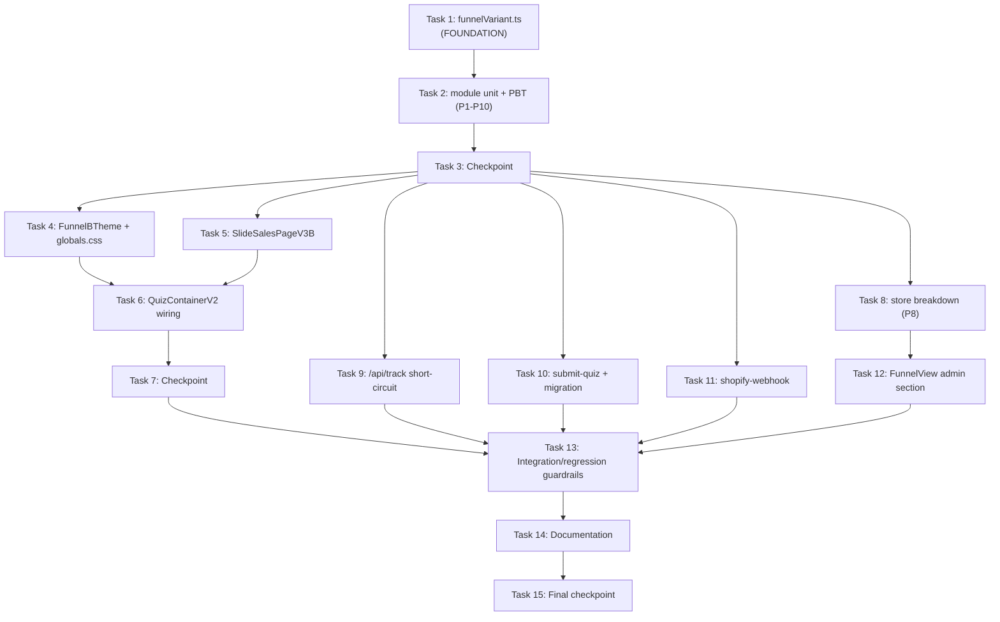

# Implementation Plan: Argentina Full-Funnel A/B Test

## Overview

This plan implements a **full-funnel A/B test for Argentina-only traffic** (Funnel A control vs. Funnel B rebranded), built as isolated, additive modules that mirror the existing `ab_entry` pattern. The implementation language is **TypeScript** (Next.js 14 App Router), with **Vitest + fast-check** for unit and property-based tests.

The work is foundation-first: the pure assignment/event module (`funnelVariant.ts`) and its property tests are built first because every other stream depends on it. After the module exists, four largely-parallel streams proceed: (1) UI/theme/sales-page, (2) quiz container wiring, (3) admin store + view, (4) API routes + migration. Each task is incremental, test-driven where sensible, references specific requirements, and ends by wiring into the previous work so no orphaned code remains.

**Conventions:**
- Sub-tasks marked with `*` are optional test tasks and may be skipped for a faster MVP.
- Property tests reference design properties **P1–P10**; each runs a minimum of 100 iterations.
- Property-test tag format: `Feature: argentina-funnel-ab-test, Property {N}: {property text}`.
- LATAM paths, `QuizContainerLatam`, `SlideSalesPageV3.tsx` (Funnel A), pricing/testimonials/config, and `abEntry.ts` historical data are **never modified**.

---

## Tasks

- [x] 1. Create the isolated funnel-variant module (`lib/quiz-v2/funnelVariant.ts`)
  - Create the new module mirroring the structure of `lib/quiz-v2/abEntry.ts`.
  - Define `FunnelVariant` (`'A' | 'B'`) and `FunnelStep` (`'quiz_start' | 'quiz_complete' | 'salespage_view' | 'checkout' | 'purchase'`) types, plus the `FUNNEL_VARIANT_LABEL` record.
  - Implement `isFunnelExperimentEnabled()` reading `NEXT_PUBLIC_AB_FUNNEL_ENABLED` (true only when value === `'true'`).
  - Implement the **pure core** `assignFunnelVariant(rand, storage, flag, version, override)` so randomness and storage are injected — this is the unit under test for the property tests. Encodes: SSR/flag-OFF/LATAM guards, `?af` override forcing + persistence, stable read of `ab_funnel_v1`, and 50/50 assignment.
  - Implement `getFunnelVariant(quizVersion)` as the SSR-safe wrapper around the pure core (reads `window`, `localStorage`, `Math.random`, querystring `af`), with all storage access wrapped in try/catch (in-memory fallback).
  - Implement `peekFunnelVariant()` (read-only, never assigns, returns `null` when unassigned).
  - Implement `funnelEventName(variant, step)` → `af_<variant>_<step>`, `isFunnelVariantEvent(name)`, and `parseFunnelVariantEvent(name)` (returns `{ variant, step }` or `null`), ensuring `af_` namespace isolation from `ab_entry_` / `sp_`.
  - Export an `AB_ENTRY_PINNED_DEFAULT` constant (or reuse the documented default) for the quiz container pause logic.
  - _Requirements: 1.1, 1.3, 1.4, 1.5, 2.1, 2.2, 2.3, 2.4, 3.1, 3.2, 6.1, 6.2, 10.1, 10.2, 10.3, 10.4, 11.1, 11.2, 11.3, 11.4, 16.1_

- [x] 2. Test the funnel-variant module (unit + property-based)
  - [x]* 2.1 Write unit tests for `funnelVariant.ts` flag/guard/override/persistence behavior
    - Cover flag parsing (set/unset/non-`'true'`), LATAM guard, SSR default, override force+persist, peek vs. assign, and localStorage-throws fallback.
    - _Requirements: 1.5, 3.1, 3.2, 6.1, 6.2, 10.3, 10.4, 16.1_
  - [x]* 2.2 Write property test — 50/50 distribution
    - **Property P1: Over many fresh assignments (flag ON, version `ar`), proportion of `B` converges to ~0.5 and every result is exactly `A` or `B`.**
    - **Validates: Requirements 1.2, 1.3**
  - [x]* 2.3 Write property test — variant stability
    - **Property P2: For any storage with `ab_funnel_v1 = X`, repeated `getFunnelVariant`/`peekFunnelVariant` return the same `X` and never overwrite it.**
    - **Validates: Requirements 2.1, 2.2, 2.3**
  - [x]* 2.4 Write property test — OFF flag ⇒ always Funnel A
    - **Property P3: For any storage state, seed, and version, flag OFF ⇒ result is `A` and nothing is persisted.**
    - **Validates: Requirements 3.1, 3.2, 3.5**
  - [x]* 2.5 Write property test — LATAM never assigned
    - **Property P4: For `version === 'latam'`, result is always `A` and `ab_funnel_v1` is never written, regardless of flag/seed.**
    - **Validates: Requirements 6.1, 6.2**
  - [x]* 2.6 Write property test — event-name round-trip + foreign rejection
    - **Property P6: For all variant×step, `parseFunnelVariantEvent(funnelEventName(v,s)) === {v,s}`; for non-`af_` strings, parse returns `null` and `isFunnelVariantEvent` returns false.**
    - **Validates: Requirements 11.1, 11.2, 11.3**
  - [x]* 2.7 Write property test — namespace isolation
    - **Property P7: `isFunnelVariantEvent` and `isAbEntryEvent`/`sp_` classification are mutually exclusive for all generated names.**
    - **Validates: Requirements 11.4**
  - [x]* 2.8 Write property test — override forces + persists when ON/`ar`
    - **Property P9: For override ∈ {A,B} with flag ON and version `ar`, result equals override and `ab_funnel_v1` is set to it.**
    - **Validates: Requirements 10.1, 10.2**
  - [x]* 2.9 Write property test — override ignored when OFF/LATAM
    - **Property P10: When flag OFF or version `latam`, the `?af` override does not change the `A` result and does not persist.**
    - **Validates: Requirements 10.3, 10.4**

- [x] 3. Checkpoint — foundation module verified
  - Ensure all `funnelVariant` unit and property tests pass before dependent streams begin. Ask the user if questions arise.

- [x] 4. Build the Funnel B scoped theme
  - [x] 4.1 Create `components/quiz-v2/FunnelBTheme.tsx`
    - Implement a wrapper that renders children inside a `data-funnel="b"` element; for Funnel A this component is never mounted (container passes through unwrapped).
    - Preserve existing logo and product name (no content changes).
    - _Requirements: 7.1, 7.2, 7.5_
  - [x] 4.2 Add the scoped `[data-funnel="b"]` token block to `app/globals.css`
    - Append an **additive** scoped CSS block redefining the brand tokens (terracotta family, fonts, brand-colored shadows) to the pink/feminine palette. Do **not** modify `:root` defaults.
    - Catalogue and add scoped overrides for the few hardcoded hex selectors (e.g. `news-card__header`) under `[data-funnel="b"]` only.
    - _Requirements: 7.2, 7.3_
  - [x]* 4.3 Write a unit/snapshot test for `FunnelBTheme`
    - Verify B renders the `data-funnel="b"` wrapper and that shared `:root` token defaults are untouched.
    - _Requirements: 7.2, 7.3_

- [x] 5. Build the Funnel B conversion-optimized sales page
  - [x] 5.1 Create `components/quiz-v2/SlideSalesPageV3B.tsx`
    - Reuse `PRICING`, `TIENDANUBE_*`, `CHECKOUT_URL` from `lib/quiz-v2/config.ts` (no new pricing) and the existing testimonials unchanged.
    - Reuse `useQuizStore` answers and diagnostic helpers (`calcularDiagnostico`, etc.) for the personalized report.
    - Write Argentine "vos" conversion copy; render so it visually matches the Funnel B branding (designed to mount inside `FunnelBTheme`).
    - On mount, fire `af_<V>_salespage_view`; on CTA click, fire `af_<V>_checkout` (using `peekFunnelVariant()` + `funnelEventName`), alongside the existing Meta `ViewContent` / `InitiateCheckout` events.
    - Attach `funnel_variant` as a Shopify cart attribute on checkout, mirroring the existing `ab_entry` cart-attribute pattern.
    - _Requirements: 8.1, 8.2, 8.3, 8.4, 12.3, 12.4, 13.4_
  - [x]* 5.2 Write unit tests for `SlideSalesPageV3B`
    - Verify pricing/testimonials reuse, that `salespage_view`/`checkout` events fire with the correct variant, and that the `funnel_variant` cart attribute is attached on checkout.
    - _Requirements: 8.2, 12.3, 12.4, 13.4_

- [x] 6. Wire variant resolution into the Argentine quiz container (`components/quiz-v2/QuizContainerV2.tsx`, AR only)
  - [x] 6.1 Resolve and apply the funnel variant
    - In the init `useEffect`, resolve the variant once via `getFunnelVariant('ar')` and store it in a ref so a single value drives both branding and the sales slide.
    - Wrap the rendered tree in `FunnelBTheme` when the variant is `B`; render `SlideSalesPageV3B` vs. `SlideSalesPageV3` from that same resolved value.
    - Do **not** modify `QuizContainerLatam` or `app/quiz/page.tsx`.
    - _Requirements: 4.1, 4.3, 7.1, 7.4, 8.1, 9.1, 9.2, 9.3_
  - [x] 6.2 Pause `ab_entry` randomization when the experiment is ON
    - When `isFunnelExperimentEnabled()` is true, set the entry variant to `peekEntryVariant() ?? AB_ENTRY_PINNED_DEFAULT` (no new randomization); otherwise call the existing `getEntryVariant()` unchanged.
    - _Requirements: 3.4, 5.1, 5.2, 5.3_
  - [x] 6.3 Fire funnel-step events from the container
    - Fire `af_<V>_quiz_start` when the first real question is reached and `af_<V>_quiz_complete` when the sales slide is reached, as fire-and-forget calls that never block progression. Emit no `af_*` events when the experiment is OFF or for LATAM.
    - _Requirements: 4.2, 6.3, 12.1, 12.2, 16.2_
  - [x]* 6.4 Write property test — render consistency
    - **Property P5: For a single resolved variant `v`, `chooseRender(v)` yields `{theme:'b', sales:'B'}` when `v==='B'` and `{theme:'none', sales:'A'}` when `v==='A'`.** (Extract a pure `chooseRender` helper to test.)
    - **Validates: Requirements 9.1, 9.2, 9.3**

- [x] 7. Checkpoint — quiz container + B funnel render correctly
  - Ensure theme, sales page, variant resolution, `ab_entry` pause, and event firing all integrate. Ensure all tests pass; ask the user if questions arise.

- [x] 8. Extend the admin store with the funnel-variant breakdown (`lib/admin/store.ts`)
  - [x] 8.1 Add the breakdown type and builder
    - Add the `FunnelVariantBreakdownRow` type and `funnelVariantBreakdown: FunnelVariantBreakdownRow[]` to `FunnelData`.
    - Implement `buildFunnelVariantBreakdown(rows)` mirroring `buildVariantBreakdown`: parse `af_*` events via `parseFunnelVariantEvent`, accumulate per-variant counts, compute denominator-safe rates in `[0,100]`, and return `[]` when no `af_*` events exist.
    - _Requirements: 12.5, 14.1, 14.2, 14.3, 15.1, 15.2, 15.3, 15.4_
  - [x]* 8.2 Write property test — breakdown safety & monotonicity
    - **Property P8: For arbitrary multisets of `af_*` events, every rate is in `[0,100]`, zero denominators yield `0` (never NaN/Infinity), counts equal the per-(variant,step) input sums, and empty input yields `[]`.**
    - **Validates: Requirements 15.1, 15.2, 15.3, 15.4**

- [x] 9. Record funnel-variant events in the Track API (`app/api/track/route.ts`)
  - [x] 9.1 Short-circuit `af_*` events before Meta CAPI
    - After the existing `isAbEntryEvent` short-circuit, add `if (isFunnelVariantEvent(eventName)) { return NextResponse.json({ ok: true, internal: true }); }` so `af_*` events are recorded in the store but never forwarded to external analytics.
    - Implement the Tienda Nube email-bridge purchase attribution: on a confirmed front purchase, look up the lead's stored `funnel_variant` by email and record `af_<V>_purchase`; if none, count toward overall totals only.
    - _Requirements: 12.6, 13.3, 13.6_
  - [x]* 9.2 Write route tests mirroring `route.test.ts`
    - Verify `af_*` events are recorded then short-circuited before CAPI, and that the email bridge records `af_<V>_purchase` when a variant exists.
    - _Requirements: 12.6, 13.3, 13.6_

- [x] 10. Persist the funnel variant on the lead (`app/api/submit-quiz/route.ts` + migration)
  - [x] 10.1 Create the additive Supabase migration
    - Add `supabase/migrations/011_add_funnel_variant_to_clientes.sql` adding a nullable, non-breaking `clientes.funnel_variant text` column with a descriptive comment.
    - _Requirements: 13.2_
  - [x] 10.2 Persist `funnel_variant` from the submit-quiz body
    - Read `funnel_variant` from the request body (client sends `peekFunnelVariant()`), write it to `clientes.funnel_variant`, and tolerate a missing column so the submission never fails if the migration has not yet run.
    - _Requirements: 13.1, 16.3_
  - [x]* 10.3 Write unit tests for submit-quiz persistence resilience
    - Verify the variant is persisted when present and that a missing-column error does not fail the submission.
    - _Requirements: 13.1, 16.3_

- [x] 11. Attribute Shopify upsell/downsell purchases (`app/api/shopify-webhook/route.ts`)
  - [x] 11.1 Add `orderFunnelVariant()` and record purchase
    - Implement `orderFunnelVariant(order)` reading `funnel_variant` from `note_attributes` and `landing_site`, mirroring the existing `orderEntryVariant` helper; when present, record `af_<V>_purchase`.
    - _Requirements: 13.5_
  - [x]* 11.2 Write webhook tests for variant parsing + purchase recording
    - Verify parsing from `note_attributes` and `landing_site`, and that `af_<V>_purchase` is recorded for the parsed variant.
    - _Requirements: 13.5_

- [x] 12. Add the admin side-by-side comparison section (`app/admin/funnel/FunnelView.tsx`)
  - Add a new `SectionCard` titled "Test full-funnel — Argentina (A vs B)" rendering `data.funnelVariantBreakdown` as a side-by-side table with per-step rates (completion, sales-page view, checkout, purchase) and a highlighted `Total_Conversion_Rate` (badge-highlight the winning variant, reusing the `bestSalesRate` pattern).
  - Hide the section entirely when `funnelVariantBreakdown` is empty.
  - _Requirements: 14.1, 14.2, 14.3, 14.4_

- [x] 13. Integration & regression guardrails
  - [x]* 13.1 Flag-OFF regression test
    - Verify AR quiz with flag OFF renders Funnel A unchanged, emits no `af_*` events, and keeps `ab_entry` randomization active.
    - _Requirements: 3.3, 3.4, 4.1, 4.2_
  - [x]* 13.2 Flag-ON integration test
    - Verify AR quiz with flag ON resolves a variant, fires `af_<V>_quiz_start`, and pins `ab_entry` (no re-randomization).
    - _Requirements: 5.1, 5.2, 12.1_
  - [x]* 13.3 LATAM isolation test
    - Verify LATAM mount writes no `ab_funnel_v1` value and emits no `af_*` events.
    - _Requirements: 6.2, 6.3, 6.4_

- [x] 14. Documentation of configuration and manual steps
  - Add `NEXT_PUBLIC_AB_FUNNEL_ENABLED` to `.env.local.example` and document the kill switch in `README.md`.
  - Document the optional manual Tienda Nube `/success/` snippet update for inline `funnel_variant` forwarding, noting that email-bridge attribution already works without it.
  - _Requirements: 3.1, 13.3_

- [x] 15. Final checkpoint — full suite green
  - Ensure all unit, property-based, and integration tests pass and every stream is wired together with no orphaned code. Ask the user if questions arise.

- [x] 16. Add the flag-independent QA preview override (`af_preview`)
  - In `lib/quiz-v2/funnelVariant.ts`, add an SSR-safe `readPreviewOverride()` helper that reads `?af_preview=A|B` (case-insensitive, else `null`).
  - Update `getFunnelVariant(quizVersion)` precedence so that, for `quizVersion === 'ar'`, a valid `af_preview` value is returned **before** the kill-switch/flag check, **without** persisting to `ab_funnel_v1`; LATAM ignores it; everything else (flag OFF ⇒ 'A', `?af` override, stable assignment, 50/50) is unchanged for normal traffic.
  - Update `peekFunnelVariant()` to return the `af_preview` value first (SSR-safe) so the sales page (`SlideSalesPageV3B`), the Shopify cart attribute, and the submit-quiz body stay consistent with the previewed variant across the session.
  - Keep `fireFunnelEvent()` gated on `isFunnelExperimentEnabled()` (no `af_*` events fire during a preview while the flag is OFF). Leave the existing `?af` experiment override and LATAM/Funnel-A behavior untouched.
  - Preview URLs: `/quiz?af_preview=B` (Funnel B), `/quiz?af_preview=A` (Funnel A).
  - [x] 16.1 Add unit tests for the preview override
    - AR + `af_preview=B` with flag OFF ⇒ `getFunnelVariant` returns `'B'` and `ab_funnel_v1` is NOT written; AR + `af_preview=A` ⇒ `'A'`; invalid value ⇒ falls through to normal logic; LATAM + `af_preview=B` ⇒ `'A'` (ignored); `peekFunnelVariant` returns the preview value when the param is present.
    - _Requirements: 17.1, 17.2, 17.3, 17.4, 17.5, 17.6_
  - [x] 16.2 Add property test — P11 (preview override)
    - **Property P11: For any flag state and any storage, when `quizVersion==='ar'` and `af_preview ∈ {A,B}`, `getFunnelVariant`/`peekFunnelVariant` return exactly that value and never write the assignment key; when `quizVersion==='latam'`, the preview param is ignored (returns `'A'`).**
    - Reconcile P3 wording to the "flag OFF AND no `af_preview` param ⇒ 'A' and nothing persisted" precondition; P10 (`?af` override) remains distinct and ignored when OFF.
    - **Validates: Requirements 17.1, 17.2, 17.3, 17.5**
  - _Requirements: 17.1, 17.2, 17.3, 17.4, 17.5, 17.6, 17.7_

- [x] 17. Conversion-optimize the Funnel B sales page for the Argentine market (Req 18)
  - Rework `components/quiz-v2/SlideSalesPageV3B.tsx` from a near-verbatim re-skin of Funnel A into a genuinely CRO-optimized page, keeping it rendering inside `FunnelBTheme` and all tracking intact.
  - **Derived price framing:** compute the per-day ARS cost from `PRICING.front.amount` on a 30-day basis (`Math.round(amount / 30)`) and render `Te sale ~$<perDay> por día — menos que un café ☕`; compute and show a `% OFF` badge derived from the `$51.000` "valor total" anchor vs the real price (no hardcoded numbers).
  - **Hero:** benefit-led headline with concrete promise + days-to-result + audience (mujeres argentinas que se sienten hinchadas); keep the Lic. Natalia Reyes credibility line.
  - **Social proof:** add a top trust line ("+3.000 mujeres ya empezaron") and repeat it near the price CTA; surface one existing testimonial (Anabela — content unchanged) higher.
  - **CTA:** benefit-driven copy ("EMPEZAR A DESHINCHARME →"), repeated inline CTAs, plus a sticky mobile buy-bar (fixed bottom, appears on scroll) that reuses the same `handleCheckout` and is accessible (`<button>` + `aria-label`).
  - **Honest urgency:** keep the countdown with an explicit rationale ("precio promo solo hoy", "después vuelve a $51.000"); no fake stock scarcity.
  - **Risk reversal:** elevate the 30-day guarantee and add a compact version next to the price/CTA box.
  - **Argentine copy:** tighten to "vos" with local comparisons (café/alfajor/SUBE); mobile-first layout with bottom padding so the sticky bar never hides the footer.
  - **Constraints preserved:** no price/config change, no "cuotas", payment row stays `Visa · Mastercard · MercadoPago`, testimonial content unchanged, Tienda Nube/Shopify branching + `funnel_variant` cart attribute identical.
  - [x] 17.1 Update unit tests for `SlideSalesPageV3B`
    - Keep existing assertions green (PRICING.front.display present; testimonials 'Anabela' / "no me cerraba el jean"; `af_B_salespage_view` on mount; `af_B_checkout` + `funnel_variant` cart attribute on the Shopify path). Add new assertions: the per-day ARS line renders a number computed from `PRICING.front.amount`, the `% OFF` badge is derived, no "cuotas" / payment row intact, and the sticky mobile CTA also triggers checkout/tracking.
    - _Requirements: 8.2, 12.3, 12.4, 13.4, 18.1, 18.2, 18.4, 18.6, 18.10_
  - _Requirements: 18.1, 18.2, 18.3, 18.4, 18.5, 18.6, 18.7, 18.8, 18.9, 18.10, 18.11, 18.12_

- [x] 18. Refine Funnel B price framing + curiosity-gated sticky CTA + nutritionist anchor, and update AR price (Req 18)
  - **Shared AR price → $7.790:** change `PRICING.front` in `lib/quiz-v2/config.ts` to `{ amount: 7790, display: '$7.790' }` (single source consumed by BOTH Funnel A and Funnel B). LATAM `PRICING_LATAM` (USD) left untouched. Real charged price must also be updated out-of-repo in Tienda Nube / Shopify.
  - **Per-day on 7-day basis:** change the per-day computation in `SlideSalesPageV3B.tsx` from a 30-day basis to the real protocol basis `PER_DAY = Math.round(PRICING.front.amount / 7)` (~$1.113 with $7.790), and render the **final total price beside it** ("~$1.113 por día · $7.790 en total"), both derived from `PRICING.front`. Keep the "menos que un café ☕" comparison and the derived `% OFF` badge (now ≈85%).
  - **Curiosity-gated sticky bar:** gate the sticky mobile buy-bar so it does NOT appear until the price `<section>` has been seen (via `priceRef` + `IntersectionObserver`, with a scroll-position fallback); before that it is hidden (`translate-y-full` + `aria-hidden`), after that it acts as a reminder. Stays mounted, accessible, reuses the same `handleCheckout`.
  - **Nutritionist price anchor:** add a real-world cost anchor block (`NUTRI_ANCHOR = 30000`, via `formatArs`, soft "arranca en ~$30.000" wording in "vos") immediately before the price reveal, complementing the "$51.000 valor total" anchor.
  - **Derived guarantee/FAQ price:** update the hardcoded "$8.000" guarantee/FAQ text in BOTH `SlideSalesPageV3.tsx` (Funnel A) and `SlideSalesPageV3B.tsx` to derive from `PRICING.front.display`. VALUE_STACK component values left as-is.
  - Update tests: `SlideSalesPageV3B.test.tsx` (per-day `/7`, final price beside, nutritionist anchor renders, sticky gating via captured IntersectionObserver callback) and `config.tiendanube.test.ts` (front amount 7790). Full vitest suite green.
  - _Requirements: 18.1, 18.2, 18.3, 18.4, 18.13_

- [x] 19. Reframe Funnel B as a 30-day plan with per-day `/30` and a 7-day guarantee (Req 18)
  - **Context:** Argentina has **no upsell**, so the front product is positioned as a complete **30-day plan**. These copy/framing changes apply to **Funnel B (`SlideSalesPageV3B.tsx`) only**; aligning Funnel A is a separate decision. Price (7790) and pricing config are unchanged; testimonial content and LATAM are untouched.
  - **Per-day on 30-day basis:** change `PROTOCOL_DAYS`/per-day computation in `SlideSalesPageV3B.tsx` to `Math.round(PRICING.front.amount / 30)` (~$260 with $7.790), keeping the final total price beside it ("~$260 por día · $7.790 en total"), the "menos que un café ☕" comparison, and the derived `% OFF` badge (≈85%).
  - **30-day plan copy:** VALUE_STACK item → "Protocolo de 30 días personalizado"; hero headline reframed to an early-results promise within the plan ("en los primeros días … vas a empezar a deshincharte") so it no longer claims a 7-DAY plan; subhead frames "el plan de 30 días". Testimonials (incl. "En 7 días entendí…") left verbatim.
  - **7-day guarantee:** update ALL guarantee references (elevated section heading/body, compact block next to price/CTA, FAQ answer, final-CTA trust badge) from 30 días to **7 días**, keeping the refund amount derived from `PRICING.front.display`.
  - Update `SlideSalesPageV3B.test.tsx` (per-day expected now `Math.round(PRICING.front.amount / 30)`, final price beside assertion kept); full vitest suite green (265 tests).
  - _Requirements: 18.1, 18.2, 18.3, 18.6, 18.8_

---

## Task Dependency Graph

**Sequencing notes:**
- **Sequential foundation:** Tasks 1 → 2 → 3 must complete first; the `funnelVariant.ts` module (assignment, event vocabulary, breakdown parsing) is imported by every downstream stream.
- **Parallelizable after Task 3:** Four independent streams can proceed concurrently —
  - **UI stream:** Task 4 (theme) and Task 5 (sales page), which then converge into Task 6 (quiz container wiring) → Task 7.
  - **Admin stream:** Task 8 (store breakdown) → Task 12 (admin view).
  - **Tracking stream:** Task 9 (`/api/track`).
  - **Attribution stream:** Task 10 (submit-quiz + migration) and Task 11 (shopify-webhook).
- **Convergence:** Task 13 (integration guardrails) depends on the quiz container (Task 7), all API streams (Tasks 9–11), and the admin view (Task 12).
- **Closeout:** Task 14 (docs) and Task 15 (final checkpoint) run last.

---

## Notes

- Tasks marked with `*` are optional test sub-tasks and can be skipped for a faster MVP; core implementation tasks are never optional.
- Property tests (P1–P10) target the **pure** `assignFunnelVariant` core, the event-name functions, the `chooseRender` helper, and `buildFunnelVariantBreakdown`, with randomness/storage injected for determinism; each runs ≥100 iterations via fast-check.
- Every task references specific requirement sub-clauses for traceability.
- All work is additive and AR-scoped; LATAM, Funnel A behavior, pricing/testimonials, and `abEntry.ts` historical data are never modified.
