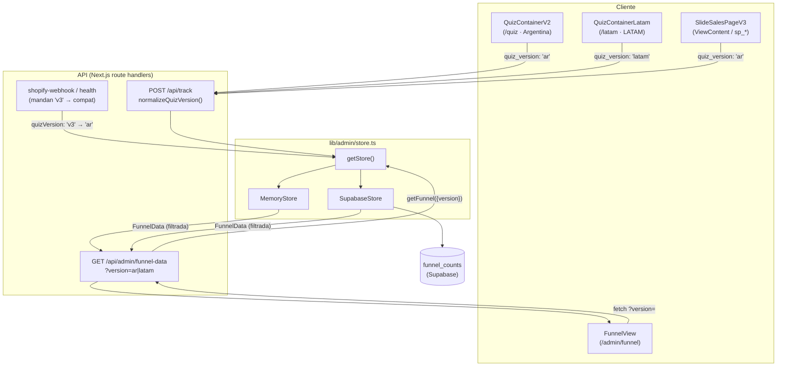
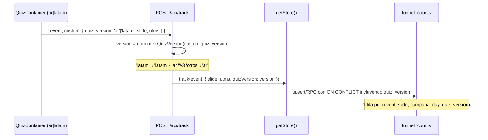
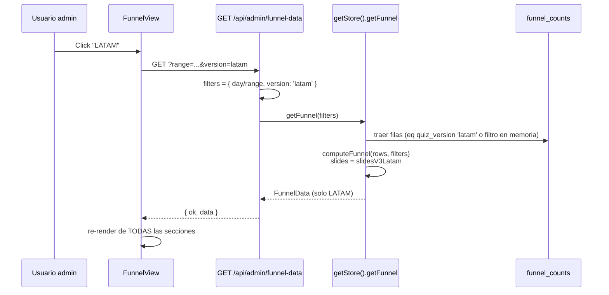

# Design Document: funnel-quiz-tracking-toggle

## Overview

El proyecto `testfunnel` corre **dos quizzes en producción** que comparten infraestructura de tracking:

- `/quiz` = **Argentina** (`components/quiz-v2/QuizContainerV2.tsx`, slides `slidesV3`), hoy emite `quiz_version: 'v3'`.
- `/latam` = **LATAM** (`components/quiz-v2/QuizContainerLatam.tsx`, slides `slidesV3Latam`), hoy emite `quiz_version: 'latam'`.

Ambos eventos pasan por `POST /api/track`, que los persiste en el funnel store (`lib/admin/store.ts` → backend `memory` o `supabase`). El dashboard `/admin/funnel` (`FunnelView.tsx` + `GET /api/admin/funnel-data`) lee esos contadores agregados y dibuja el embudo, KPIs, atribución por campaña, país y dos tests A/B.

**El bug central** está en `app/api/track/route.ts`:

```ts
quizVersion: customData.quiz_version === 'v2' ? 'v2'
           : customData.quiz_version === 'v3' ? 'v3'
           : 'v1',
```

Cualquier valor que no sea `'v2'` ni `'v3'` cae en `'v1'`. Como `/latam` manda `'latam'`, **LATAM se guarda como `'v1'`**. Encima, ni la API `funnel-data` ni la UI usan el filtro de versión (el tipo `FunnelFilters.version` ya existe pero está muerto), así que **Argentina y LATAM se ven mezclados** en un único embudo.

**Este diseño (Frente A)** ataca cuatro cosas, con decisiones ya cerradas con el usuario:

1. **Tracking limpio** con etiquetas `'ar'` y `'latam'` (sin geo-IP/country), arreglando el mapeo, los tipos y la emisión, manteniendo compat con los emisores que mandan `'v3'`.
2. **Toggle de 3 vistas** en `/admin/funnel` (Argentina / LATAM / Unificado) que aplica a TODAS las secciones, vía `?version=ar|latam` en la API.
3. **Slides correctos** del embudo: hoy usa `slidesV2` (incorrecto); debe usar `slidesV3` (AR) y `slidesV3Latam` (LATAM) según la vista, con estrategia explícita para Unificado.
4. **Migración de data histórica**: re-etiquetar `'v3' → 'ar'` en `funnel_counts` (Supabase + memory), con la limitación documentada de que el LATAM histórico quedó como `'v1'` y no se puede separar con certeza.

### Hallazgo crítico de almacenamiento (Supabase)

El índice único de `funnel_counts` (migraciones 007/009) es sobre
`(event_name, slide, utm_source, utm_medium, utm_campaign, utm_content, day)` —
**`quiz_version` NO forma parte de la clave única**. Por lo tanto, AR y LATAM que comparten
`(event, slide, campaña, day)` **colisionan en una sola fila contador**, etiquetada con la versión
de quien insertó primero. Sin arreglar esto, el filtro por versión es estructuralmente imposible en
Supabase. El backend `memory` no tiene este problema porque su clave (`makeKey`) ya incluye
`quizVersion`. La migración debe **agregar `quiz_version` a la clave única** y a los `ON CONFLICT`
de los RPC/upserts.

---

## Architecture

### Componentes afectados



### Flujo de datos — escritura (tracking)



### Flujo de datos — lectura (dashboard con toggle)



---

## Version Labeling Model

| Concepto | Antes | Después |
|----------|-------|---------|
| Argentina (`/quiz`) | emite `'v3'`, se guarda `'v3'` | emite `'ar'`, se guarda `'ar'` |
| LATAM (`/latam`) | emite `'latam'`, se guarda `'v1'` (BUG) | emite `'latam'`, se guarda `'latam'` |
| Sales page V3 | emite `'v3'` | emite `'ar'` |
| shopify-webhook / health | emiten `'v3'` | **siguen** `'v3'`, normalizados a `'ar'` (compat) |
| Histórico mezclado | `'v1'` | queda `'v1'` (no separable) — solo visible en Unificado |

**Tipos:**

```ts
/** Etiqueta de versión que se ESCRIBE de ahora en más. */
export type QuizVersion = 'ar' | 'latam';

/** Etiquetas legacy que pueden existir en filas históricas (solo lectura). */
export type LegacyQuizVersion = 'v1' | 'v2' | 'v3';

/** Unión usada al LEER filas almacenadas. */
export type StoredQuizVersion = QuizVersion | LegacyQuizVersion;
```

**Semántica del toggle:**

- `version: 'ar'`   → filtra `quiz_version === 'ar'`.
- `version: 'latam'`→ filtra `quiz_version === 'latam'`.
- `version: undefined` (**Unificado**) → **sin filtro** = suma de TODAS las filas (incluye el bucket `'v1'` histórico).

> **Caveat documentado:** como Unificado no filtra, `AR + LATAM` puede **no** igualar exactamente a Unificado: la diferencia es el histórico `'v1'` (que contiene LATAM mal etiquetado + data vieja, no separable con certeza). Esto se muestra al usuario con un banner informativo en la vista Unificado.

---

## Components and Interfaces

### 1. `app/api/track/route.ts`

**Propósito**: punto único de entrada del tracking; debe normalizar la etiqueta de versión.

**Cambio de interfaz interno** (reemplaza el ternario roto):

```ts
/**
 * Normaliza la etiqueta de versión que llega del cliente o de callers server-side.
 * - 'latam' (en cualquier capitalización) → 'latam'
 * - 'ar', 'v3' (legacy Argentina) y cualquier otro/undefined → 'ar'
 * Nunca devuelve 'v1'/'v2'/'v3' para escrituras nuevas.
 */
function normalizeQuizVersion(raw: unknown): 'ar' | 'latam' {
  return raw === 'latam' ? 'latam' : 'ar';
}
```

Uso dentro del `getStore().track(...)`:

```ts
await getStore().track(eventName, {
  slide: ...,
  questionId,
  utms,
  quizVersion: normalizeQuizVersion(customData.quiz_version),
  country, // se sigue ignorando en supabase; sin geo-IP nuevo
});
```

**Responsabilidades**:
- Mapear `'latam' → 'latam'` y todo lo demás (incluido `'v3'`) a `'ar'`.
- No introducir geo-IP/country para la segmentación de versión (decisión: las etiquetas mandan, no el país).

### 2. `lib/admin/store.ts` (tipos + memory backend)

**Propósito**: definir el contrato del store y el backend en memoria.

**Cambios de firma**:

```ts
export type FunnelFilters = {
  /** Filtra por versión del quiz. undefined = unificado (todas las filas). */
  version?: 'ar' | 'latam';
  day?: string | 'all';
  from?: string;
  to?: string;
};

export type TrackProps = {
  slide?: number;
  questionId?: string;
  utms?: Record<string, string>;
  /** Escrituras nuevas: 'ar' | 'latam'. Acepta legacy por compat de callers. */
  quizVersion?: 'ar' | 'latam' | 'v1' | 'v2' | 'v3';
  country?: string;
};
```

`makeKey()` / `parseKey()` / `CounterRow.quiz_version` pasan a tipar `StoredQuizVersion`
(`'ar' | 'latam' | 'v1' | 'v2' | 'v3'`). La clave de memoria ya incluye `quizVersion`, así que
**no hay colisión** en este backend.

### 3. `lib/admin/supabase-store.ts`

**Propósito**: backend persistente; debe **separar por versión** en la clave única.

**Responsabilidades nuevas**:
- Incluir `quiz_version` en TODOS los `onConflict` (RPC daily, RPC legacy, upsert con day, upsert sin day).
- `fetchAllRows(..., version)` ya filtra con `.eq('quiz_version', version)` cuando `version` está seteado — se conserva, ahora con valores `'ar' | 'latam'`.
- `computeFunnel` elige slides por versión (ver Algoritmos).

### 4. `app/api/admin/funnel-data/route.ts`

**Propósito**: exponer el embudo filtrable por versión.

**Cambio**: parsear `?version` y agregarlo a `filters` (combinable con `day`/`range`):

```ts
const versionParam = url.searchParams.get('version');
const version: 'ar' | 'latam' | undefined =
  versionParam === 'ar' || versionParam === 'latam' ? versionParam : undefined;

const filters: FunnelFilters = rangeParam
  ? (() => { const r = resolveRangeFromParam(rangeParam); return { from: r.fromDay, to: r.toDay, version }; })()
  : { day, version };
```

El POST `backfill_purchase` pasa a usar `quizVersion: 'ar'` (en vez de `'v3'`), ya que el backfill manual representa ventas de Argentina (Shopify).

### 5. `components/quiz-v2/QuizContainerV2.tsx` y `SlideSalesPageV3.tsx`

**Propósito**: emisores del funnel de Argentina.

**Cambio**: reemplazar `quiz_version: 'v3'` por `quiz_version: 'ar'` en todos los `custom` de los `fetch('/api/track', ...)`. `QuizContainerLatam.tsx` ya manda `'latam'` → no se toca.

> Aunque no se actualizara algún emisor, `normalizeQuizVersion` mapea `'v3' → 'ar'`, así que la red de seguridad cubre la compat.

### 6. `app/admin/funnel/FunnelView.tsx`

**Propósito**: UI del dashboard; agrega el toggle de 3 vistas.

**Nueva interfaz de estado**:

```ts
type VersionView = 'ar' | 'latam' | 'unified';

const [versionView, setVersionView] = useState<VersionView>('unified');
```

**Responsabilidades**:
- Renderizar 3 botones: **Argentina** / **LATAM** / **Unificado**.
- En `refetch`, agregar `&version=ar|latam` (omitir el query param para `unified`).
- Re-fetch al cambiar `versionView`; como TODAS las secciones renderizan desde `data`, se actualizan solas.
- Mostrar un banner informativo en `unified` aclarando la suma + caveat del histórico `'v1'`.

```ts
const refetch = useCallback(async () => {
  const versionQS = versionView === 'unified' ? '' : `&version=${versionView}`;
  const res = await fetch(`/api/admin/funnel-data?range=${range.preset}${versionQS}`, { cache: 'no-store', credentials: 'same-origin' });
  // ...resto igual
}, [range.preset, versionView]);

useEffect(() => { refetch(); }, [refetch]); // ya re-fetchea al cambiar versionView
```

---

## Data Models

### Tabla `funnel_counts` (Supabase)

**Esquema actual (relevante)**: `event_name, slide, utm_source, utm_medium, utm_campaign, utm_content, quiz_version, day, count`.

**Índice único actual** (migración 009):
`(event_name, slide, utm_source, utm_medium, utm_campaign, utm_content, day)` — **sin `quiz_version`**.

**Índice único propuesto** (migración 010):
`(event_name, slide, utm_source, utm_medium, utm_campaign, utm_content, day, quiz_version)`.

**Reglas de validación / invariantes**:
- `quiz_version` de filas nuevas ∈ `{'ar','latam'}`.
- Filas históricas pueden tener `{'v1','v2','v3'}`; tras la migración 010, `'v3' → 'ar'`.
- 1 fila por `(event_name, slide, utm_campaign, day, quiz_version)` (source/medium/content fijos en `'(directo)'`).

### `FunnelData` (sin cambios de forma)

La forma de salida no cambia. Lo que cambia es **qué filas entran** (filtradas por `version`) y **qué lista de slides** se usa para `slides[]` (por versión).

---

## Algorithmic Pseudocode

### A. Normalización de versión en `/api/track`

```pascal
ALGORITHM normalizeQuizVersion(raw)
INPUT:  raw (valor crudo de custom.quiz_version)
OUTPUT: 'ar' | 'latam'
BEGIN
  IF raw = 'latam' THEN
    RETURN 'latam'
  ELSE
    RETURN 'ar'   // 'ar', 'v3' legacy, undefined, cualquier otro
  END IF
END
```

**Precondición**: ninguna (acepta cualquier `unknown`).
**Postcondición**: el resultado siempre ∈ `{'ar','latam'}`; jamás `'v1'`.

### B. `computeFunnel` — filtro por versión + selección de slides

```pascal
ALGORITHM computeFunnel(rows, filters, backend)
INPUT:  rows (contadores), filters (incluye version?), backend
OUTPUT: FunnelData
BEGIN
  // 1. Filtro por versión (igual en memory y supabase)
  IF filters.version IS NOT NULL THEN
    versionRows ← rows WHERE row.quiz_version = filters.version
  ELSE
    versionRows ← rows                       // Unificado = todas las filas
  END IF

  // 2. Filtro por día/rango (lógica existente, sin cambios)
  filteredRows ← applyDayOrRange(versionRows, filters)

  // 3. Selección de la lista de slides según versión
  activeSlides ← selectSlides(filters.version)

  // 4. Agregación por slide/evento (lógica existente) usando activeSlides
  RETURN aggregate(filteredRows, activeSlides, ...)
END
```

```pascal
ALGORITHM selectSlides(version)
INPUT:  version ∈ {'ar','latam', NULL}
OUTPUT: lista de slides
BEGIN
  IF version = 'latam' THEN
    RETURN slidesV3Latam        // import desde '@/lib/quiz-v2/data-latam'
  ELSE
    RETURN slidesV3             // 'ar' y Unificado usan el scaffold de Argentina
  END IF
END
```

**Estrategia de alineación para Unificado** (decisión de diseño):
- Los **KPIs macro** del embudo (`totalStarts` = slide 0, `totalCompletes` = `ViewContent`, `totalCheckoutClicks`, `totalSales`) son **agnósticos de versión** y suman correctamente AR + LATAM + histórico.
- La **tabla paso a paso** en Unificado usa `slidesV3` (Argentina, el funnel más completo con email) como scaffold de referencia, alineando por índice. Como LATAM tiene menos slides y distintos `id` (no tiene `email_capture`), los conteos por slide en Unificado son **aproximados por índice**. Se muestra un banner: *"Vista unificada: el embudo paso a paso usa los pasos de Argentina como referencia; LATAM se alinea por posición y puede no coincidir 1:1. Los totales (inicios, ventas, etc.) sí suman correctamente."*

### C. Migración 010 — re-etiquetado + clave única

```pascal
ALGORITHM migration_010
BEGIN
  // 1. Re-etiquetar Argentina histórico
  UPDATE funnel_counts SET quiz_version = 'ar' WHERE quiz_version = 'v3'

  // 2. Recrear índice único incluyendo quiz_version
  DROP INDEX funnel_counts_unique_combo (o el nombre vigente)
  CREATE UNIQUE INDEX ... ON (event_name, slide, utm_source, utm_medium,
                              utm_campaign, utm_content, day, quiz_version)

  // 3. CREATE OR REPLACE de los RPC increment_* con ON CONFLICT que incluye quiz_version

  // NOTA: 'v1' NO se toca. Contiene LATAM mal etiquetado + data vieja, no separable.
END
```

---

## Example Usage

```ts
// 1) Emisión (cliente Argentina) — QuizContainerV2 / SlideSalesPageV3
fetch('/api/track', {
  method: 'POST', keepalive: true,
  headers: { 'Content-Type': 'application/json' },
  body: JSON.stringify({
    event: 'QuizProgress',
    custom: { slide: currentStep, question_id: slide.id, quiz_version: 'ar', utms },
  }),
});

// 2) Dashboard — fetch por vista
fetch('/api/admin/funnel-data?range=hoy');            // Unificado (sin version)
fetch('/api/admin/funnel-data?range=hoy&version=ar'); // Argentina
fetch('/api/admin/funnel-data?range=hoy&version=latam'); // LATAM

// 3) Caller server-side legacy (compat) — sigue mandando 'v3'
await getStore().track('Purchase', { utms, quizVersion: 'v3', country }); // → se guarda como 'ar' tras normalización en /api/track; en webhook se llama directo al store
```

> Nota: `shopify-webhook` y `health` llaman a `getStore().track()` **directamente** (no pasan por `/api/track`). Para mantener compat sin tocarlos, el store normaliza también: `quizVersion === 'latam' ? 'latam' : 'ar'`. Así `'v3'` que mandan esos callers se guarda como `'ar'`.

---

## Correctness Properties

1. **No más fuga a v1**: para todo evento entrante, `normalizeQuizVersion(x) ∈ {'ar','latam'}`. En particular `normalizeQuizVersion('latam') = 'latam'` y `normalizeQuizVersion('v3') = 'ar'`.
2. **Aislamiento de versión (Supabase)**: tras la migración 010, dos eventos con la misma `(event, slide, campaña, day)` pero distinta `quiz_version` ocupan **filas distintas** (no se mezclan los contadores).
3. **Filtro correcto**: `getFunnel({version:'ar'})` no incluye ninguna fila con `quiz_version ≠ 'ar'`; idem `'latam'`.
4. **Unificado = suma**: `getFunnel({})` incluye todas las filas. `totalStarts(unified) = totalStarts(ar) + totalStarts(latam) + totalStarts(v1_histórico)`.
5. **Slides por vista**: la vista `'latam'` usa `slidesV3Latam`; `'ar'` y Unificado usan `slidesV3`. Nunca `slidesV2`.
6. **Compat preservada**: callers que mandan `'v3'` siguen contabilizando en Argentina (`'ar'`).
7. **Idempotencia de la migración**: correr la migración 010 N veces deja el mismo estado (no hay filas `'v3'` luego de la 1ª corrida; el índice se recrea con `IF EXISTS`/`IF NOT EXISTS`).

---

## Error Handling

| Escenario | Condición | Respuesta | Recuperación |
|-----------|-----------|-----------|--------------|
| `?version` inválido | `version` ≠ `ar`/`latam` | tratar como `undefined` (Unificado) | la UI nunca manda valores inválidos |
| Falla escritura en store | RPC + upserts fallan | `/api/track` loguea y sigue (no rompe al cliente); el webhook propaga el error para reintento | cadena de fallbacks existente (daily RPC → legacy RPC → upsert con day → upsert sin day) |
| Migración 010 sin correr | índice viejo sin `quiz_version` | AR y LATAM colisionan en el mismo contador → filtro inexacto | banner de UI desaconsejable; **bloquear merge** hasta correr la migración (documentado en tasks) |
| Backend `memory` | re-deploy | datos en RAM se pierden | banner existente "backend memory" |
| Histórico `'v1'` | LATAM mal etiquetado | no separable | banner en Unificado explicando el caveat |

---

## Migration: Data Histórica

### Supabase — `supabase/migrations/010_relabel_v3_to_ar_and_version_unique.sql`

Sigue el estilo de las migraciones 007/009 (idempotente, corrible desde el SQL Editor, comentada en español). Esqueleto:

```sql
-- ============================================================================
-- MIGRACIÓN 010: etiquetas de versión 'ar'/'latam' + aislamiento por versión
--
-- (A) Re-etiquetar el Argentina histórico: 'v3' -> 'ar'.
-- (B) Incluir quiz_version en la clave única para que AR y LATAM NO colisionen.
-- (C) Recrear los RPC increment_* con ON CONFLICT que incluya quiz_version.
--
-- LIMITACIÓN: el LATAM histórico quedó guardado como 'v1' (bug del mapeo en
-- /api/track). NO se puede separar con certeza de la data vieja, así que 'v1'
-- se deja intacto y solo aparece en la vista "Unificado".
--
-- Idempotente: se puede correr varias veces.
-- ============================================================================

-- (A) Re-etiquetado de Argentina.
UPDATE funnel_counts SET quiz_version = 'ar' WHERE quiz_version = 'v3';

-- (B) Recrear la clave única incluyendo quiz_version.
DROP INDEX IF EXISTS funnel_counts_unique_combo;
CREATE UNIQUE INDEX IF NOT EXISTS funnel_counts_unique_combo
  ON funnel_counts
  (event_name, slide, utm_source, utm_medium, utm_campaign, utm_content, day, quiz_version);

-- (C) Recrear RPCs con ON CONFLICT que incluya quiz_version.
CREATE OR REPLACE FUNCTION increment_funnel_count_daily(
  p_event_name text,
  p_slide smallint,
  p_utm_source text DEFAULT '(directo)',
  p_utm_medium text DEFAULT '(directo)',
  p_utm_campaign text DEFAULT '(directo)',
  p_utm_content text DEFAULT '(directo)',
  p_quiz_version text DEFAULT 'ar',   -- default pasa de 'v1' a 'ar'
  p_day date DEFAULT NULL
) RETURNS void
LANGUAGE plpgsql AS $$
DECLARE
  v_day date := COALESCE(p_day, (now() AT TIME ZONE 'America/Argentina/Buenos_Aires')::date);
  v_slide smallint := COALESCE(p_slide, -1);
BEGIN
  INSERT INTO funnel_counts (event_name, slide, utm_source, utm_medium, utm_campaign, utm_content, quiz_version, day, count)
  VALUES (p_event_name, v_slide, p_utm_source, p_utm_medium, p_utm_campaign, p_utm_content, p_quiz_version, v_day, 1)
  ON CONFLICT (event_name, slide, utm_source, utm_medium, utm_campaign, utm_content, day, quiz_version)
  DO UPDATE SET count = funnel_counts.count + 1;
END;
$$;
-- (idem para el RPC legacy increment_funnel_count, recreando su ON CONFLICT)
```

> El upsert directo de `supabase-store.ts` (fallbacks 3 y 4) también debe actualizar su string `onConflict` para incluir `,quiz_version`.

### Backend `memory`

No requiere migración de datos: `makeKey()` ya incorpora `quizVersion`, así que la separación es automática. Solo cambian los **tipos** (`'ar'|'latam'` para escrituras nuevas) y el `selectSlides`. Los datos en memoria se pierden en cada re-deploy de todas formas (no hay histórico que migrar).

### Limitación reconocida

El LATAM histórico previo a este fix está mezclado dentro de `'v1'` junto con data vieja. **No es recuperable con certeza**, por lo que se deja en `'v1'` y solo contribuye a la vista Unificado. A partir del deploy, LATAM se etiqueta correctamente como `'latam'`.

---

## Testing Strategy

### Unit
- `normalizeQuizVersion`: tabla de casos (`'latam'→'latam'`, `'ar'→'ar'`, `'v3'→'ar'`, `'v1'→'ar'`, `undefined→'ar'`, `'xyz'→'ar'`).
- `selectSlides`: `'latam'→slidesV3Latam`, `'ar'/undefined→slidesV3`.
- `computeFunnel` (memory): dado un set de filas mixtas AR/LATAM/v1, verificar conteos por versión y que Unificado = suma total.

### Property-based
**Librería sugerida**: `fast-check` (proyecto TS).
- ∀ string `s`: `normalizeQuizVersion(s) ∈ {'ar','latam'}` y `s='latam' ⇔ resultado='latam'`.
- ∀ multiset de eventos: `count(ar) + count(latam) + count(v1) = count(unified)` para cada métrica macro.
- ∀ filas: `getFunnel({version:v})` no contiene filas con `quiz_version ≠ v`.

### Integración
- `GET /api/admin/funnel-data?version=ar|latam|<none>` devuelve datos coherentes y aislados.
- Simular tracking desde `/quiz` y `/latam` y verificar que el toggle separa correctamente (con la migración 010 aplicada en Supabase de test).

---

## Out of Scope (Frentes B/C — solo notas de trabajo futuro)

- **Frente B**: sacar la captura de email de `/quiz`.
- **Frente C**: limpiar cruft v2/v3 de los archivos (`slidesV2`, helpers muertos) y unificación total de `/latam` con `/quiz`.

Estas tareas no se abordan en este spec; se dejan anotadas para que la deuda quede visible.

---

## Dependencies

- **Next.js App Router** (route handlers `runtime = 'nodejs'`).
- **TypeScript**.
- **Supabase** (`@supabase/supabase-js`) + tabla `funnel_counts` y RPCs `increment_funnel_count[_daily]`.
- Slides: `slidesV3` (`@/lib/quiz-v2/data`), `slidesV3Latam` (`@/lib/quiz-v2/data-latam`).
- Helpers existentes: `lib/utm` (`cleanUtmValue`), `lib/admin/day` (`getArgentinaDay`, `DAY_SENTINEL`), `lib/admin/range`.
- UI: componentes de `@/components/admin/ui` y `FunnelShape`.
- (Sin nuevas dependencias externas; sin geo-IP nuevo.)
