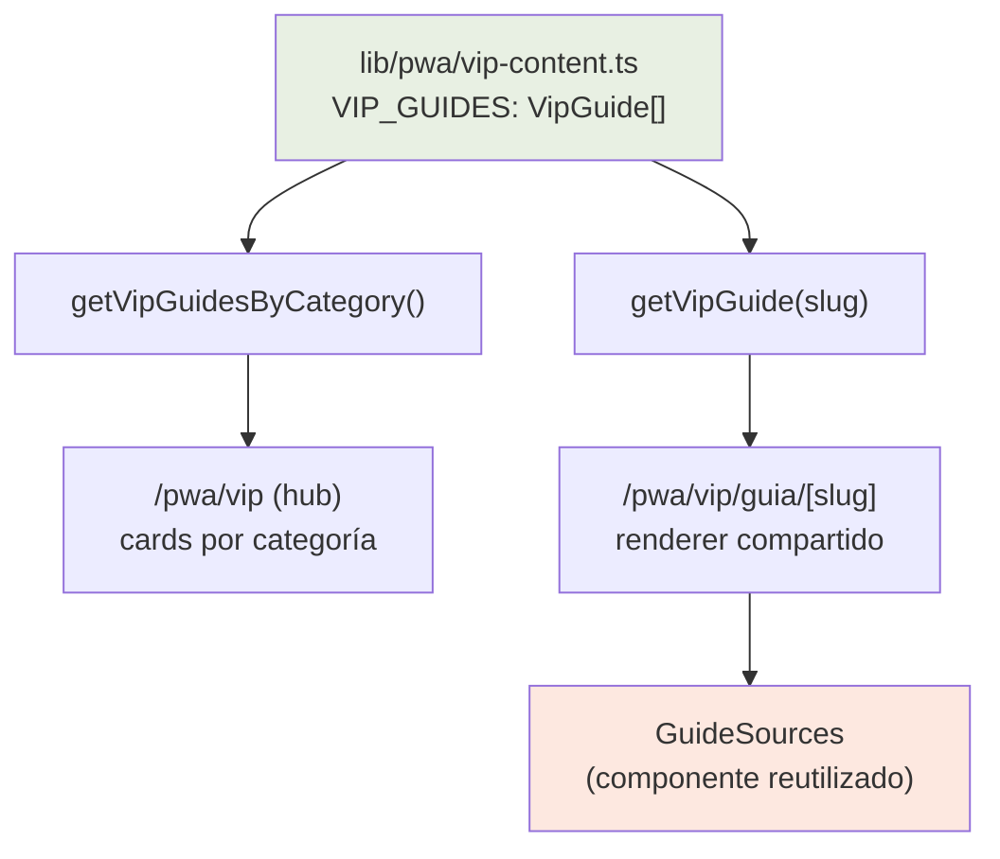
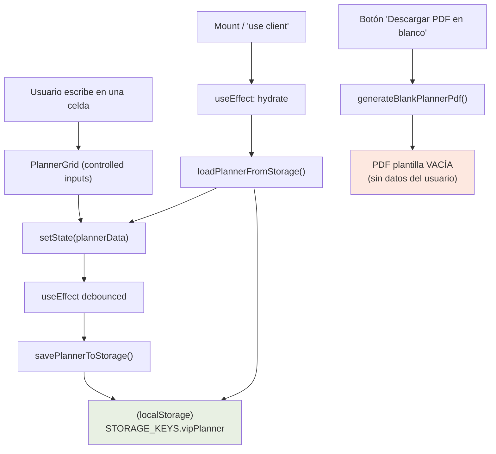

# Design Document: Guías VIP enriquecidas + Planner editable con PDF

## Overview

Esta funcionalidad ataca dos problemas concretos de la sección VIP de la PWA (`/pwa/vip`), ambos orientados a aumentar el valor percibido por quien pagó el Acceso VIP y reducir el riesgo de reembolso.

**Objetivo 1 — Guías VIP enriquecidas.** Las 10 guías VIP actuales (`lib/pwa/vip-content.ts`) son demasiado cortas. Hay que llevarlas al nivel de profundidad, longitud y calidad de los bonos TURBO (`lib/pwa/bonus-guides.ts`): más secciones, más detalle, ejemplos concretos, pasos accionables, errores comunes, calendarios y, donde corresponda, fuentes citadas. Esto es mayormente un trabajo de **contenido**, pero requiere un pequeño cambio de **estructura de datos** (sumar el campo opcional `sources` al tipo `VipGuide` de forma retrocompatible) y un ajuste menor del renderer compartido (`app/pwa/vip/guia/[slug]`) para mostrar esas fuentes reutilizando el componente `GuideSources`.

**Objetivo 2 — Planner editable con PDF.** El planner actual (`app/pwa/vip/planner/page.tsx`) es una tabla print-friendly de solo lectura que únicamente llama a `window.print()`. Hay que transformarlo en una planilla **rellenable** (cada celda editable), con **autoguardado en `localStorage`** siguiendo las convenciones del proyecto, y un **botón de descarga de PDF en blanco** (plantilla vacía, sin los datos del usuario). Como no hay librería de PDF instalada, el diseño define el enfoque de generación.

El diseño respeta el patrón existente: componentes `'use client'`, design system Tailwind (sage / coral / cream / charcoal / sand), animaciones con `framer-motion`, y helpers de `localStorage` puros y server-safe.

---

## Parte A — Guías VIP enriquecidas

### A.1 Architecture (High-Level)

El flujo de datos de las guías VIP no cambia estructuralmente; se enriquece el contenido y se suma un campo opcional. El renderer ya es compartido.



**Decisión de diseño clave:** No se crea una estructura nueva. Se reutiliza el tipo `VipGuide` existente, ampliándolo de forma **aditiva y opcional** (`sources?`), idéntico al patrón ya probado en `BonusGuide`. Así:
- El renderer `[slug]` actual sigue funcionando sin romper ninguna guía existente.
- Las guías sin `sources` se renderizan igual que hoy (el bloque de fuentes solo aparece si el array existe y tiene elementos).
- Se mantiene la consistencia visual y de datos entre bonos TURBO y guías VIP.

### A.2 Data Models

#### Tipo `VipGuide` ampliado

Se agrega un tipo `VipSource` (alias estructural de `BonusSource` / `GuideSource`) y el campo opcional `sources` al final del tipo `VipGuide`. El resto del tipo no cambia.

```typescript
// lib/pwa/vip-content.ts

/** Fuente citada al pie de una guía. Estructuralmente igual a BonusSource y GuideSource. */
export type VipSource = {
  /** Texto visible del enlace (ej: "Harvard Health — Foods that fight inflammation"). */
  label: string;
  url: string;
};

export type VipSection = {
  emoji: string;
  title: string;
  body: string;
  items?: string[];
};

export type VipGuide = {
  slug: string;
  category: VipCategory;
  emoji: string;
  title: string;
  cardDescription: string;
  intro: string;
  sections: VipSection[];
  closingTitle: string;
  closingText: string;
  cta?: { label: string; href: string };
  /** NUEVO — Fuentes que respaldan el contenido (opcional, retrocompatible). */
  sources?: VipSource[];
};
```

**Validation Rules / Invariantes de contenido:**
- `slug` único en todo `VIP_GUIDES` (ya es la clave de ruta y de búsqueda).
- `category` ∈ `{'masterclass', 'mini-guia', 'protocolo'}`.
- `sections.length` ≥ umbral de calidad por categoría (ver A.4).
- Si `sources` existe, cada entrada tiene `label` no vacío y `url` válida (http/https).
- El contenido es divulgativo y parafraseado (no copia literal de las fuentes), coherente con el disclaimer ya presente en el renderer.

#### Compatibilidad estructural con `GuideSources`

El componente `components/pwa/guias/GuideSources.tsx` recibe `sources: GuideSource[]` donde `GuideSource = { label: string; url: string }`. `VipSource` es estructuralmente idéntico, por lo que TypeScript lo acepta sin casts ni adaptadores. **No se modifica `GuideSources`.**

### A.3 Components and Interfaces

#### Renderer compartido `/pwa/vip/guia/[slug]`

Único cambio: agregar el bloque de fuentes al final (antes o después del disclaimer), condicional a `guide.sources`, replicando exactamente el patrón del renderer de bonos.

```typescript
// app/pwa/vip/guia/[slug]/page.tsx — fragmento a agregar

import GuideSources from '@/components/pwa/guias/GuideSources';

// ...dentro del JSX, después del closing card y antes/junto al disclaimer:
{guide.sources && guide.sources.length > 0 && (
  <motion.div variants={item}>
    <GuideSources sources={guide.sources} />
  </motion.div>
)}
```

**Responsabilidades:**
- Mostrar fuentes solo cuando existan (cero impacto en guías sin `sources`).
- Mantener la identidad visual VIP (badge dorado/corona) ya presente.
- No alterar el orden ni el estilo de las secciones existentes.

### A.4 Criterios de calidad y longitud (sin contenido literal)

> El contenido literal reescrito de las 10 guías es trabajo de implementación. Acá se definen los **criterios objetivos** que ese contenido debe cumplir, usando los bonos TURBO como vara de medición.

**Referencia de profundidad (bonos TURBO actuales):**
- Bono "potenciadores": ~12 secciones, varias con `items`, incluye sección de "errores comunes", un "calendario / semana tipo" y `sources`.
- Cada sección combina un `body` explicativo (2-4 frases) con `items` accionables.

**Criterios por categoría VIP (mínimos objetivo):**

| Categoría | Secciones mínimas | Elementos obligatorios |
|-----------|-------------------|------------------------|
| Masterclass | 6-8 | intro ampliada, ≥1 sección "errores comunes / qué NO hacer", ≥1 sección con calendario o rutina paso a paso, `sources` |
| Protocolo | 6-8 | pasos numerados/secuenciales, ≥1 checklist accionable, criterios de "cuándo aplicar", `sources` cuando haya afirmaciones de salud |
| Mini-guía | 5-6 | foco práctico, ejemplos listos para copiar, al menos un bloque de `items` por sección |

**Criterios transversales de tono y redacción:**
- Tono amigable y cercano, tratamiento de "vos" (rioplatense/neutro), como las guías actuales.
- Uso de emojis en títulos de sección (ya es el patrón).
- Lenguaje simple: todo término técnico (cortisol, nervio vago, piperina, glucemia, etc.) se explica entre paréntesis o en frase aparte.
- Cada sección "muestra, no solo cuenta": incluye ejemplos concretos, cantidades, horarios o pasos.
- Donde haya afirmaciones de salud, citar fuentes en `sources` (mismo estilo que los bonos: PMC, Harvard Health, Cleveland Clinic, etc.), parafraseando, sin copiar.

**Inventario de las 10 guías a enriquecer:**
- Masterclasses: `masterclass-sueno`, `masterclass-cortisol`, `masterclass-ejercicio`, `masterclass-ayuno`
- Protocolos: `anti-rebote`, `reintroduccion-alimentos`
- Mini-guías: `deshincha-72h`, `en-viajes`, `cena-anti-rebote`, `snacks-que-desinflaman`

### A.5 Correctness Properties (Parte A)

- **Retrocompatibilidad:** `∀ g ∈ VIP_GUIDES`, una guía sin `sources` se renderiza exactamente igual que antes del cambio (el bloque de fuentes no aparece).
- **Renderizado condicional:** El bloque `GuideSources` aparece **si y solo si** `g.sources` está definido y `g.sources.length > 0`.
- **Unicidad de slug:** `∀ i ≠ j`, `VIP_GUIDES[i].slug ≠ VIP_GUIDES[j].slug`.
- **Integridad de navegación:** Todo `slug` referenciado por el hub `/pwa/vip` resuelve a una guía válida vía `getVipGuide(slug)`.
- **Validez de fuentes:** `∀ s ∈ g.sources`, `s.label ≠ "" ∧ s.url` empieza con `http`.

---

## Parte B — Planner editable con autoguardado y PDF en blanco

### B.1 Architecture (High-Level)



**Tres capacidades independientes:**
1. **Edición** — cada celda de la planilla (8 filas × 7 días) es un input controlado.
2. **Persistencia** — autoguardado en `localStorage` (debounce) + hidratación al montar.
3. **PDF en blanco** — botón que genera/descarga una plantilla vacía, sin los datos cargados.

### B.2 Decisión de diseño: enfoque del PDF

Se evaluaron tres opciones. La planilla del PDF debe ser **siempre en blanco** (requisito explícito), lo que simplifica enormemente el problema: no hay que serializar el estado del usuario al PDF.

| Opción | Cómo | Pros | Contras |
|--------|------|------|---------|
| **A. `window.print()` dedicado a una plantilla en blanco** | Render oculto de una tabla vacía + `@media print` que muestra solo esa tabla | Cero dependencias nuevas; ya hay patrón `@media print` en el archivo | El usuario debe elegir "Guardar como PDF" en el diálogo del navegador; no es un `.pdf` descargado directo |
| **B. `jsPDF` + `jspdf-autotable` (client-side)** | Dibujar la tabla vacía con la API de jsPDF y `doc.save()` | Descarga `.pdf` directa de un toque; control total del layout | Suma ~250-400 KB de dependencias nuevas al bundle del cliente |
| **C. `pdf-lib` (client-side)** | Construir el PDF a mano (líneas/celdas) | Liviano y moderno | Dibujar una grilla a mano es verboso; sin helper de tablas |

**Recomendación: Opción B (`jsPDF` + `jspdf-autotable`)** para cumplir literalmente el requisito de "botón de descarga de PDF" (descarga directa de un archivo `.pdf`), con **Opción A como fallback** si se prefiere evitar dependencias.

Justificación:
- El requisito dice "botón de descarga de PDF" y "plantilla en blanco". jsPDF entrega un archivo `.pdf` descargado en un click, sin pasar por el diálogo de impresión del SO, lo que da mejor UX en mobile (la PWA es mobile-first).
- `jspdf-autotable` genera la grilla 8×7 con encabezados de días en pocas líneas, evitando dibujar celdas a mano.
- Como el PDF es siempre en blanco, la función generadora es **pura respecto del estado del usuario**: no lee `plannerData`, solo usa las constantes `DAYS` y `ROWS`.
- Debe importarse de forma dinámica/client-only (`'use client'` + import dentro del handler) para no afectar SSR ni el bundle inicial.

> Si el equipo prefiere no agregar dependencias, la implementación cae a Opción A: un segundo nodo oculto con una tabla vacía y reglas `@media print` que imprimen solo ese nodo. El resto del diseño (edición + persistencia) es idéntico en ambos casos.

### B.3 Data Models

#### Estructura de datos del planner

```typescript
// lib/pwa/planner-state.ts (NUEVO)

/** Claves estables de fila (NO se traducen; el label visible vive en la UI). */
export type PlannerRowKey =
  | 'ritual'
  | 'desayuno'
  | 'almuerzo'
  | 'cena'
  | 'snacks'
  | 'agua'
  | 'movimiento'
  | 'sintomas';

/** Índice de día 0..6 (Lunes..Domingo). */
export type PlannerDayIndex = 0 | 1 | 2 | 3 | 4 | 5 | 6;

/**
 * Datos del planner: por cada fila, un arreglo de 7 strings (uno por día).
 * Estructura fija y densa → simple de hidratar, serializar y validar.
 */
export type PlannerData = Record<PlannerRowKey, string[]>; // cada string[] tiene length 7

/** Envoltura persistida con versión para migraciones futuras. */
export type PlannerStored = {
  version: 1;
  data: PlannerData;
  updatedAt: string; // ISO timestamp
};
```

**Validation Rules:**
- Cada `PlannerData[rowKey]` tiene exactamente `length === 7`.
- Todo valor de celda es `string` (incluido `""`).
- `version` permite migraciones si el shape cambia (patrón de robustez).
- Al leer storage corrupto/incompleto → se descarta y se devuelve un planner vacío (fail-safe), igual que el patrón try/catch de `diary-helpers.ts`.

#### Constantes compartidas (fuente única)

`DAYS` y `ROWS` se extraen del componente a un módulo compartido para que **el grid editable, el generador de PDF y los helpers de storage** usen la misma definición.

```typescript
// lib/pwa/planner-state.ts (NUEVO) — constantes

export const PLANNER_DAYS = [
  'Lunes', 'Martes', 'Miércoles', 'Jueves', 'Viernes', 'Sábado', 'Domingo',
] as const;

export const PLANNER_ROWS: { key: PlannerRowKey; label: string }[] = [
  { key: 'ritual', label: '🌾 Agua de arroz / ritual' },
  { key: 'desayuno', label: '🥣 Desayuno' },
  { key: 'almuerzo', label: '🍽️ Almuerzo' },
  { key: 'cena', label: '🌙 Cena (temprana)' },
  { key: 'snacks', label: '🥗 Snacks' },
  { key: 'agua', label: '💧 Agua (vasos)' },
  { key: 'movimiento', label: '🚶 Caminata / movimiento' },
  { key: 'sintomas', label: '📊 Hinchazón AM / PM (0-10)' },
];
```

#### Clave de localStorage

Siguiendo la convención de `lib/constants.ts` (`STORAGE_KEYS`), se agrega una clave centralizada. Como es una clave nueva (sin datos legacy en navegadores), el valor puede ser descriptivo y namespaced con prefijo `pwa_`, consistente con `pwa_vip_unlocked_latam`, `pwa_onboarding_completed`, `pwa_symptom_logs`.

```typescript
// lib/constants.ts — agregar a STORAGE_KEYS
export const STORAGE_KEYS = {
  quizState: 'agua-arroz-quiz-v3',
  utm: 'anti-hinchazon-utms',
  vipPlanner: 'pwa_vip_planner', // NUEVO
} as const;
```

### B.4 Low-Level Design: helpers de localStorage

Módulo nuevo `lib/pwa/planner-state.ts`, puro y **server-safe** (mismo patrón que `vip-access.ts`, `onboarding-state.ts`, `diary-helpers.ts`: guard `typeof window === 'undefined'` + try/catch silencioso).

#### Function: `createEmptyPlanner()`

```typescript
function createEmptyPlanner(): PlannerData
```
**Preconditions:** ninguna.
**Postconditions:**
- Devuelve un `PlannerData` con todas las filas presentes.
- Cada fila es un array nuevo de 7 strings vacíos (`""`).
- Función pura: sin efectos secundarios, sin lectura de storage.

#### Function: `loadPlannerFromStorage()`

```typescript
function loadPlannerFromStorage(): PlannerData
```
**Preconditions:** ninguna (segura en servidor y cliente).
**Postconditions:**
- Si `typeof window === 'undefined'` → devuelve `createEmptyPlanner()` (SSR-safe; nunca lanza).
- Si no hay valor persistido o el JSON es inválido → devuelve `createEmptyPlanner()`.
- Si el valor persistido es válido → devuelve un `PlannerData` **normalizado**: toda fila faltante se completa con 7 vacíos; toda fila con `length ≠ 7` se trunca/rellena a 7. (Robustez ante shapes viejos.)
- No muta `localStorage`.

#### Function: `savePlannerToStorage()`

```typescript
function savePlannerToStorage(data: PlannerData): void
```
**Preconditions:** `data` es un `PlannerData` (filas con 7 entradas; la función igualmente normaliza por las dudas).
**Postconditions:**
- Si `typeof window === 'undefined'` → no-op.
- Persiste `{ version: 1, data, updatedAt: new Date().toISOString() }` como JSON bajo `STORAGE_KEYS.vipPlanner`.
- Si `localStorage` lanza (modo privado, cuota) → falla en silencio (no lanza); el usuario no pierde la sesión de edición en memoria.
- **Idempotente respecto del contenido:** guardar dos veces el mismo `data` deja el mismo `data` persistido (puede diferir solo `updatedAt`).

#### Function: `clearPlanner()` (QA/debug, opcional)

```typescript
function clearPlanner(): void
```
**Postconditions:** elimina la clave del storage; server-safe; no lanza. (Análogo a `resetOnboarding()`.)

#### Function: `setCell()` (helper puro de actualización)

```typescript
function setCell(
  data: PlannerData,
  row: PlannerRowKey,
  day: PlannerDayIndex,
  value: string,
): PlannerData
```
**Preconditions:** `day ∈ 0..6`; `row` es una `PlannerRowKey` válida.
**Postconditions:**
- Devuelve un **nuevo** `PlannerData` (inmutable; no muta el input) con `result[row][day] === value`.
- Todas las demás celdas quedan idénticas al input.
- Apto para usar directo en `setState` de React sin mutaciones accidentales.

### B.5 Low-Level Design: generador de PDF en blanco

Módulo nuevo `lib/pwa/planner-pdf.ts`, **client-only** (se importa dinámicamente dentro del handler del botón para no romper SSR ni inflar el bundle inicial).

#### Function: `generateBlankPlannerPdf()`

```typescript
async function generateBlankPlannerPdf(): Promise<void>
```
**Preconditions:**
- Se ejecuta solo en cliente (disparada por un click del usuario).
**Postconditions:**
- Genera un PDF **en blanco**: tabla con encabezado de los 7 días (`PLANNER_DAYS`), una primera columna con los labels de `PLANNER_ROWS`, y todas las celdas de datos vacías.
- **No lee `PlannerData` ni `localStorage`**: la salida es independiente del estado del usuario (requisito de "plantilla en blanco").
- Dispara la descarga de un archivo (ej. `planner-semanal-chau-hinchazon.pdf`).
- Layout apaisado (landscape) para que entren las 7 columnas, coherente con el `@page { size: landscape }` actual.
- Import dinámico de la librería de PDF dentro de la función (no en el top-level del módulo) para mantener el SSR sano.

**Pseudo-firma de la implementación (Opción B):**
```typescript
async function generateBlankPlannerPdf(): Promise<void> {
  const { default: jsPDF } = await import('jspdf');
  await import('jspdf-autotable'); // registra autoTable en la instancia
  const doc = new jsPDF({ orientation: 'landscape' });
  // título + subtítulo "Semana del ___ al ___"
  // autoTable: head = ['', ...PLANNER_DAYS], body = PLANNER_ROWS.map(r => [r.label, '', '', '', '', '', '', ''])
  doc.save('planner-semanal-chau-hinchazon.pdf');
}
```

> Si se adopta la Opción A (sin dependencias), `generateBlankPlannerPdf` se reemplaza por `printBlankPlanner()` que togglea la visibilidad de un nodo oculto con la tabla vacía y llama a `window.print()`.

### B.6 Low-Level Design: componente del planner (SSR / hydration)

`app/pwa/vip/planner/page.tsx` se reescribe a un componente `'use client'` con estado e hidratación diferida para evitar mismatches de SSR (el storage solo existe en cliente).

```typescript
'use client';

export default function VipPlannerPage() {
  // 1) Estado inicial determinista para que SSR y primer render del cliente coincidan.
  const [planner, setPlanner] = useState<PlannerData>(() => createEmptyPlanner());
  const [hydrated, setHydrated] = useState(false);

  // 2) Hidratar desde localStorage SOLO en cliente, tras el montaje.
  useEffect(() => {
    setPlanner(loadPlannerFromStorage());
    setHydrated(true);
  }, []);

  // 3) Autoguardado con debounce: solo después de hidratar (no pisar storage con vacíos en el primer render).
  useEffect(() => {
    if (!hydrated) return;
    const id = setTimeout(() => savePlannerToStorage(planner), 400);
    return () => clearTimeout(id);
  }, [planner, hydrated]);

  // 4) Handler de edición de celda (inmutable).
  const handleCellChange = (row: PlannerRowKey, day: PlannerDayIndex, value: string) =>
    setPlanner((prev) => setCell(prev, row, day, value));

  // 5) Descarga de PDF en blanco.
  const handleDownloadPdf = () => { void generateBlankPlannerPdf(); };

  // ...render: tabla con <textarea>/<input> controlados por celda + botón PDF.
}
```

**Decisiones SSR/hydration:**
- Estado inicial = `createEmptyPlanner()` (determinista) → el HTML del servidor y el primer render cliente coinciden (sin warning de hydration).
- La carga real de `localStorage` ocurre en `useEffect` (solo cliente), evitando acceder a `window` en SSR.
- El flag `hydrated` evita que el autoguardado escriba un planner vacío encima de datos persistidos antes de hidratar.
- Debounce (~400 ms) para no escribir en cada pulsación de tecla.

**Componentes / responsabilidades:**

| Componente | Responsabilidad |
|------------|-----------------|
| `VipPlannerPage` (page) | Orquesta estado, hidratación, autoguardado, render del header y acciones |
| Grid de celdas (inline o `PlannerGrid`) | Render de la tabla 8×7 con inputs controlados; emite cambios por `(row, day, value)` |
| Botón "Descargar PDF" | Invoca `generateBlankPlannerPdf()` |
| `planner-state.ts` | Tipos, constantes, helpers puros de storage |
| `planner-pdf.ts` | Generación client-only del PDF en blanco |

**UI / Design system:**
- Mantener badge dorado "👑 Planner premium", colores sage/coral/cream/charcoal/sand, animaciones `framer-motion` (`item`/`container`) ya presentes.
- Inputs de celda: `<textarea>` de 1-2 líneas con borde `border-sand/40` y focus `ring-sage/40`, coherente con el input del candado VIP.
- Indicador sutil de "Guardado ✓" (opcional) tras autoguardar, para reforzar valor percibido.
- Las celdas de `agua` y `sintomas` pueden usar `inputMode="numeric"` para mejor teclado en mobile (no obligatorio).

### B.7 Example Usage (Parte B)

```typescript
// Hidratar al entrar (cliente)
const planner = loadPlannerFromStorage();
// => { ritual: ['','','','','','',''], desayuno: [...], ... } (7 por fila)

// Editar la celda "cena" del Miércoles (índice 2)
const next = setCell(planner, 'cena', 2, 'Pescado al horno + puré de zanahoria');
setPlanner(next);

// Autoguardado (efecto debounced) → persistencia transparente
savePlannerToStorage(next);
// localStorage['pwa_vip_planner'] = '{"version":1,"data":{...},"updatedAt":"2025-..."}'

// Al recargar la página → loadPlannerFromStorage() devuelve exactamente lo guardado

// Descargar plantilla en blanco (NO incluye lo escrito arriba)
await generateBlankPlannerPdf(); // descarga planner-semanal-chau-hinchazon.pdf vacío
```

### B.8 Correctness Properties (Parte B)

- **Round-trip de persistencia:** `∀ data` válido, `loadPlannerFromStorage()` tras `savePlannerToStorage(data)` devuelve un `PlannerData` equivalente a `data` (mismas celdas).
- **Inmutabilidad de `setCell`:** `setCell(data, r, d, v)` no muta `data`; el resultado difiere solo en la celda `(r, d)`, que vale `v`.
- **Forma fija:** `∀` resultado de `loadPlannerFromStorage()` / `createEmptyPlanner()`, toda fila tiene `length === 7` y todas las `PlannerRowKey` están presentes.
- **Fail-safe ante corrupción:** Si el JSON persistido es inválido o tiene shape viejo, `loadPlannerFromStorage()` devuelve un planner normalizado/vacío sin lanzar.
- **SSR-safe:** Llamar a cualquier helper de storage con `typeof window === 'undefined'` no lanza y devuelve el default (load) o es no-op (save).
- **PDF independiente del estado:** La salida de `generateBlankPlannerPdf()` no depende de `PlannerData` ni de `localStorage`: para cualquier estado del usuario, el PDF generado es idéntico (plantilla vacía).
- **No-op silencioso:** Si `localStorage` lanza al escribir, `savePlannerToStorage` no propaga la excepción (la edición en memoria sigue funcionando).

---

## Error Handling

| Escenario | Condición | Respuesta | Recuperación |
|-----------|-----------|-----------|--------------|
| Storage no disponible (modo privado/SSR) | `window`/`localStorage` ausente o lanza | Helpers devuelven default o son no-op | Edición sigue funcionando en memoria; no se rompe la página |
| JSON persistido corrupto | `JSON.parse` lanza o shape inválido | Se descarta y se usa planner vacío normalizado | Usuario empieza limpio; no hay crash |
| Fila con `length ≠ 7` (dato viejo) | shape migrado | Se trunca/rellena a 7 al cargar | Grid consistente |
| Falla la carga de la librería PDF | `import()` rechaza | `catch` → mensaje suave ("No se pudo generar el PDF, probá imprimir") y/o fallback a `window.print()` | Usuario igual puede imprimir/guardar PDF por el navegador |
| Slug VIP inexistente | `getVipGuide(slug)` undefined | Renderer muestra "Contenido no encontrado" (ya implementado) | Link de vuelta a `/pwa/vip` |

---

## Testing Strategy

### Unit Testing (Vitest — ya configurado)
- `planner-state.ts`: `createEmptyPlanner` (forma), `setCell` (inmutabilidad + cambio puntual), `load/save` round-trip, normalización de shapes inválidos, comportamiento SSR (mock de `window` ausente), no-op ante `localStorage` que lanza.
- `vip-content.ts`: unicidad de slugs; toda guía cumple los mínimos de secciones por categoría (test de "calidad estructural"); si `sources` existe, `label` no vacío y `url` http(s).

### Property-Based Testing (fast-check — ya disponible)
- **Round-trip:** `∀ PlannerData` arbitrario → `load(save(x))` ≡ `x`.
- **Inmutabilidad de `setCell`:** propiedad sobre `(data, row, day, value)` arbitrarios.
- **Robustez de `load`:** ante strings arbitrarios en storage, nunca lanza y siempre devuelve forma válida (7 por fila, todas las keys).

**Property Test Library:** `fast-check`.

### Integration / Component Testing
- Render del planner: escribir en una celda → estado actualizado → tras debounce, `localStorage` contiene el valor.
- Remontar el componente → las celdas se rehidratan con lo guardado.
- Click en "Descargar PDF" → se invoca el generador (mock) sin leer `PlannerData`.
- Renderer VIP: una guía con `sources` muestra `GuideSources`; una sin `sources` no lo muestra (snapshot/condición).

---

## Performance Considerations
- Autoguardado con **debounce (~400 ms)** para no escribir en cada tecla.
- Librería de PDF cargada por **import dinámico** solo al hacer click → no afecta el bundle inicial ni el SSR.
- `PlannerData` es pequeño (8×7 strings) → serialización JSON trivial.

## Security / Privacy Considerations
- Todo vive en `localStorage` del dispositivo: sin red, sin PII enviada a servidores (coherente con el resto de la PWA).
- El PDF en blanco no contiene datos del usuario por diseño → cero fuga de información personal al compartir/descargar la plantilla.
- Contenido de guías: divulgativo y parafraseado; fuentes citadas con atribución vía `GuideSources` (no copia literal).

## Dependencies
- **Existentes (reutilizadas):** `framer-motion`, Tailwind (design system sage/coral/cream), `fast-check` (tests), `vitest`.
- **Nuevas (solo si se adopta Opción B de PDF):** `jspdf` y `jspdf-autotable` (client-side). Si se adopta la Opción A (`window.print()` a plantilla en blanco), **no se agregan dependencias**.
- **Sin cambios de backend, base de datos ni red.**

---

## Resumen de archivos afectados

| Archivo | Acción |
|---------|--------|
| `lib/pwa/vip-content.ts` | Ampliar tipo (`VipSource`, `sources?`) + reescribir/enriquecer las 10 guías (implementación) |
| `app/pwa/vip/guia/[slug]/page.tsx` | Agregar bloque condicional `GuideSources` |
| `lib/pwa/planner-state.ts` | **NUEVO** — tipos, constantes, helpers de storage (puros, SSR-safe) |
| `lib/pwa/planner-pdf.ts` | **NUEVO** — generador client-only del PDF en blanco |
| `app/pwa/vip/planner/page.tsx` | Reescribir: grid editable + hidratación + autoguardado + botón PDF |
| `lib/constants.ts` | Agregar `STORAGE_KEYS.vipPlanner` |
| `components/pwa/guias/GuideSources.tsx` | Sin cambios (se reutiliza) |
| `package.json` | (Solo Opción B) agregar `jspdf` + `jspdf-autotable` |
