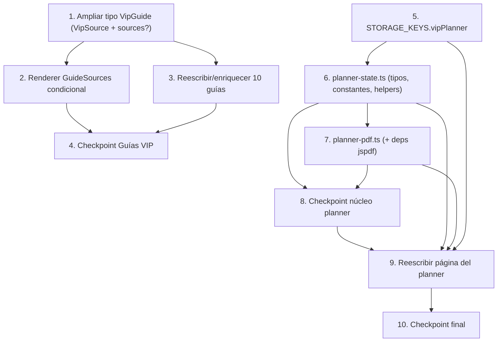

# Implementation Plan: Guías VIP enriquecidas + Planner editable con PDF

## Overview

Este plan implementa los dos objetivos del diseño en TypeScript/TSX (Next.js App Router + React `'use client'`), de forma incremental y orientada a código. El orden está pensado para validar lo más temprano posible: primero se amplía el tipo de datos (cambio aditivo y retrocompatible), luego el renderer condicional, después el contenido de las 10 guías; en paralelo conceptual, se construye el núcleo puro del planner (constantes + helpers server-safe), su generador de PDF en blanco, y finalmente se cablea la página editable. Cada bloque cierra con tests (unitarios + property-based con `fast-check`) que validan las propiedades de correctitud del diseño.

**Lenguaje de implementación:** TypeScript / TSX (definido por el diseño y el stack existente; no se requiere elección de lenguaje).

**Framework de tests:** Vitest + fast-check (ya disponibles en el proyecto).

### Mapa de propiedades de correctitud (del diseño → numeración usada en este plan)

Parte A (`design.md` §A.5):
- **Propiedad A1 — Retrocompatibilidad:** una guía sin `sources` se renderiza igual que antes.
- **Propiedad A2 — Renderizado condicional:** `GuideSources` aparece sii `sources` está definido y tiene ≥1 fuente válida.
- **Propiedad A3 — Unicidad de slug:** todos los `slug` de `VIP_GUIDES` son únicos.
- **Propiedad A4 — Integridad de navegación:** todo slug del hub resuelve vía `getVipGuide(slug)`.
- **Propiedad A5 — Validez de fuentes:** toda fuente tiene `label` no vacío y `url` http(s).

Parte B (`design.md` §B.8):
- **Propiedad B1 — Round-trip de persistencia:** `load(save(x)) ≡ x`.
- **Propiedad B2 — Inmutabilidad de `setCell`:** no muta el input; difiere solo en la celda objetivo.
- **Propiedad B3 — Forma fija:** toda fila tiene `length === 7` y están todas las `PlannerRowKey`.
- **Propiedad B4 — Fail-safe ante corrupción:** storage inválido → planner vacío normalizado, sin lanzar.
- **Propiedad B5 — SSR-safe:** helpers con `window` indefinido no lanzan (default en load, no-op en save).
- **Propiedad B6 — PDF independiente del estado:** el PDF en blanco es idéntico para cualquier `PlannerData`.
- **Propiedad B7 — No-op silencioso:** si `localStorage` lanza al escribir, no se propaga la excepción.

---

## Tasks

### Objetivo 1 — Guías VIP enriquecidas

- [x] 1. Ampliar el tipo de datos de guías de forma retrocompatible
  - [x] 1.1 Definir `VipSource` y extender `VipGuide` con `sources?`
    - En `lib/pwa/vip-content.ts`, agregar el tipo `VipSource = { label: string; url: string }` con doc-comment, estructuralmente idéntico a `BonusSource`/`GuideSource`.
    - Agregar el campo opcional `sources?: VipSource[]` al final del tipo `VipGuide`, sin reordenar ni alterar los campos existentes.
    - Verificar que `VipSource` es asignable a `GuideSource` sin casts (compatibilidad estructural).
    - _Requirements: 1.1, 1.2, 1.3, 1.4, 1.5_

  - [ ]* 1.2 Test de compatibilidad estructural y retrocompatibilidad del tipo
    - Test unitario que confirme que una guía sin `sources` sigue siendo válida y que un `VipSource[]` se pasa a un parámetro `GuideSource[]` sin conversión.
    - _Requirements: 1.3, 1.4, 1.5_

- [x] 2. Renderizado condicional de fuentes en la guía VIP
  - [x] 2.1 Integrar `GuideSources` condicional en el renderer `[slug]`
    - En `app/pwa/vip/guia/[slug]/page.tsx`, importar `GuideSources` desde `@/components/pwa/guias/GuideSources` (sin modificar el componente).
    - Renderizar el bloque como última sección de la guía, envuelto en `motion.div` con la variante `item`, solo cuando exista al menos una fuente válida (`label` 1–200 chars tras `trim`, `url` que empieza con `http://`/`https://` sin distinción de mayúsculas).
    - Filtrar y pasar únicamente las fuentes válidas (descartando inválidas) preservando su orden, hasta un máximo de 50.
    - No alterar el orden ni el estilo de las secciones existentes ni la identidad visual VIP (badge dorado / corona).
    - Conservar el estado "Contenido no encontrado" + enlace a `/pwa/vip` para slugs inexistentes (ya implementado; verificar que sigue intacto).
    - _Requirements: 2.1, 2.2, 2.3, 2.4, 2.5, 5.8_

  - [ ]* 2.2 Test de render condicional de `GuideSources`
    - **Propiedad A2 — Renderizado condicional**
    - Test de componente: guía con ≥1 fuente válida muestra `GuideSources`; guía sin `sources`, con array vacío, o solo con fuentes inválidas NO lo muestra (sin encabezado ni contenedor). Guía mixta muestra solo las válidas.
    - **Validates: Requirements 2.1, 2.2, 2.3**

- [x] 3. Reescribir y enriquecer las 10 guías VIP
  - [x] 3.1 Enriquecer las masterclasses
    - Reescribir `masterclass-sueno`, `masterclass-cortisol`, `masterclass-ejercicio`, `masterclass-ayuno` en `lib/pwa/vip-content.ts`.
    - Cada una: 6–8 secciones, intro ≥150 palabras, ≥1 sección "errores comunes / qué NO hacer" con ≥3 items, ≥1 sección con calendario o rutina paso a paso con ≥5 pasos, `sources` con ≥1 fuente, conteo total ≥800 palabras.
    - Tono "vos" consistente, ≥1 emoji por título de sección, términos técnicos explicados en 1–2 oraciones, ≥1 elemento concreto por sección, afirmaciones de salud parafraseadas (≤15 palabras consecutivas idénticas a la fuente) y respaldadas en `sources`.
    - _Requirements: 3.1, 3.5, 3.7, 3.8, 4.1, 4.2, 4.3, 4.4, 4.5_

  - [x] 3.2 Enriquecer los protocolos
    - Reescribir `anti-rebote` y `reintroduccion-alimentos`.
    - Cada uno: 6–8 secciones, ≥5 pasos secuenciales numerados, ≥1 checklist accionable con ≥4 items marcables, criterios explícitos de cuándo aplicar y cuándo NO aplicar, conteo ≥800 palabras, y `sources` con ≥1 fuente donde haya afirmaciones de salud.
    - Aplicar tono "vos", emojis por título, explicación de términos técnicos y ejemplos concretos.
    - _Requirements: 3.2, 3.3, 3.5, 3.7, 3.8, 4.1, 4.2, 4.3, 4.4, 4.5_

  - [x] 3.3 Enriquecer las mini-guías
    - Reescribir `deshincha-72h`, `en-viajes`, `cena-anti-rebote`, `snacks-que-desinflaman`.
    - Cada una: 5–6 secciones, ≥2 ejemplos concretos listos para copiar, ≥1 bloque de `items` por sección con ≥3 items, conteo ≥500 palabras.
    - Donde haya afirmaciones de salud incluir `sources`; donde solo haya orientación práctica, `sources` es opcional. Tono "vos", emojis por título, términos explicados, ejemplos concretos.
    - _Requirements: 3.4, 3.5, 3.7, 3.8, 4.1, 4.2, 4.3, 4.4, 4.5, 4.6_

  - [ ]* 3.4 Tests de calidad estructural de contenido (unitarios + property)
    - **Propiedad A3 — Unicidad de slug** y **Propiedad A5 — Validez de fuentes**
    - Property-test sobre `VIP_GUIDES`: todos los `slug` únicos (sensible a mayúsculas); toda `category` ∈ {`masterclass`,`mini-guia`,`protocolo`}; si `sources` existe, cada fuente tiene `label` no vacío tras `trim` y `url` http(s); cada guía cumple los mínimos de secciones/items/palabras de su categoría (incluyendo el caso de rechazo si 0 secciones/items/ejemplos).
    - Unitario: ≥1 emoji en cada título de sección de cada guía.
    - **Validates: Requirements 3.1, 3.2, 3.4, 3.6, 3.8, 4.2, 5.1, 5.3, 5.6**

  - [ ]* 3.5 Test de integridad de navegación del hub
    - **Propiedad A4 — Integridad de navegación** y **Propiedad A1 — Retrocompatibilidad**
    - Property-test: para todo slug listado por el hub / `getVipGuidesByCategory()`, `getVipGuide(slug)` resuelve a una guía válida; una guía sin `sources` produce el mismo render que antes del cambio (no aparece bloque de fuentes).
    - **Validates: Requirements 5.5, 2.2**

- [x] 4. Checkpoint — Guías VIP
  - Ensure all tests pass, ask the user if questions arise.

---

### Objetivo 2 — Planner editable con autoguardado y PDF en blanco

- [x] 5. Agregar la clave de storage centralizada
  - [x] 5.1 Añadir `STORAGE_KEYS.vipPlanner` en `lib/constants.ts`
    - Agregar `vipPlanner: 'pwa_vip_planner'` al objeto `STORAGE_KEYS` sin alterar las claves existentes.
    - _Requirements: 7.5_

- [x] 6. Construir el núcleo puro del planner (`lib/pwa/planner-state.ts`)
  - [x] 6.1 Definir tipos y constantes
    - Crear `lib/pwa/planner-state.ts` con `PlannerRowKey`, `PlannerDayIndex` (0..6), `PlannerData = Record<PlannerRowKey, string[]>`, `PlannerStored = { version: 1; data: PlannerData; updatedAt: string }`.
    - Exportar `PLANNER_DAYS` (7 días, `as const`) y `PLANNER_ROWS` (8 entradas `{ key, label }`) como fuente única compartida.
    - _Requirements: 6.1_

  - [x] 6.2 Implementar `createEmptyPlanner` y `setCell` (puros)
    - `createEmptyPlanner()`: función pura que devuelve un `PlannerData` con todas las `PlannerRowKey` presentes y cada fila como array nuevo e independiente de 7 strings vacíos.
    - `setCell(data, row, day, value)`: devuelve un nuevo `PlannerData` inmutable con solo la celda `(row, day)` en `value` y las demás 55 celdas intactas.
    - _Requirements: 6.4, 6.7, 10.2_

  - [ ]* 6.3 Property-test de `createEmptyPlanner` y `setCell`
    - **Propiedad B2 — Inmutabilidad de `setCell`** y **Propiedad B3 — Forma fija**
    - fast-check: para `(data, row, day, value)` arbitrarios, `setCell` no muta `data`, solo cambia la celda objetivo, y el resultado mantiene 7 entradas por fila con todas las keys. `createEmptyPlanner` produce siempre 8 filas × 7 vacíos con arrays independientes.
    - **Validates: Requirements 6.4, 6.7, 10.2**

  - [x] 6.4 Implementar `loadPlannerFromStorage`, `savePlannerToStorage`, `clearPlanner` (server-safe)
    - `loadPlannerFromStorage()`: SSR-safe (guard `typeof window === 'undefined'` → `createEmptyPlanner()`); parsea bajo `STORAGE_KEYS.vipPlanner`; normaliza (toda `PlannerRowKey` presente, índices ≥7 descartados, faltantes 0..6 rellenados con `""` → 7 por fila); ante JSON inválido/shape inválido devuelve `createEmptyPlanner()` sin lanzar y sin sobrescribir storage.
    - `savePlannerToStorage(data)`: SSR-safe (no-op si no hay `window`); persiste `{ version: 1, data, updatedAt: ISO }`; normaliza por las dudas; envuelve en try/catch silencioso ante errores de `localStorage`.
    - `clearPlanner()`: elimina la clave; server-safe; no lanza.
    - _Requirements: 7.3, 8.2, 8.3, 8.4, 8.5, 8.6, 10.1, 10.3, 10.4_

  - [ ]* 6.5 Property-test de round-trip, robustez y SSR-safe
    - **Propiedad B1 — Round-trip**, **Propiedad B4 — Fail-safe**, **Propiedad B5 — SSR-safe**, **Propiedad B7 — No-op silencioso**
    - fast-check: `∀ PlannerData` arbitrario, `load(save(x))` devuelve las mismas celdas; ante strings arbitrarios en storage `load` nunca lanza y devuelve forma válida (7 por fila, todas las keys); con `window` mockeado como ausente, `load` devuelve default y `save` es no-op; si `localStorage.setItem` lanza, `save` no propaga.
    - **Validates: Requirements 8.3, 8.6, 10.1, 10.3, 10.4**

- [x] 7. Generador de PDF en blanco (`lib/pwa/planner-pdf.ts`)
  - [x] 7.1 Agregar dependencias `jspdf` y `jspdf-autotable`
    - Añadir `jspdf` y `jspdf-autotable` a `dependencies` en `package.json` (versiones estables compatibles) y dejar nota para `npm install`.
    - _Requirements: 9.1, 9.5_

  - [x] 7.2 Implementar `generateBlankPlannerPdf` (client-only)
    - Crear `lib/pwa/planner-pdf.ts` con `generateBlankPlannerPdf(): Promise<void>`.
    - Importar `jspdf` y `jspdf-autotable` con `import()` dinámico dentro de la función (no en top-level), para no afectar SSR ni el bundle inicial.
    - Construir el documento en landscape: head `['', ...PLANNER_DAYS]`, body `PLANNER_ROWS.map(r => [r.label, '', '', '', '', '', '', ''])` (todas las celdas de datos vacías), usando solo las constantes (sin leer `PlannerData` ni `localStorage`).
    - Descargar como `planner-semanal-chau-hinchazon.pdf` vía `doc.save(...)`.
    - Propagar/exponer el error para que la página lo maneje si la generación falla (sin descargar archivo parcial).
    - _Requirements: 9.1, 9.2, 9.3, 9.4, 9.5, 9.7_

  - [ ]* 7.3 Test de PDF independiente del estado (mock de jsPDF)
    - **Propiedad B6 — PDF independiente del estado**
    - fast-check con `jspdf`/`jspdf-autotable` mockeados: para cualquier `PlannerData` o estado de `localStorage`, las llamadas de construcción del PDF (head/body) son idénticas y no leen el estado del usuario; el nombre de archivo y la orientación landscape son constantes.
    - **Validates: Requirements 9.2, 9.3, 9.4**

- [x] 8. Checkpoint — Núcleo del planner
  - Ensure all tests pass, ask the user if questions arise.

- [x] 9. Reescribir la página del planner editable (`app/pwa/vip/planner/page.tsx`)
  - [x] 9.1 Convertir a componente `'use client'` con hidratación SSR-safe
    - Estado inicial determinista `useState(() => createEmptyPlanner())` y flag `hydrated`.
    - `useEffect` post-montaje que hidrata con `loadPlannerFromStorage()` en una sola actualización (<100ms, sin renders intermedios visibles) y marca `hydrated = true`; no acceder a `window`/`localStorage` en SSR.
    - Si la lectura falla o devuelve datos inválidos, conservar el estado vacío y seguir renderizando.
    - _Requirements: 8.1, 11.1, 11.2, 11.3, 11.4, 11.5_

  - [x] 9.2 Implementar el grid editable 8×7 con inputs controlados
    - Renderizar tabla de 8 filas (`PLANNER_ROWS`) × 7 días (`PLANNER_DAYS`) = 56 celdas como `<textarea>`/`<input>` controlados (0–500 chars, `maxLength={500}`).
    - `handleCellChange(row, day, value)` que actualiza el estado vía `setCell` solo en respuesta a la escritura del usuario (no en init/hidratación), sin tocar las otras 55 celdas; borrar una celda la deja en `""`.
    - Mantener design system (badge dorado "👑 Planner premium", sage/coral/cream/charcoal/sand, animaciones `framer-motion`); `inputMode="numeric"` opcional en `agua`/`sintomas`.
    - _Requirements: 6.1, 6.2, 6.3, 6.5, 6.6, 6.7_

  - [x] 9.3 Autoguardado con debounce 400ms
    - `useEffect` dependiente de `[planner, hydrated]` que, solo si `hydrated`, programa `setTimeout` de 400ms para `savePlannerToStorage(planner)` y limpia el timer en cada cambio (reinicio del debounce).
    - No persistir antes de hidratar (evitar pisar datos con vacíos).
    - Si el guardado no puede completarse, conservar el estado en memoria y mostrar una indicación sutil de que el autoguardado falló.
    - _Requirements: 7.1, 7.2, 7.4, 7.6_

  - [x] 9.4 Botón de descarga de PDF en blanco
    - Botón "Descargar PDF en blanco" que invoca `generateBlankPlannerPdf()`.
    - Deshabilitar el botón mientras se genera/descarga (evitar descargas duplicadas) y rehabilitarlo al terminar.
    - Capturar el rechazo del `import()` dinámico o de la generación y mostrar un mensaje de error legible, sin recargar ni navegar fuera; mantener edición y guardado operativos mientras el error está visible.
    - _Requirements: 9.1, 9.6, 9.7, 10.5, 10.6_

  - [ ]* 9.5 Tests de integración del planner (component)
    - Escribir en una celda → estado actualizado → tras 400ms `localStorage` contiene el valor; remontar el componente → celdas rehidratadas con lo guardado; click en "Descargar PDF" invoca el generador (mock) sin leer `PlannerData`; render inicial SSR/cliente sin warning de hidratación; botón se deshabilita durante la descarga y se rehabilita ante error.
    - _Requirements: 7.1, 8.1, 9.1, 9.6, 11.1, 11.4_

- [x] 10. Checkpoint final — Ensure all tests pass
  - Ensure all tests pass, ask the user if questions arise.

---

## Task Dependency Graph

**Lectura del grafo:**
- Los dos objetivos son **independientes entre sí** y pueden desarrollarse en paralelo; convergen solo en su propio checkpoint.
- **Objetivo 1:** la ampliación del tipo (1) habilita tanto el renderer condicional (2) como la reescritura de contenido (3); ambos confluyen en el checkpoint (4).
- **Objetivo 2:** la clave de storage (5) precede al núcleo puro (6), que es prerrequisito del generador de PDF (7) y de la página (9). La página (9) es el paso de **wiring** que integra constantes, helpers de estado y generador de PDF, sin dejar código huérfano.

## Notes

- Las tareas marcadas con `*` son de testing (opcionales para un MVP rápido, pero recomendadas); el agente no las implementa automáticamente.
- Cada tarea referencia cláusulas de requisito granulares (Requisitos 1–11) para trazabilidad.
- Los property-tests usan `fast-check` con mínimo 100 iteraciones y referencian explícitamente las propiedades de correctitud del diseño (A1–A5, B1–B7).
- Los checkpoints aseguran validación incremental.
- No se incluyen tareas de despliegue, pruebas manuales de usuario ni actividades no-código (fuera de alcance de un agente de código).
