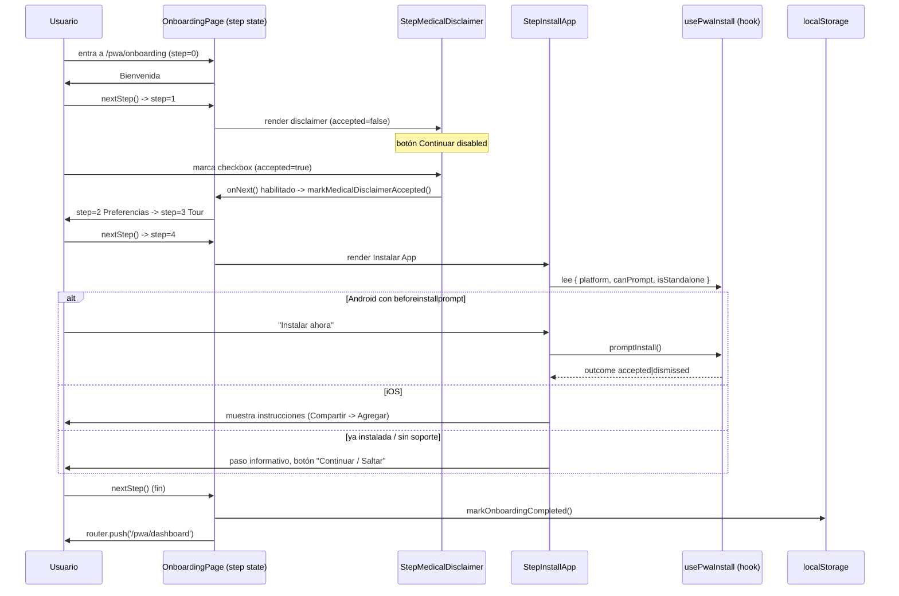

# Design Document: PWA Onboarding — Disclaimer Médico + Instalar App

## Overview

Se agregan dos pasos al flujo de onboarding de la PWA (`app/pwa/onboarding/page.tsx`): un **Disclaimer Médico bloqueante** (el botón "Continuar" queda deshabilitado hasta que se marque un checkbox de aceptación) y un **paso "Instalar App" no bloqueante** que reutiliza la lógica de `components/pwa/InstallPrompt.tsx` extraída a un hook `usePwaInstall`. El total de pasos pasa de 3 a 5 y los textos "Paso X de N" se derivan dinámicamente en lugar de estar hardcodeados.

## Main Algorithm/Workflow

Orden recomendado de los pasos (disclaimer temprano, instalación al final antes del dashboard):

| index | Paso | Bloqueante | Efecto al salir |
|-------|------|-----------|-----------------|
| 0 | Bienvenida | No | — |
| 1 | **Disclaimer Médico** (NUEVO) | **Sí** (checkbox) | `markMedicalDisclaimerAccepted()` |
| 2 | Preferencias dietéticas | No | `saveDietaryPreferences()` |
| 3 | Tour | No | — |
| 4 | **Instalar App** (NUEVO) | No (se puede saltar) | — |
| — | fin | — | `markOnboardingCompleted()` + `router.push('/pwa/dashboard')` |



## Core Interfaces/Types

```typescript
// ─── lib/pwa/use-pwa-install.ts (NUEVO hook, extrae la lógica de InstallPrompt) ───

/** Evento no estándar emitido por Chromium en Android/desktop. */
interface BeforeInstallPromptEvent extends Event {
  prompt(): Promise<void>;
  userChoice: Promise<{ outcome: 'accepted' | 'dismissed' }>;
}

type InstallPlatform = 'android' | 'ios' | 'standalone' | 'unsupported';

interface PwaInstallState {
  /** Plataforma/estado detectado, decide qué UI mostrar. */
  platform: InstallPlatform;
  /** true si existe un deferredPrompt capturado (Android/Chromium). */
  canPrompt: boolean;
  /** true si la app ya corre en display-mode: standalone. */
  isStandalone: boolean;
  /** Dispara el prompt nativo. Solo válido si canPrompt === true. */
  promptInstall: () => Promise<'accepted' | 'dismissed' | 'unavailable'>;
}

// ─── app/pwa/onboarding/page.tsx (tipos internos) ───

/** Un paso del onboarding. `blocking` indica si nextStep puede quedar gated. */
interface OnboardingStep {
  id: 'welcome' | 'disclaimer' | 'dietary' | 'tour' | 'install';
  blocking: boolean;
}

/** Config declarativa que reemplaza el TOTAL_STEPS = 3 hardcodeado. */
const ONBOARDING_STEPS: readonly OnboardingStep[];
// TOTAL_STEPS = ONBOARDING_STEPS.length  (= 5)
```

```typescript
// ─── lib/pwa/onboarding-state.ts (AMPLIADO) ───

/** Nueva key dedicada para el consentimiento del disclaimer médico. */
const MEDICAL_DISCLAIMER_KEY = 'pwa_medical_disclaimer_accepted';

function markMedicalDisclaimerAccepted(): void;
function isMedicalDisclaimerAccepted(): boolean;
// resetOnboarding() también limpia MEDICAL_DISCLAIMER_KEY.
```

## Key Functions with Formal Specifications

### Función 1: `usePwaInstall()`

```typescript
function usePwaInstall(): PwaInstallState
```

**Preconditions:**
- Se invoca dentro de un componente client-side (`'use client'`).
- `window` está disponible (efecto corre solo en cliente).

**Postconditions:**
- `platform === 'standalone'` si y solo si `window.matchMedia('(display-mode: standalone)').matches`.
- `platform === 'ios'` si el userAgent matchea `/iPad|iPhone|iPod/` y no es standalone.
- `platform === 'android'` cuando se capturó un evento `beforeinstallprompt`.
- `platform === 'unsupported'` en cualquier otro caso (ej: desktop sin prompt, navegador sin soporte).
- `canPrompt === true` si y solo si hay un `deferredPrompt` no nulo.
- No hay efectos secundarios sobre el DOM fuera del registro/desregistro del listener `beforeinstallprompt` (cleanup en unmount).

**Loop Invariants:** N/A (sin bucles).

### Función 2: `promptInstall()` (retornada por el hook)

```typescript
promptInstall(): Promise<'accepted' | 'dismissed' | 'unavailable'>
```

**Preconditions:**
- Ninguna estricta; es seguro llamarla en cualquier plataforma.

**Postconditions:**
- Si `canPrompt === false` o `deferredPrompt === null` → resuelve `'unavailable'` sin lanzar.
- Si `canPrompt === true` → invoca `deferredPrompt.prompt()`, espera `userChoice` y resuelve con `outcome`.
- Tras un intento (`accepted` o `dismissed`) el `deferredPrompt` se consume (se pone a null → `canPrompt` pasa a false).
- No lanza excepciones no controladas al consumidor.

**Loop Invariants:** N/A.

### Función 3: `nextStep()` (en OnboardingPage, refactor)

```typescript
function nextStep(): void
```

**Preconditions:**
- `step` es un índice válido: `0 <= step < ONBOARDING_STEPS.length`.
- Si `ONBOARDING_STEPS[step].blocking === true`, el gate correspondiente ya fue satisfecho (garantizado porque el botón que la invoca está deshabilitado hasta entonces).

**Postconditions:**
- Al salir del paso `disclaimer` → `isMedicalDisclaimerAccepted() === true`.
- Al salir del paso `dietary` → se persistieron las preferencias vía `saveDietaryPreferences()`.
- Si `step < TOTAL_STEPS - 1` → `step' === step + 1` y `direction === 1`.
- Si `step === TOTAL_STEPS - 1` → `markOnboardingCompleted()` fue llamado y se navega a `/pwa/dashboard`.
- El paso `install` NO impone ninguna precondición para avanzar (no bloqueante).

**Loop Invariants:** N/A.

### Función 4: `StepMedicalDisclaimer` (gating del checkbox)

```typescript
function StepMedicalDisclaimer(props: { onNext: () => void }): JSX.Element
```

**Preconditions:**
- `onNext` es una callback válida (avanza el onboarding).

**Postconditions:**
- Existe estado local `accepted: boolean` inicializado en `false`.
- El botón "Continuar" tiene `disabled === !accepted` en todo momento.
- `onNext` solo puede dispararse cuando `accepted === true`.
- El checkbox y el botón exponen atributos de accesibilidad (`aria-checked`, `aria-disabled`, asociación label/input).

**Loop Invariants:** N/A.

## Algorithmic Pseudocode

### Detección de plataforma de instalación (dentro de `usePwaInstall`)

```pascal
ALGORITHM detectInstallPlatform()
OUTPUT: state of type PwaInstallState

BEGIN
  // Efecto client-side (useEffect con deps [])
  IF window.matchMedia('(display-mode: standalone)').matches THEN
    platform ← 'standalone'
    RETURN   // no registrar listeners; ya está instalada
  END IF

  isIOSDevice ← REGEX_MATCH(navigator.userAgent, /iPad|iPhone|iPod/)
                 AND NOT window.MSStream
  IF isIOSDevice THEN
    platform ← 'ios'
    // iOS no soporta beforeinstallprompt: la UI mostrará instrucciones manuales
  ELSE
    platform ← 'unsupported'   // provisional hasta capturar el evento
    handler(e) ←
      BEGIN
        e.preventDefault()
        deferredPrompt ← e
        platform ← 'android'
        canPrompt ← true
      END
    window.addEventListener('beforeinstallprompt', handler)
    // cleanup: removeEventListener('beforeinstallprompt', handler)
  END IF
END
```

**Preconditions:** corre en cliente; `window`/`navigator` disponibles.
**Postconditions:** `platform` refleja el estado real; listener removido en cleanup.
**Loop Invariants:** N/A.

### Avance de pasos con gating declarativo

```pascal
ALGORITHM nextStep()
BEGIN
  direction ← 1
  currentId ← ONBOARDING_STEPS[step].id

  // Efectos de salida por paso
  IF currentId = 'disclaimer' THEN
    markMedicalDisclaimerAccepted()
  ELSE IF currentId = 'dietary' THEN
    saveDietaryPreferences(dietaryPrefs)
  END IF

  IF step < LENGTH(ONBOARDING_STEPS) - 1 THEN
    step ← step + 1
  ELSE
    markOnboardingCompleted()
    router.push('/pwa/dashboard')
  END IF
END
```

**Preconditions:** botón bloqueante ya validó el gate cuando aplica.
**Postconditions:** ver especificación de `nextStep()` arriba.
**Loop Invariants:** N/A.

### Progress dots dinámicos (reemplazo de "Paso X de N" hardcodeado)

```pascal
ALGORITHM renderProgress(step)
BEGIN
  total ← LENGTH(ONBOARDING_STEPS)
  ariaLabel ← "Paso " + (step + 1) + " de " + total
  FOR i ← 0 TO total - 1 DO
    IF i = step THEN estilo ← activo(ancho grande)
    ELSE IF i < step THEN estilo ← completado
    ELSE estilo ← pendiente
    END IF
  END FOR
  // Los sub-headers internos ("Paso 2 de 3", "Paso 3 de 3") se reemplazan
  // por `Paso ${step + 1} de ${total}` en cada StepXxx.
END
```

**Loop Invariants:** en cada iteración, todos los índices `< i` ya recibieron su estilo correcto.

## Example Usage

```typescript
// ─── lib/pwa/onboarding-state.ts (adición) ───
const MEDICAL_DISCLAIMER_KEY = 'pwa_medical_disclaimer_accepted';

export function markMedicalDisclaimerAccepted(): void {
  if (typeof window === 'undefined') return;
  try {
    localStorage.setItem(MEDICAL_DISCLAIMER_KEY, 'true');
  } catch {
    /* noop: si localStorage está bloqueado, el consentimiento se re-pedirá */
  }
}

export function isMedicalDisclaimerAccepted(): boolean {
  if (typeof window === 'undefined') return false;
  try {
    return localStorage.getItem(MEDICAL_DISCLAIMER_KEY) === 'true';
  } catch {
    return false;
  }
}
```

```typescript
// ─── StepMedicalDisclaimer: gating con checkbox + accesibilidad ───
function StepMedicalDisclaimer({ onNext }: { onNext: () => void }) {
  const [accepted, setAccepted] = useState(false);

  return (
    <div className="space-y-6">
      <div className="text-center">
        <p className="font-body text-charcoal/60 text-sm mb-1">Paso 2 de 5</p>
        <h1 className="font-heading text-2xl font-semibold text-charcoal">
          Antes de empezar
        </h1>
      </div>

      <div className="bg-warm rounded-2xl p-6 border border-warm-border text-left space-y-3">
        <p className="font-body text-sm text-charcoal/80 leading-relaxed">
          Este plan es de carácter informativo y de bienestar general.{' '}
          <strong className="text-charcoal">
            Si tenés alguna enfermedad o condición médica, consultá a tu médico
            antes de comenzar el plan.
          </strong>{' '}
          No reemplaza el consejo, diagnóstico ni tratamiento profesional.
        </p>
      </div>

      {/* Checkbox de aceptación — label asociado + aria */}
      <label className="flex items-start gap-3 cursor-pointer">
        <input
          type="checkbox"
          checked={accepted}
          onChange={(e) => setAccepted(e.target.checked)}
          aria-checked={accepted}
          className="mt-1 w-5 h-5 accent-terracotta"
        />
        <span className="font-body text-sm text-charcoal/80">
          Leí y acepto el aviso médico.
        </span>
      </label>

      <Button
        variant="primary"
        onClick={onNext}
        disabled={!accepted}
        aria-disabled={!accepted}
        className="w-full"
      >
        Continuar →
      </Button>
    </div>
  );
}
```

```typescript
// ─── StepInstallApp: no bloqueante, reutiliza usePwaInstall ───
function StepInstallApp({ onNext }: { onNext: () => void }) {
  const { platform, canPrompt, promptInstall } = usePwaInstall();
  const [showIOSHelp, setShowIOSHelp] = useState(false);

  async function handleInstall() {
    if (platform === 'ios') { setShowIOSHelp(true); return; }
    const outcome = await promptInstall();
    if (outcome === 'accepted') onNext(); // instalada: avanzar
  }

  const skipLabel =
    platform === 'standalone' ? 'Ya está instalada, continuar →' : 'Saltar por ahora';

  return (
    <div className="space-y-6">
      <p className="font-body text-charcoal/60 text-sm mb-1">Paso 5 de 5</p>
      {/* Android/soporte nativo */}
      {canPrompt && (
        <Button variant="primary" onClick={handleInstall} className="w-full">
          Instalar ahora
        </Button>
      )}
      {/* iOS: instrucciones manuales (Compartir → Agregar a inicio → Agregar) */}
      {platform === 'ios' && (
        <Button variant="primary" onClick={handleInstall} className="w-full">
          Ver instrucciones
        </Button>
      )}
      {/* Siempre disponible: el paso NO bloquea */}
      <Button variant="ghost" onClick={onNext} className="w-full">
        {skipLabel}
      </Button>
    </div>
  );
}
```

```typescript
// ─── Refactor de InstallPrompt.tsx para consumir el hook (evita duplicación) ───
// InstallPrompt sigue siendo el banner flotante global, pero delega la
// detección/prompt a usePwaInstall en lugar de tener su propio useEffect.
export default function InstallPrompt() {
  const { platform, canPrompt, promptInstall } = usePwaInstall();
  // ...banner + modal iOS + key `pwa-install-dismissed` (ventana 7 días) sin cambios.
}
```

## Correctness Properties

```typescript
// P1 — El disclaimer bloquea el avance hasta aceptar.
// ∀ render del paso disclaimer: botón.disabled === !accepted
assert(disclaimerButton.disabled === !accepted);

// P2 — No se puede completar onboarding sin haber aceptado el disclaimer.
// ∀ ejecución que llega a markOnboardingCompleted():
assert(isMedicalDisclaimerAccepted() === true);

// P3 — El consentimiento se persiste al salir del paso disclaimer.
// salir(disclaimer) ⟹ isMedicalDisclaimerAccepted() === true
assert.eventually(isMedicalDisclaimerAccepted());

// P4 — El paso de instalación nunca bloquea el avance.
// ∀ platform ∈ {android, ios, standalone, unsupported}:
//   existe un control visible que invoca onNext().
assert(installStep.hasEnabledAdvanceControl === true);

// P5 — promptInstall es total (nunca lanza) y consume el deferredPrompt.
// ∀ estado: promptInstall() ∈ {accepted, dismissed, unavailable}
const r = await promptInstall();
assert(['accepted', 'dismissed', 'unavailable'].includes(r));
assert(canPromptAfter === false); // tras un intento real

// P6 — Los indicadores de progreso son consistentes con el total dinámico.
// ∀ step: dotsRenderizados === ONBOARDING_STEPS.length
//         ∧ ariaLabel === `Paso ${step+1} de ${ONBOARDING_STEPS.length}`
assert(progressDots.length === ONBOARDING_STEPS.length);

// P7 — Sin duplicación de lógica de instalación:
//   la detección de standalone/iOS/beforeinstallprompt vive SOLO en usePwaInstall.
// (propiedad estructural verificable por revisión / grep)
```

## Dependencies

- **framer-motion** — animaciones de transición entre pasos (ya en uso).
- **next/navigation** (`useRouter`) — navegación al dashboard (ya en uso).
- **@/components/pwa/ui/Button**, **@/components/pwa/ui/Icon** (`download`/`close`/`share`) — UI (ya existentes).
- **@/lib/pwa/onboarding-state** — ampliado con la key `pwa_medical_disclaimer_accepted`.
- **@/lib/pwa/dietary-preferences** — sin cambios.
- Nuevo módulo: **@/lib/pwa/use-pwa-install** (hook extraído desde `InstallPrompt.tsx`).
- API de plataforma: evento `beforeinstallprompt` (Chromium/Android), `matchMedia('(display-mode: standalone)')`, `navigator.userAgent` (detección iOS). Tokens de diseño: terracotta, warm, charcoal, warm-border, terracotta-soft.
