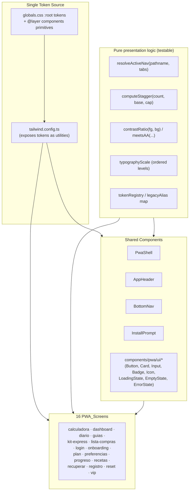

# Design Document

## Overview

This design describes a **presentation-layer overhaul** of the PWA under `app/pwa`. The goal is to raise visual quality, consistency, and polish by collapsing the two parallel color systems into one authoritative design system (the terracotta/warm family) and applying it uniformly across all PWA_Screens and Shared_Components — **without changing routing, data logic, persisted data, or flow outcomes**.

The work is organized around three ideas:

1. **One token source of truth.** `app/globals.css` already declares CSS custom properties and `tailwind.config.ts` already exposes them as Tailwind utilities. We keep this single source, make the terracotta/warm family canonical, and **re-map the legacy `sage/cream/coral/sand` tokens onto current terracotta/warm values** so that existing class names keep working but render the current palette. This lets us migrate screens incrementally with zero behavioral risk.
2. **Thin, testable presentation logic.** Most of the change is styling (className edits), which is verified by snapshot/example tests. But a handful of decisions are genuine *logic* — which bottom-nav item is active, how list-entrance stagger delays are computed and capped, whether a token color pair meets a contrast threshold, whether the typographic scale decreases monotonically. We **extract these into small pure functions** so they can be property-tested with `fast-check`.
3. **Shared styling primitives.** Rather than hand-rolling button/card/input/badge styles on every screen, we centralize them as documented Tailwind component classes (in `globals.css` `@layer components`) and/or thin React wrappers in `components/pwa/ui`, so every screen consumes identical styling tokens.

### Research Findings

Findings gathered by inspecting the actual repository:

- **Two palettes coexist.** `tailwind.config.ts` and `globals.css` both define the current terracotta/warm tokens *and* legacy `sage`, `cream`, `coral`, `sand` tokens. PWA screens render the legacy palette (e.g. `bg-cream`, `text-sage`, `bg-sage-soft`, `border-sand`, `text-coral`, `bg-coral-soft`), while the design intent (theme color `#C0553A`, CTA shadows, quiz components) is terracotta. This is the root cause of the fragmentation called out in the requirements.
- **Typography utility names diverge and one is broken.** `tailwind.config.ts` defines `fontFamily.serif` and `fontFamily.sans` only. Screens such as `dashboard` and `diario` use `font-serif`; `AppHeader` and `login` use `font-heading` — **which is not defined in the Tailwind config and silently falls back to the default sans stack.** So headings are visually inconsistent today.
- **Icons are ad-hoc emoji.** Dashboard, BottomNav, diario, etc. use emoji glyphs (🏠 📋 📊 🍽️ 📚 👑 🌾 ✅ 📝 🔥 🧬 …). `InstallPrompt` uses inline hand-written SVG paths. The dependency `@phosphor-icons/react` (^2.1.7) is already installed and unused in the PWA — an ideal single icon set.
- **Navigation chrome.** `BottomNav` distinguishes the active tab by color alone (`text-sage` vs `text-charcoal/40`), has no `aria-current`, and renders `pb-safe` for the bottom Safe_Area. `PwaShell` already omits header + nav on the Auth_Screens (`/pwa/login`, `/pwa/registro`, `/pwa/recuperar`, `/pwa/reset`). `BottomNav` active detection uses `pathname.startsWith(tab.href)`.
- **Motion.** `framer-motion` (^11) is used with `staggerChildren: 0.07` (70 ms — already inside the target 40–80 ms band) and per-item durations ~0.35 s. `globals.css` already has a global `@media (prefers-reduced-motion: reduce)` block that neutralizes animation/transition durations.
- **Loading/empty/error today.** Patterns exist but are inconsistent: `diario` uses `animate-pulse` skeletons colored `bg-sage-soft`, an emoji empty state, and `login` shows an error as `text-coral` text. There is no shared treatment.
- **Layout.** `PwaShell` constrains content to `max-w-md` (448 px, well under the 768 px max) and `px-4` (16 px page margin). Auth screens use `max-w-sm`. The viewport is locked (`maximumScale: 1, userScalable: false`).
- **Available tooling.** `fast-check` ^3.23.1, `vitest` ^2.1.8, `@testing-library/react` + `jsdom` are present. Per-file `// @vitest-environment jsdom` opt-in is already the project convention.

### Non-Goals

- No route, data-fetch, persistence, or business-logic changes (Requirement 12).
- No new backend, no schema changes, no copy rewrites beyond what a state pattern requires (e.g. adding an error message string).
- No dark mode.

## Architecture

### Layered structure



### Migration strategy (behavior-preserving)

The risky part of "replace the palette everywhere" is touching 16 screens. We de-risk it with a **two-track approach**:

1. **Alias track (instant, global).** Re-point the legacy CSS variables and the legacy Tailwind color entries so they resolve to terracotta/warm values. After this single change, every existing `bg-cream`/`text-sage`/`border-sand` class renders the current palette without editing any screen. This satisfies Requirements 1.3 and 1.6 immediately and guarantees no class becomes undefined.
2. **Canonicalization track (incremental, per screen).** Screen by screen, replace legacy class names with canonical token utilities and shared UI primitives, swap emoji for the icon component, and apply the typography scale. Because the alias track already guarantees correct colors, each screen edit is low-risk and independently shippable.

Both tracks are presentation-only: no JSX that affects routing, event handlers, or data is altered except to add accessibility attributes (e.g. `aria-current`, `aria-live`, label associations) and to wire the new state components.

### Typography utility consolidation

We standardize on **`font-heading`** and **`font-body`** as the two canonical family utilities, because:

- `font-heading` is already used in the most "shell-level" components (AppHeader, login) and is the more semantic name.
- We add `font-heading` and `font-body` to `tailwind.config.ts` `fontFamily`, both pointing to the existing DM Serif Display / Plus Jakarta Sans stacks. We keep `font-serif`/`font-sans` as aliases to the same stacks so no current screen breaks, then migrate occurrences of `font-serif` → `font-heading`. This fixes the currently-broken `font-heading` (Requirements 2.5, 2.6).

## Components and Interfaces

### New pure-logic module: `lib/pwa/ui/` 

These functions contain the only non-trivial presentation *logic* and are the focus of property-based testing. They are pure (no DOM, no I/O).

#### `resolveActiveNav(pathname, tabs)`

```ts
interface NavTab { href: string; label: string; iconName: string; }

/**
 * Returns the index of the single active tab, or -1 if none match.
 * A tab matches when pathname === tab.href or pathname starts with tab.href + "/".
 * When multiple tabs match (nested hrefs), the LONGEST (most specific) href wins,
 * guaranteeing at most one active tab.
 */
function resolveActiveNav(pathname: string, tabs: NavTab[]): number
```

Replaces the inline `pathname.startsWith(tab.href)` logic in `BottomNav`. The "longest match wins" rule guarantees exactly-one-or-zero active items (Requirements 6.3, 6.5, 6.6). `BottomNav` then renders the active item with **two cues**: terracotta color **and** a non-color cue (a top indicator bar + bold label weight), plus `aria-current="page"` (Requirements 6.3, 6.4).

#### `computeStagger(count, baseDelayMs, capMs)`

```ts
/**
 * Returns an array of entrance delays (ms), one per item.
 * - Inter-item delay equals baseDelayMs (clamped to [40, 80]) until the cap.
 * - The last item's delay never exceeds capMs (default 800).
 * - When count * baseDelay would exceed cap, delays are compressed so
 *   delays[count-1] <= capMs while remaining monotonically non-decreasing.
 */
function computeStagger(count: number, baseDelayMs?: number, capMs?: number): number[]
```

Centralizes the stagger rules (Requirements 10.2, 10.3). All screens that animate a list (dashboard cards, recetas list, guias list, lista-compras, plan) feed `framer-motion` `transition.delay` from this function instead of hard-coded values.

#### `contrastRatio(fg, bg)` and `meetsContrast(fg, bg, level)`

```ts
function contrastRatio(fg: string, bg: string): number; // WCAG 2.1 ratio, 1..21
function meetsContrast(fg: string, bg: string, level: 'AA-normal' | 'AA-large' | 'UI'): boolean;
// thresholds: AA-normal = 4.5, AA-large = 3.0, UI = 3.0
```

Pure color math used by tests to assert token pairings meet Requirement 3, and reusable at build/dev time to guard the token registry.

#### `tokenRegistry` and `legacyAlias`

```ts
// Canonical token names grouped by the six required categories.
const tokenRegistry: {
  color:   Record<string, string>;   // hex values
  font:    Record<string, string>;   // family stacks
  spacing: Record<string, string>;   // rem steps
  radius:  Record<string, string>;   // px
  shadow:  Record<string, string>;   // css shadow
  motion:  Record<string, string>;   // durations + easings
};

// Every legacy token name maps to a canonical color token name.
const legacyAlias: Record<string, keyof typeof tokenRegistry.color>;
```

This is a TypeScript mirror of the CSS/Tailwind tokens, used purely so tests can assert: every category is non-empty (1.1), every legacy alias resolves to a current value (1.3, 1.6), and designated text/background pairs meet contrast (3.x).

#### `typographyScale`

```ts
type ScaleLevel = 'pageTitle' | 'sectionHeading' | 'body' | 'caption';
interface ScaleEntry { fontSizePx: number; fontWeight: number; lineHeight: number; family: 'heading' | 'body'; }
const typographyScale: Record<ScaleLevel, ScaleEntry>;
const SCALE_ORDER: ScaleLevel[] = ['pageTitle', 'sectionHeading', 'body', 'caption'];
```

Defines the four named levels (Requirement 2.3, 2.4). Body level `fontSizePx >= 16` (2.2).

### Shared UI primitives: `components/pwa/ui/`

Thin, presentational React components that consume only tokens. Each renders standard markup so behavior is unchanged; they exist to guarantee one consistent style per element type.

| Component | Purpose | Key requirements |
|---|---|---|
| `Button` (`variant: 'primary' \| 'outline'`, `disabled`) | One primary-action style; disabled style + `aria-disabled` | 5.1, 5.4, 5.5, 5.6, 5.7, 11.1, 11.5 |
| `Card` | One card style (bg, border, radius, shadow) | 5.3, 4.4 |
| `TextInput` (requires `id` + `label`) | One input style with programmatically linked `<label>` | 5.2, 11.3 |
| `Badge` (`tone: 'neutral' \| 'success' \| 'warning' \| 'error'`) | One badge style; status via token + text/icon | 5.8, 3.5, 3.7 |
| `Icon` (`name`, `size`, `label?`, `decorative?`) | Wraps Phosphor; one set, token size + color | 7.1–7.5 |
| `LoadingState` | Token-styled skeleton/spinner with `aria-busy`/`role="status"` | 9.1, 9.4, 9.5 |
| `EmptyState` (`message`, `action`) | Explanatory text + next-action control | 9.2, 9.4 |
| `ErrorState` (`message`, `onRetry`, `onDismiss?`) | Names failed action + retry/dismiss; preserves inputs | 9.3, 9.7 |

`Icon` maps a small enumerated set of `name`s (e.g. `home`, `plan`, `diary`, `recipes`, `guides`, `vip`, `streak`, `back`, `add`, `close`, `share`, `download`, `success`, `warning`, `error`, `info`) to Phosphor icon components, rendered at a token size (`--icon-sm`/`--icon-md`/`--icon-lg`). Decorative icons get `aria-hidden="true"`; meaningful icons get an accessible label (7.4, 7.5).

### Shared component updates

- **`PwaShell`** — unchanged logic; the Auth_Screen omission of header/nav already satisfies 6.8. Verified, not rewritten.
- **`AppHeader`** — restyle to canonical tokens, fix `font-heading`, replace the avatar/emoji with `Icon` where applicable (6.1).
- **`BottomNav`** — consume `resolveActiveNav`; render two-cue active state + `aria-current`; replace emoji with `Icon`; keep `pb-safe` (6.1–6.7, 7.x).
- **`InstallPrompt`** — restyle to tokens; replace inline SVG with `Icon`; keep all install logic intact.

### Responsive strategy

- Mobile-first. Single column below 640 px (8.2) — the existing `max-w-md` shell is already single column; multi-column grids (e.g. dashboard 2-col) use `grid-cols-2` which is acceptable as it is not "primary content columns"; we keep `<640px` content single-column where a requirement-relevant primary flow is involved.
- Breakpoints standardized on Tailwind defaults `sm:640 md:768 lg:1024` (8.4).
- Content max width ≤ 768 px and centered (4.2) — shell `max-w-md mx-auto` satisfies this.
- Safe areas via `env(safe-area-inset-*)` utilities (`pb-safe` for nav, top inset for header) (8.3, 6.7).
- Media: `max-width:100%; height:auto` defaults applied in `globals.css` base layer (8.5).
- No horizontal overflow 320–1920 px (8.1) — enforced by single-column + `max-w` + `overflow-x` guards.

## Data Models

This is a presentation feature; there are no persisted data models. The "models" are the design-token and configuration shapes consumed by components and tests.

### Design Token categories (single source: `globals.css` `:root` + `tailwind.config.ts`)

```
ColorTokens     terracotta{DEFAULT,soft,dark,light}, warm{DEFAULT,border},
                charcoal, muted{DEFAULT,light}, status{success,warning,error}
FontTokens      heading (DM Serif Display stack), body (Plus Jakarta Sans stack)
SpacingTokens   space-1,2,3,4,6,8,12,16,24  (page margin = space-4 = 16px)
RadiusTokens    sm,md,lg,xl,2xl,full
ShadowTokens    sm,md,lg,xl,cta
MotionTokens    duration-fast(150ms), duration-base(300ms), duration-slow(500ms),
                stagger-step(60ms), stagger-cap(800ms),
                ease-standard, ease-emphasized
```

### Legacy alias mapping (Requirements 1.3, 1.6)

| Legacy token | Canonical target |
|---|---|
| `sage`, `sage-dark` | `terracotta`, `terracotta-dark` |
| `sage-soft` | `terracotta-soft` |
| `coral`, `coral-soft` | `terracotta-light`, `terracotta-soft` |
| `cream`, `cream-warm` | `warm`, `warm-border` |
| `sand` | `warm-border` |

Each legacy CSS var and Tailwind color is redefined to the canonical hex, so both names resolve to an identical visual result and the current palette always wins.

### Typographic scale (Requirement 2.3)

| Level | Family | Size (px) | Weight | Line height |
|---|---|---|---|---|
| pageTitle | heading | 30 | 600 | 1.15 |
| sectionHeading | heading | 20 | 600 | 1.3 |
| body | body | 16 | 400 | 1.6 |
| caption | body | 13 | 500 | 1.4 |

Sizes strictly decrease in scale order; body ≥ 16 px.

### NavTab model (BottomNav)

```ts
{ href: '/pwa/dashboard', label: 'Inicio',   iconName: 'home'    }
{ href: '/pwa/plan',      label: 'Plan',      iconName: 'plan'    }
{ href: '/pwa/diario',    label: 'Diario',    iconName: 'diary'   }
{ href: '/pwa/recetas',   label: 'Recetas',   iconName: 'recipes' }
{ href: '/pwa/guias',     label: 'Guías',     iconName: 'guides'  }
{ href: '/pwa/vip',       label: 'VIP',       iconName: 'vip'     } // conditional
```

### UI state model (Loading / Empty / Error)

```ts
type AsyncView<T> =
  | { phase: 'loading' }
  | { phase: 'empty' }
  | { phase: 'error'; failedAction: string; retainedInput?: unknown }
  | { phase: 'ready'; data: T };
```

Screens already hold equivalent local state (e.g. `isLoaded`, `status`, `errorMsg`); this model documents the consistent shape the shared state components render against. No persisted values change (Requirement 12.4).


## Correctness Properties

*A property is a characteristic or behavior that should hold true across all valid executions of a system — essentially, a formal statement about what the system should do. Properties serve as the bridge between human-readable specifications and machine-verifiable correctness guarantees.*

Although this is primarily a presentation effort (most criteria are verified with snapshot/example tests — see Testing Strategy), the design deliberately extracts the non-trivial decisions into pure functions and data structures. Those are universally quantifiable and are captured below as property-based tests. The properties were derived from the prework analysis and consolidated to remove redundancy (e.g. all contrast criteria collapse into one parameterized property; the two nav-resolver facets into one; the two stagger facets into one).

### Property 1: Token registry is complete across all six categories

*For all* six required token categories (color, font/typography, spacing, radius, shadow, motion), the single token registry contains that category and the category has at least one named token.

**Validates: Requirements 1.1**

### Property 2: Every legacy token resolves to the current terracotta/warm value

*For any* legacy token name in the alias map, resolving that name yields exactly the hex/value of its canonical current token, so both names produce an identical visual result and the current palette always takes precedence over the legacy sage/cream/coral/sand palette.

**Validates: Requirements 1.3, 1.6**

### Property 3: Typographic scale is monotonic and body meets the minimum size

*For any* two adjacent levels in the scale order (pageTitle → sectionHeading → body → caption), the earlier level's font size is strictly greater than the later level's, all four levels are present with distinct size/weight/line-height triples, and the body level's font size is at least 16 CSS pixels.

**Validates: Requirements 2.2, 2.3**

### Property 4: Approved token color pairs meet their contrast threshold

*For any* designated foreground/background token pair in the approved pairings set, the WCAG 2.1 contrast ratio computed by `contrastRatio` is at least the threshold required for that pair's role (4.5 for normal body text and status-as-normal-text, 3.0 for large text, interactive boundaries/text, active-state changes, and focus indicators).

**Validates: Requirements 3.1, 3.2, 3.3, 3.6, 5.4, 11.2**

### Property 5: At most one navigation item is active, and none when no route matches

*For any* pathname and any list of navigation tabs, `resolveActiveNav` returns either the index of exactly one tab (the longest/most-specific matching href when several match) or `-1` when no tab href is a prefix of the pathname — never more than one active item.

**Validates: Requirements 6.5, 6.6**

### Property 6: Auth routes omit chrome; non-auth PWA routes include it

*For any* auth route or sub-path (`/pwa/login`, `/pwa/registro`, `/pwa/recuperar`, `/pwa/reset`), the shell route classifier reports it as an auth route (header and BottomNav omitted), and *for any* other `/pwa/*` route it reports non-auth (chrome present).

**Validates: Requirements 6.8**

### Property 7: Breakpoint classification is total and consistent

*For any* viewport width in the range 320–1920 px, `resolveBreakpoint` returns exactly one breakpoint band, and the mapping is monotonic and consistent with the 640/768/1024 px thresholds (a smaller width never maps to a larger band).

**Validates: Requirements 8.4**

### Property 8: List entrance stagger stays within band and within the cap

*For any* item count, `computeStagger` produces a non-decreasing sequence of entrance delays whose pre-cap inter-item difference is a single consistent value within 40–80 ms, and whose maximum (last item's) delay never exceeds 800 ms.

**Validates: Requirements 10.2, 10.3**

### Property 9: Motion durations respect their upper bounds

*For any* motion token classified as an entrance/transition, its duration is at most 600 ms, and *for any* motion token flagged as essential (retained under reduced motion), its duration is at most 200 ms.

**Validates: Requirements 10.5, 10.6**

### Property 10: Text inputs are always associated with a visible label

*For any* id and label text, the `TextInput` primitive renders a `<label>` whose `htmlFor` equals the input's `id` and whose text content is the provided visible label, so the input is always programmatically and visibly labeled.

**Validates: Requirements 5.2, 11.3**

### Property 11: Icon accessibility matches its role

*For any* icon, when it is decorative it is hidden from assistive technology (`aria-hidden="true"`, no accessible name); when it carries a non-empty label and is not decorative, it exposes exactly that label as its accessible name and is not hidden from assistive technology.

**Validates: Requirements 7.4, 7.5**

### Property 12: Empty state always offers explanation and a next action

*For any* message text and action descriptor, the `EmptyState` primitive renders the explanatory text and a focusable interactive control for the suggested next action.

**Validates: Requirements 9.2**

### Property 13: Error state names the failed action, offers recovery, and preserves input

*For any* failed-action label and any user-entered input value, the `ErrorState` primitive renders a message identifying the failed action, exposes a retry and/or dismiss control, and returns the user-entered input unchanged so no data is lost.

**Validates: Requirements 9.3, 12.5**

### Property 14: Persistence is byte-for-byte preserved

*For any* generated user data (diary logs, day progress, microbiota assessments, onboarding flag), the existing persistence helpers produce identical localStorage keys and serialized values after the visual changes as before, confirming the presentation overhaul does not alter persisted data.

**Validates: Requirements 12.4**

## Error Handling

Because no data or control flow changes, error handling is about **presenting** failures consistently, not introducing new failure modes.

- **Action failures (forms, mutations).** Each flow that can fail (login, registro, recuperar, reset, diary entry save, plan progression) renders the shared `ErrorState`/inline error treatment: a human-readable message naming the failed action, a retry and/or dismiss control, and **retention of user-entered input** (form fields keep their values; the component never clears state on error). This standardizes the current ad-hoc `text-coral` message in `login` (Requirements 9.3, 9.7, 12.5).
- **Data retrieval failures.** Where a screen fetches required data, the `AsyncView` model transitions `loading → error` and renders `ErrorState` with a retry control that re-invokes the same fetch (Requirement 9.7). Screens that currently only model `loading/ready` (e.g. `diario` `isLoaded`) gain an explicit error branch without changing their fetch logic.
- **Empty data.** `empty` phase renders `EmptyState` with explanatory text and a next-action control (e.g. "Nuevo registro") (Requirement 9.2).
- **Icon/asset fallback.** The `Icon` component maps a fixed enum of names to Phosphor icons; an unknown name resolves to a safe default and logs in dev, never throwing.
- **Token integrity.** A dev-time check (and a unit test) asserts that every token referenced by name exists in the registry, so a typo'd token name is caught early rather than rendering an undefined value (Requirement 1.5).
- **Reduced motion.** The global `prefers-reduced-motion` block remains the safety net; the `computeStagger`/motion helpers additionally short-circuit to final-state (zero effective delay) when reduced motion is reported (Requirements 10.4, 10.5).
- **Regression safety.** Behavior-preservation tests (route set, nav targets, persistence serialization) act as guardrails so a styling edit that accidentally changes a target or storage key fails CI (Requirements 12.1–12.4).

## Testing Strategy

### Approach

A **dual approach**: property-based tests for the extracted pure logic and data, and example/snapshot/integration tests for the styling and behavior-preservation surface. This split matters because most acceptance criteria are about *how things look* (best verified by snapshot/DOM assertions), while a minority are genuine input-varying *logic* (best verified by properties).

### Property-based tests (`fast-check` + `vitest`)

- Library: **`fast-check`** (already a dev dependency). Do not hand-roll generators-from-scratch beyond domain arbitraries.
- **Minimum 100 iterations** per property (`fc.assert(fc.property(...), { numRuns: 100 })`).
- Each test is tagged with a comment in the format:
  `// Feature: pwa-visual-improvements, Property {number}: {property_text}`
- Each property in the Correctness Properties section maps to **exactly one** property-based test:
  - P1 token registry completeness — over category keys.
  - P2 legacy alias resolution — over the alias map entries.
  - P3 typography scale — over adjacent level pairs / arbitrary permutations to confirm strict monotonic decrease.
  - P4 contrast — over the approved foreground/background token-pair set, asserting `contrastRatio >= threshold(role)`; generators also produce arbitrary hex pairs to validate `contrastRatio` math symmetry/bounds (1–21).
  - P5 nav resolver — over arbitrary pathnames and tab lists (including nested/duplicate hrefs); assert active count ∈ {0,1} and longest-match wins.
  - P6 auth-route classifier — over generated `/pwa/*` paths including auth routes and sub-paths.
  - P7 breakpoint classifier — over integer widths in [320,1920]; assert totality + monotonicity around 640/768/1024.
  - P8 stagger — over item counts (incl. >10 and large); assert band, uniformity pre-cap, monotonicity, cap ≤ 800.
  - P9 motion bounds — over the motion-token table partitioned by role.
  - P10 TextInput label association — over arbitrary id/label strings (jsdom), assert `label[for] === input.id`.
  - P11 Icon accessibility — over arbitrary labels × {decorative,meaningful} (jsdom).
  - P12 EmptyState — over arbitrary message/action props (jsdom).
  - P13 ErrorState — over arbitrary failedAction strings + input values (jsdom); assert message present, control present, input echoed back unchanged.
  - P14 persistence preservation — over generated domain data; serialize via existing helpers and assert keys/values equal a frozen baseline snapshot.

DOM-touching properties (P10–P13) use the per-file `// @vitest-environment jsdom` opt-in already used in the repo, with `@testing-library/react`.

### Example, snapshot, and integration tests

These cover the criteria classified as EXAMPLE/INTEGRATION/SMOKE in the prework:

- **Snapshot tests** for shared primitives (`Button`, `Card`, `TextInput`, `Badge`, `Icon`, `LoadingState`, `EmptyState`, `ErrorState`) to lock one consistent style per element type and consistent state treatments across screens (Requirements 1.4, 4.4, 5.1, 5.3, 5.8, 9.1, 9.4, 9.5).
- **DOM/interaction tests** for: BottomNav two-cue active rendering + `aria-current` (6.3, 6.4); disabled Button style + `aria-disabled` (5.6); hover/at-rest affordances (5.5, 5.7); keyboard Enter/Space activation parity with click (11.5); focus-visible indicator presence (11.2); AsyncView success/error transitions (9.6, 9.7).
- **Static/lint scans** for governance criteria: no embedded color/font/spacing/radius/shadow literals in components (1.2, 4.1, 6.1, 6.2, 7.3, 10.1); uniform heading/body utility names with no remaining `font-serif`/`font-heading` divergence and config-defined families (2.5, 2.6); referenced tokens exist (1.5); safe-area utilities present (6.7, 8.3); media base rule present (8.5); touch-target min-size utilities on interactive primitives (11.1).
- **Layout/responsive checks** rendering representative screens at widths across 320–1920 px asserting no horizontal overflow (`scrollWidth <= clientWidth`) and single-column below 640 px (8.1, 8.2); content max-width ≤ 768 px + centered, uniform 16 px page margin (4.2, 4.3, 4.5).
- **Behavior-preservation / regression tests**: route-set snapshot unchanged (12.1), nav target hrefs unchanged vs baseline (12.2), and the existing flow tests for login/onboarding/diary/plan continue to pass with identical destinations, persisted data, and success indications (12.3). The repo already has `route.test.ts` files and component tests that must remain green.

### Why PBT is limited to the helper layer

The styling itself (which Tailwind classes a `<div>` carries, how a card looks) does not have a meaningful "for all inputs" statement and is correctly covered by snapshot/DOM tests. Property-based testing is reserved for the parts where input variation genuinely reveals bugs: route → active-tab resolution, width → breakpoint, count → stagger schedule, token pairs → contrast, and prop → accessible-output for the state/label/icon primitives.
