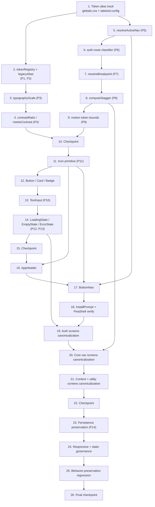

# Implementation Plan: PWA Visual Improvements

## Overview

This plan implements the presentation-layer overhaul described in `design.md` using the
two-track migration strategy: a **global token re-alias** (instant, low-risk, enabling) plus
**shared primitives and pure helpers**, followed by **incremental per-screen canonicalization**.

Implementation language/stack (from the design): **TypeScript + React (Next.js)**, styling via
**Tailwind + `globals.css` tokens**, icons via **`@phosphor-icons/react`**, animation via
**framer-motion**, and tests via **vitest + fast-check + @testing-library/react (jsdom)**.

Ordering principle:
1. Token alias track first — every legacy `bg-cream`/`text-sage`/`border-sand` class instantly
   renders the terracotta/warm palette with zero screen edits (Requirements 1.3, 1.6).
2. Pure logic helpers (`lib/pwa/ui/`) + their property-based tests next — these are the only
   input-varying logic and are the focus of PBT.
3. Shared UI primitives (`components/pwa/ui/`) + their accessibility property tests.
4. Shared chrome (AppHeader, BottomNav, InstallPrompt, PwaShell verification).
5. Incremental per-screen canonicalization, screen group by screen group.
6. Behavior-preservation, persistence, responsive, and static-governance verification.

All tasks are **presentation-layer only** and **behavior-preserving**: no routing, data-fetch,
persistence, business-logic, or event-handler changes — only className edits, accessibility
attributes (`aria-current`, `aria-live`, label associations), and wiring of new presentational
components (Requirement 12).

Tasks marked with `*` are optional test sub-tasks and can be skipped for a faster MVP.

## Task Dependency Graph

## Tasks

- [x] 1. Establish the single token source and global alias track
  - In `app/globals.css` `:root`, define/confirm the canonical token set across all six categories: color (`terracotta{DEFAULT,soft,dark,light}`, `warm{DEFAULT,border}`, `charcoal`, `muted{DEFAULT,light}`, status `success/warning/error`), font (`heading`, `body`), spacing steps, radius, shadow, and motion (`duration-fast/base/slow`, `stagger-step`, `stagger-cap`, `ease-standard`, `ease-emphasized`)
  - Re-map every legacy CSS variable (`sage`, `sage-dark`, `sage-soft`, `coral`, `coral-soft`, `cream`, `cream-warm`, `sand`) to its canonical terracotta/warm value per the design's alias table, so the current palette always wins
  - In `tailwind.config.ts`, point legacy color entries to the same canonical values, add `fontFamily.heading` and `fontFamily.body` (DM Serif Display / Plus Jakarta Sans stacks), keep `font-serif`/`font-sans` as aliases, and expose icon-size tokens (`--icon-sm/md/lg`) and motion tokens as utilities
  - Add the base-layer media rule (`img,video,svg { max-width:100%; height:auto }`) and `safe-area` inset utilities (top inset for header, `pb-safe` for nav)
  - _Requirements: 1.1, 1.2, 1.3, 1.4, 1.6, 2.5, 2.6, 4.3, 6.7, 7.2, 7.3, 8.3, 8.5, 10.1_

- [x] 2. Create the token registry pure module (`lib/pwa/ui/tokens.ts`)
  - [x] 2.1 Implement `tokenRegistry` (six categories with hex/value maps) and `legacyAlias` (each legacy name → canonical color token), mirroring the CSS/Tailwind source exactly
    - _Requirements: 1.1, 1.3, 1.5, 1.6_
  - [x]* 2.2 Write property test for token registry completeness
    - **Property 1: Token registry is complete across all six categories**
    - **Validates: Requirements 1.1**
  - [x]* 2.3 Write property test for legacy alias resolution
    - **Property 2: Every legacy token resolves to the current terracotta/warm value**
    - **Validates: Requirements 1.3, 1.6**

- [x] 3. Implement the typographic scale (`lib/pwa/ui/typography.ts`)
  - Define `typographyScale` with the four named levels (`pageTitle`, `sectionHeading`, `body`, `caption`) each with distinct `fontSizePx`/`fontWeight`/`lineHeight`/`family`, and `SCALE_ORDER`; body `fontSizePx >= 16`
  - _Requirements: 2.1, 2.2, 2.3, 2.4_
  - [x]* 3.1 Write property test for typographic scale monotonicity and body minimum size
    - **Property 3: Typographic scale is monotonic and body meets the minimum size**
    - **Validates: Requirements 2.2, 2.3**

- [x] 4. Implement contrast math helpers (`lib/pwa/ui/contrast.ts`)
  - Implement `contrastRatio(fg, bg)` (WCAG 2.1, 1..21) and `meetsContrast(fg, bg, level)` with thresholds `AA-normal=4.5`, `AA-large=3.0`, `UI=3.0`; define the approved foreground/background token-pair set with roles
  - _Requirements: 3.1, 3.2, 3.3, 3.5, 3.6_
  - [x]* 4.1 Write property test for approved token-pair contrast (and `contrastRatio` symmetry/bounds)
    - **Property 4: Approved token color pairs meet their contrast threshold**
    - **Validates: Requirements 3.1, 3.2, 3.3, 3.6, 5.4, 11.2**

- [x] 5. Implement the active-navigation resolver (`lib/pwa/ui/nav.ts`)
  - Implement `resolveActiveNav(pathname, tabs)` returning the index of the longest/most-specific matching href, or `-1` when none match (guaranteeing at most one active item); define the `NavTab` interface and the BottomNav tab list from the design
  - _Requirements: 6.3, 6.5, 6.6_
  - [x]* 5.1 Write property test for single/zero active item resolution
    - **Property 5: At most one navigation item is active, and none when no route matches**
    - **Validates: Requirements 6.5, 6.6**

- [x] 6. Implement the auth-route classifier (`lib/pwa/ui/routes.ts`)
  - Implement an `isAuthRoute(pathname)` classifier that reports `/pwa/login`, `/pwa/registro`, `/pwa/recuperar`, `/pwa/reset` and their sub-paths as auth (chrome omitted) and any other `/pwa/*` as non-auth
  - _Requirements: 6.8_
  - [x]* 6.1 Write property test for auth vs non-auth classification
    - **Property 6: Auth routes omit chrome; non-auth PWA routes include it**
    - **Validates: Requirements 6.8**

- [x] 7. Implement the breakpoint classifier (`lib/pwa/ui/breakpoints.ts`)
  - Implement `resolveBreakpoint(width)` mapping any width to exactly one band, monotonic and consistent with the 640/768/1024 px thresholds
  - _Requirements: 8.2, 8.4_
  - [x]* 7.1 Write property test for total, monotonic breakpoint classification
    - **Property 7: Breakpoint classification is total and consistent**
    - **Validates: Requirements 8.4**

- [x] 8. Implement the stagger scheduler (`lib/pwa/ui/motion.ts`)
  - Implement `computeStagger(count, baseDelayMs?, capMs?)` returning a non-decreasing delay array with a single consistent inter-item delay clamped to 40–80 ms, compressed so the last delay never exceeds the 800 ms cap; short-circuit to zero delays under reduced motion
  - Define the motion-token table (each entry tagged entrance/transition vs essential) in the same module
  - _Requirements: 10.1, 10.2, 10.3, 10.4_
  - [x]* 8.1 Write property test for stagger band, uniformity, monotonicity, and cap
    - **Property 8: List entrance stagger stays within band and within the cap**
    - **Validates: Requirements 10.2, 10.3**
  - [x]* 8.2 Write property test for motion duration upper bounds
    - **Property 9: Motion durations respect their upper bounds**
    - **Validates: Requirements 10.5, 10.6**

- [x] 9. Checkpoint - pure-logic layer
  - Ensure all tests pass, ask the user if questions arise.

- [x] 10. Implement the `Icon` primitive (`components/pwa/ui/Icon.tsx`)
  - Wrap `@phosphor-icons/react`, mapping the enumerated `name` set (home, plan, diary, recipes, guides, vip, streak, back, add, close, share, download, success, warning, error, info) to Phosphor components; render at a token size (`--icon-sm/md/lg`) and token color; unknown names resolve to a safe default with a dev log (never throw); decorative icons set `aria-hidden="true"`, meaningful icons expose an accessible label
  - _Requirements: 7.1, 7.2, 7.3, 7.4, 7.5_
  - [x]* 10.1 Write property test for icon accessibility by role (jsdom)
    - **Property 11: Icon accessibility matches its role**
    - **Validates: Requirements 7.4, 7.5**

- [x] 11. Implement `Button`, `Card`, and `Badge` primitives (`components/pwa/ui/`)
  - [x] 11.1 Implement `Button` (`variant: 'primary' | 'outline'`, `disabled`) consuming only tokens: one consistent style, active/hover/at-rest affordances, disabled style with `aria-disabled`, min 44x44 touch target, and Enter/Space activation parity with click
    - _Requirements: 5.1, 5.4, 5.5, 5.6, 5.7, 11.1, 11.5_
  - [x] 11.2 Implement `Card` (one style for bg/border/radius/shadow) and `Badge` (`tone: neutral|success|warning|error` with status token + text/icon non-color cue)
    - _Requirements: 3.5, 3.7, 4.4, 5.3, 5.8_
  - [x]* 11.3 Write snapshot/DOM tests for Button (disabled `aria-disabled`, hover/at-rest, keyboard activation), Card, and Badge consistent styling
    - Test one-consistent-style and state treatments
    - _Requirements: 5.1, 5.3, 5.4, 5.5, 5.6, 5.7, 5.8_

- [x] 12. Implement the `TextInput` primitive (`components/pwa/ui/TextInput.tsx`)
  - Render one consistent input style with a visible `<label>` whose `htmlFor` equals the input `id` (required props), min 44px touch target
  - _Requirements: 5.2, 11.1, 11.3_
  - [x]* 12.1 Write property test for label association (jsdom)
    - **Property 10: Text inputs are always associated with a visible label**
    - **Validates: Requirements 5.2, 11.3**

- [x] 13. Implement state primitives `LoadingState`, `EmptyState`, `ErrorState` (`components/pwa/ui/`)
  - [x] 13.1 Implement `LoadingState` (token-styled skeleton/spinner with `role="status"`/`aria-busy`/`aria-live`) and `EmptyState` (`message` + focusable next-action control)
    - _Requirements: 9.1, 9.2, 9.4, 9.5_
  - [x] 13.2 Implement `ErrorState` (`message` naming failed action, `onRetry`/`onDismiss?` controls, preserves/echoes back user-entered input)
    - _Requirements: 9.3, 9.4, 9.7, 12.5_
  - [x]* 13.3 Write property test for EmptyState explanation + next action (jsdom)
    - **Property 12: Empty state always offers explanation and a next action**
    - **Validates: Requirements 9.2**
  - [x]* 13.4 Write property test for ErrorState message/recovery/input preservation (jsdom)
    - **Property 13: Error state names the failed action, offers recovery, and preserves input**
    - **Validates: Requirements 9.3, 12.5**

- [x] 14. Checkpoint - shared primitives layer
  - Ensure all tests pass, ask the user if questions arise.

- [x] 15. Restyle the `AppHeader` shared component
  - Replace literal color/font/spacing values with named tokens, fix the broken `font-heading` usage, apply the typography scale, and replace ad-hoc emoji/avatar with the `Icon` primitive; apply the top safe-area inset
  - _Requirements: 2.1, 2.5, 2.6, 6.1, 7.1, 7.3, 8.3_

- [x] 16. Update the `BottomNav` shared component
  - Consume `resolveActiveNav`; render the active item with two cues (terracotta color + non-color indicator bar/bold label) and `aria-current="page"`; replace emoji with `Icon`; keep `pb-safe`; drive any entrance animation from `computeStagger`
  - _Requirements: 6.2, 6.3, 6.4, 6.5, 6.6, 6.7, 7.1, 7.2, 7.3_
  - [x]* 16.1 Write DOM tests for two-cue active rendering, single active item, and `aria-current`
    - Test active/non-active cues and assistive-tech state
    - _Requirements: 6.3, 6.4, 6.5, 6.6_

- [x] 17. Update `InstallPrompt` and verify `PwaShell`
  - Restyle `InstallPrompt` to tokens and replace inline SVG with `Icon`, keeping all install logic intact; verify (do not rewrite) `PwaShell`'s Auth_Screen omission of header/nav using the auth-route classifier, and confirm content max-width <= 768 px, centered, with uniform 16px page margin
  - _Requirements: 4.2, 4.3, 6.8, 7.1, 7.3_

- [x] 18. Canonicalize Auth screens (login, registro, recuperar, reset)
  - Replace legacy class names with canonical token utilities and the typography scale; swap form fields to `TextInput`, actions to `Button`, and the ad-hoc `text-coral` error to `ErrorState`/inline error treatment that preserves entered input; replace emoji with `Icon`
  - _Requirements: 1.2, 2.1, 2.4, 4.1, 4.5, 5.1, 5.2, 9.3, 9.7, 11.1, 11.2, 11.3, 12.5_

- [x] 19. Canonicalize core navigation screens (dashboard, plan, diario, recetas, guias)
  - [x] 19.1 Canonicalize dashboard and plan: token utilities + typography scale, `Card`/`Button`/`Badge` primitives, `Icon` for emoji, list entrances driven by `computeStagger`, and `LoadingState`/`EmptyState`/`ErrorState` wired to existing local state
    - _Requirements: 1.2, 2.1, 2.4, 4.1, 4.4, 4.5, 5.1, 5.3, 5.8, 7.1, 7.3, 9.1, 9.2, 9.4, 10.1, 10.2, 10.3_
  - [x] 19.2 Canonicalize diario, recetas, and guias: replace `bg-sage-soft` skeletons with `LoadingState`, emoji empty states with `EmptyState`, apply primitives, `Icon`, typography scale, and `computeStagger`-driven list entrances
    - _Requirements: 1.2, 2.1, 2.4, 4.1, 4.4, 4.5, 5.3, 7.1, 7.3, 9.1, 9.2, 9.4, 10.1, 10.2, 10.3_

- [x] 20. Canonicalize content and utility screens (calculadora, onboarding, preferencias, progreso, kit-express, lista-compras, vip)
  - Apply canonical token utilities, typography scale, shared primitives (`Card`/`Button`/`Badge`/`TextInput`), `Icon` for emoji, and state components where each screen retrieves/holds data; drive any repeated-item lists via `computeStagger`
  - _Requirements: 1.2, 2.1, 2.4, 4.1, 4.4, 4.5, 5.1, 5.2, 5.3, 5.8, 7.1, 7.3, 9.1, 9.2, 9.4, 10.1, 10.2, 10.3_

- [x] 21. Checkpoint - all screens canonicalized
  - Ensure all tests pass, ask the user if questions arise.

- [x] 22. Verify persistence preservation
  - [x]* 22.1 Write property test asserting localStorage keys/serialized values are byte-for-byte identical to a frozen baseline
    - **Property 14: Persistence is byte-for-byte preserved**
    - **Validates: Requirements 12.4**

- [x] 23. Add responsive and static-governance verification tests
  - [x]* 23.1 Write layout/responsive tests rendering representative screens across 320–1920 px asserting no horizontal overflow (`scrollWidth <= clientWidth`), single column below 640 px, content max-width <= 768 px centered, uniform 16px margin, and media not exceeding container width
    - _Requirements: 4.2, 4.3, 4.5, 8.1, 8.2, 8.5_
  - [x]* 23.2 Write static/lint scans asserting no embedded color/font/spacing/radius/shadow literals in PWA components, uniform `font-heading`/`font-body` usage with no remaining `font-serif`/undefined `font-heading` divergence, referenced tokens exist, safe-area utilities present, and interactive primitives carry min touch-target utilities
    - _Requirements: 1.2, 1.5, 2.5, 2.6, 4.1, 6.1, 6.2, 7.3, 8.3, 10.1, 11.1_

- [x] 24. Add behavior-preservation regression tests
  - [x]* 24.1 Write regression tests: route-set snapshot unchanged, BottomNav/link target hrefs unchanged vs baseline, focus-visible indicator presence, keyboard Enter/Space parity, and AsyncView success/error transitions; confirm existing `route.test.ts` and component tests remain green
    - _Requirements: 9.6, 9.7, 11.2, 11.4, 11.5, 12.1, 12.2, 12.3_

- [x] 25. Final checkpoint - full verification
  - Ensure all tests pass, ask the user if questions arise.

## Notes

- Tasks marked with `*` are optional test sub-tasks and can be skipped for a faster MVP; core implementation sub-tasks are never optional.
- Each property in the design's Correctness Properties section maps to exactly one property-based test (`fast-check`, minimum 100 iterations, tagged `// Feature: pwa-visual-improvements, Property {n}: {text}`). DOM-touching property tests (P10–P13) use the per-file `// @vitest-environment jsdom` opt-in.
- The alias track (Task 1) is intentionally first so every legacy class instantly renders the terracotta/warm palette, making each subsequent per-screen edit low-risk and independently shippable.
- All changes are presentation-layer only and behavior-preserving (Requirement 12): no routing, data-fetch, persistence, or business-logic changes.
