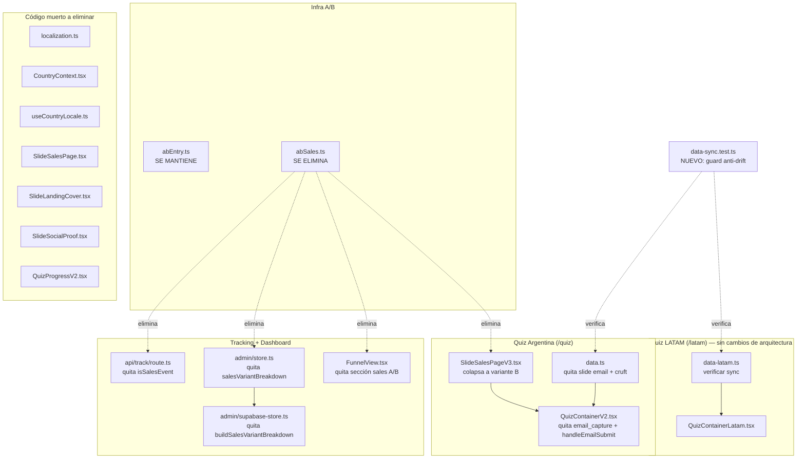
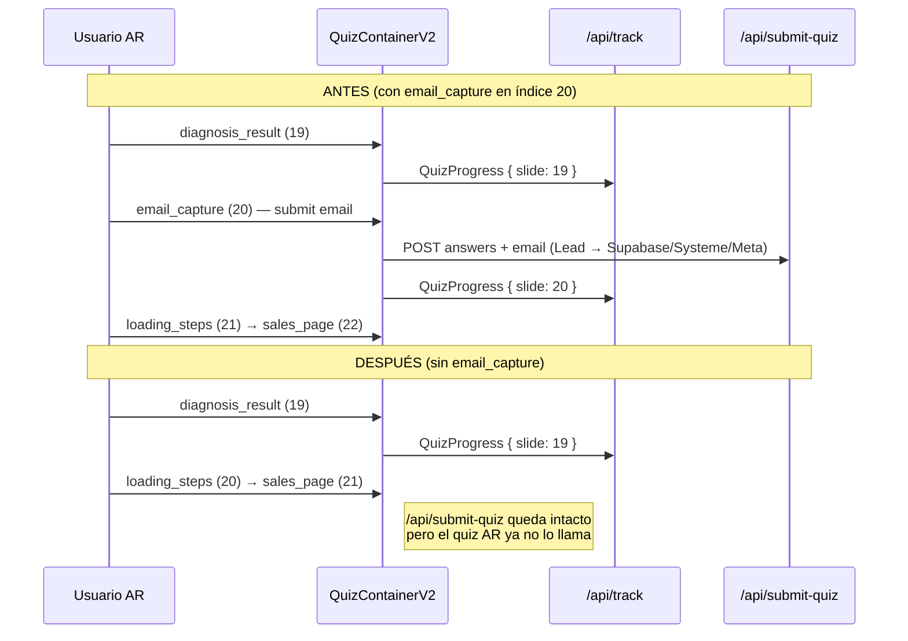

# Design Document: quiz-cleanup-and-latam-sync

## Overview

Este spec ejecuta una limpieza quirúrgica sobre el funnel de quiz (Next.js App Router + TypeScript) en dos frentes ya acordados:

- **Frente B — Email en Argentina:** se saca el slide `email_capture` del flujo del quiz de Argentina (`/quiz`). El endpoint `/api/submit-quiz` y todas sus integraciones (Supabase `clientes`, Systeme.io, Meta CAPI `Lead`) se conservan intactos; simplemente el quiz de AR deja de invocarlo. Consecuencia documentada: AR deja de capturar leads vía quiz y queda con la misma cantidad/estructura de slides que LATAM.
- **Frente C — Limpieza y sincronización:**
  1. **Sales page A/B:** se colapsa `SlideSalesPageV3` a la variante ganadora B de forma permanente (sin contador flotante + sección extra de valor), se elimina toda la infra del test de sales (`abSales.ts`, eventos `sp_*`, breakdown en el dashboard) y se borra la sales page vieja `SlideSalesPage.tsx`. El test A/B/C de **entrada** (`abEntry.ts`) se mantiene intacto.
  2. **LATAM:** NO se refactoriza la arquitectura. Se mantienen `data-latam.ts`, `QuizContainerLatam` y los componentes `*Latam`. Solo se verifica/sincroniza que `slidesV3Latam` quede estructuralmente idéntico a `slidesV3` (mismos `id`/`type`/orden y `value` de opciones), y se agrega un test liviano anti-drift.
  3. **localization.ts:** auditado como código muerto (ver §"Auditoría de localization"). Se elimina junto con su cadena de consumidores muertos.
  4. **Cruft v2/v3:** se eliminan aliases/legacy confirmados como muertos (`slidesV2`, `PROGRESS_SECTIONS`/`getProgressSection`, `TIPO_NOMBRES`, `QuizProgressV2.tsx`) y se actualizan los tests que importan `slidesV2`.

El principio rector es **borrar solo lo confirmado muerto, sin tocar lo que vive**, respetando el trabajo del spec anterior (`funnel-quiz-tracking-toggle`): el toggle AR/LATAM/Unificado, `normalizeQuizVersion`, el filtro por versión y la migración 010 NO se tocan, salvo el ajuste obligado de quitar `salesVariantBreakdown` del `FunnelData`/dashboard y de actualizar los tests que importan `slidesV2`.

### Lenguaje y stack

TypeScript + Next.js (App Router). Tests con Vitest + fast-check (ya presentes en el repo). No se introducen dependencias nuevas.

---

## Architecture

### Componentes afectados (mapa de impacto)



### Flujo del quiz de Argentina — antes vs después (Frente B)



### Impacto en el embudo / tracking

- El tracking emite `slide = currentStep` de forma **dinámica** (`QuizContainerV2` manda `custom.slide = currentStep`), y el dashboard mapea `perSlide[i]` contra `selectSlides(version)[i]` por posición. Por eso, al quitar el slide de email, los índices "se corren" pero el embudo **sigue alineado** porque ambos (escritura y lectura) usan la misma lista `slidesV3`.
- AR pasa de 23 a 22 slides (índices 0–21), quedando **idéntico en cantidad y estructura a LATAM** (`slidesV3Latam`, 22 slides). El paso "Email" desaparece del embudo de AR.
- La data histórica de slides de AR queda intacta en la DB; el slide histórico `email` (índice 20 viejo) ya no recibe escrituras nuevas y deja de figurar como paso. No se borra ni migra data.
- Los eventos `sp_*` históricos quedan en la DB pero se **ignoran** (nadie los parsea tras la limpieza). No se borran.

---

## Components and Interfaces

### Frente B — Quiz de Argentina sin email

**`lib/quiz-v2/data.ts`**
- Quitar el slide `{ type: 'email_capture', id: 'email' }` (índice 20) del array `slidesV3`.
- Quitar `'email_capture'` del set `SLIDES_WITHOUT_PROGRESS`.

**`components/quiz-v2/QuizContainerV2.tsx`**
- Quitar el import `import { SlideEmailCaptureV3 } from './SlideEmailCapture';`.
- Quitar la función `handleEmailSubmit`.
- Quitar `'email_capture'` del array literal de `isFullscreen`.
- Quitar el bloque de render `{slide.type === 'email_capture' && (...)}`.
- Conservar `answers`/`setAnswer` (los usan otros slides: `name_capture`, sliders, etc.).

**`components/quiz-v2/SlideEmailCapture.tsx`** — **se conserva** (queda sin uso en el flujo AR; no se elimina para no tocar nada que dependa de él). No quedan imports colgados porque el único consumidor (`QuizContainerV2`) deja de importarlo.

**`app/api/submit-quiz/route.ts`** y sus integraciones (Supabase `clientes`, Systeme.io, Meta CAPI `Lead`) — **intactos**. Documentado: AR deja de capturar leads vía quiz.

### Frente C.1 — Colapsar la sales page a la ganadora B

**`components/quiz-v2/SlideSalesPageV3.tsx`** (se mantiene el archivo, se simplifica):
- Quitar el import de `abSales`: `getSalesVariant, peekSalesVariant, salesEventName, type SalesVariant`.
- Quitar el estado `const [salesVariant] = useState<SalesVariant>(() => getSalesVariant());`.
- Quitar el `fetch('/api/track', ...)` que emite `salesEventName(salesVariant, 'view')`.
- En `handleCheckout`: quitar `peekSalesVariant()`, el `fetch` que emite `salesEventName(sVariant, 'checkout')`, el campo `sp_variant` de los `custom` y `cartAttrs.sp_variant`.
- Render permanente de la variante B:
  - **Eliminar** el bloque de la sticky countdown bar (`{salesVariant !== 'B' && (...)}`) — en B no se muestra.
  - **Desenvolver** la sección "VALOR EXTRA (solo variante B)" quitando el guard `{salesVariant === 'B' && (...)}` para que se renderice siempre.
- **Conservar:** el countdown `timeLeft`/`COUNTDOWN_SECS`/`formatTime` (lo usa el badge y la sección de precio, no dependen de la variante), `peekEntryVariant`/`abEntryEventName` (test de entrada) y `cartAttrs.ab_entry`.

**Archivos a ELIMINAR (Frente C.1):**
- `lib/quiz-v2/abSales.ts`
- `components/quiz-v2/SlideSalesPage.tsx` (sales page vieja; confirmado que ningún contenedor vivo la importa — el flujo vivo usa `SlideSalesPageV3`).

### Frente C.1 — Limpieza de tracking y dashboard (referencias a `sp_*`)

**`app/api/track/route.ts`**
- Quitar `import { isSalesEvent } from '@/lib/quiz-v2/abSales';`.
- Cambiar la guarda de eventos internos:
  - Antes: `if (isAbEntryEvent(eventName) || isSalesEvent(eventName)) { ... }`
  - Después: `if (isAbEntryEvent(eventName)) { ... }`

**`lib/admin/store.ts`**
- Quitar `import { parseSalesEvent, type SalesVariant } from '@/lib/quiz-v2/abSales';`.
- Eliminar el tipo `SalesVariantBreakdownRow`.
- Eliminar el campo `salesVariantBreakdown: SalesVariantBreakdownRow[];` de `FunnelData`.
- Eliminar la función `buildSalesVariantBreakdown(...)`.
- En `computeFunnel`: eliminar `const salesVariantBreakdown = buildSalesVariantBreakdown(filteredRows);` y el campo `salesVariantBreakdown` del objeto retornado.

**`lib/admin/supabase-store.ts`**
- Quitar `import { buildSalesVariantBreakdown } from './store';`.
- Quitar `salesVariantBreakdown: buildSalesVariantBreakdown(filteredRows),` del objeto retornado.

**`app/admin/funnel/FunnelView.tsx`**
- Quitar `SALES_VARIANT_LABEL, SALES_WINNER` del import de `abSales` (eliminar la línea de import completa).
- Quitar `SalesVariantBreakdownRow` del import de tipos de `@/lib/admin/store`.
- Eliminar el `useMemo` `bestSalesPageRate`.
- Eliminar por completo la `SectionCard` "Test A/B — página de ventas" (el bloque `{data.salesVariantBreakdown && ...}`).
- Mantener intacta la sección "Test A/B/C — pantalla de entrada" y sus imports `ENTRY_VARIANT_LABEL`/`ENTRY_DISCARDED_VARIANTS` y el tipo `VariantBreakdownRow`.

#### Cambio de tipo: `FunnelData` (low-level)

```typescript
// ANTES
export type FunnelData = {
  // ...
  variantBreakdown: VariantBreakdownRow[];
  salesVariantBreakdown: SalesVariantBreakdownRow[]; // ← se elimina
  // ...
};

// DESPUÉS
export type FunnelData = {
  // ...
  variantBreakdown: VariantBreakdownRow[];
  // (sin salesVariantBreakdown)
  // ...
};
```

`SalesVariantBreakdownRow` y `buildSalesVariantBreakdown` se eliminan del módulo. `VariantBreakdownRow`/`buildVariantBreakdown` (test de entrada) se conservan.

### Frente C.2 — Sincronización LATAM (sin refactor)

`slidesV3Latam` ya es estructuralmente idéntico a `slidesV3` **una vez removido el email de AR** (mismos `id`/`type`/orden y mismos `value` de opciones; difieren solo en texto visible "tú" y "barriga/panza"). Resultado de la verificación:

| # | id | type | AR (post-email) | LATAM |
|---|----|------|-----------------|-------|
| 0 | landing_hook | landing_hook | ✓ | ✓ |
| 1 | edad | age_slider | ✓ | ✓ |
| 2 | tipo_cuerpo | body_type | ✓ | ✓ |
| 3 | donde_acumula | question | ✓ | ✓ |
| 4 | viral_news | viral_news | ✓ | ✓ |
| 5 | nombre | name_capture | ✓ | ✓ |
| 6 | como_afecta | question | ✓ | ✓ |
| 7 | conforme_panza | question | ✓ | ✓ |
| 8 | impide_deshincharse | question | ✓ | ✓ |
| 9 | no_es_tu_culpa | question | ✓ | ✓ |
| 10 | que_queres_lograr | question | ✓ | ✓ |
| 11 | peso_actual | number_slider | ✓ | ✓ |
| 12 | altura | number_slider | ✓ | ✓ |
| 13 | peso_deseado | number_slider | ✓ | ✓ |
| 14 | embarazos | question | ✓ | ✓ |
| 15 | rutina_diaria | question | ✓ | ✓ |
| 16 | horas_sueno | question | ✓ | ✓ |
| 17 | agua_dia | question | ✓ | ✓ |
| 18 | expert_bridge | expert_bridge | ✓ | ✓ |
| 19 | diagnosis_result | diagnosis_result | ✓ | ✓ |
| 20 | loading_steps | loading_steps | ✓ | ✓ |
| 21 | sales_page | sales_page | ✓ | ✓ |

**Acción:** si la verificación detecta cualquier divergencia de `id`/`type`/orden o `value` de opciones, corregir `data-latam.ts` ajustando SOLO esos campos (nunca el texto visible). Se mantiene `SLIDES_WITHOUT_PROGRESS_LATAM` consistente con `SLIDES_WITHOUT_PROGRESS` (ambos sin `email_capture`).

#### Mecanismo anti-drift (NUEVO test, sin refactor de arquitectura)

Crear `lib/quiz-v2/data-sync.test.ts` (Vitest) que compara `slidesV3` vs `slidesV3Latam`:
- Misma longitud (`slidesV3.length === slidesV3Latam.length`).
- Para cada índice `i`: mismo `id` y mismo `type`.
- Para slides con opciones (`question`, `body_type`): misma secuencia de `value` (ignorando `label`/`emoji`/textos).

Firma conceptual del helper de extracción usado por el test:

```typescript
type StructuralShape = {
  id: string;
  type: string;
  optionValues: string[]; // [] si el slide no tiene opciones
};

// Proyecta un slide a su "forma estructural" (ignora todo el texto visible).
function structuralShape(slide: SlideV3): StructuralShape;

// El test: ∀ i, structuralShape(slidesV3[i]) === structuralShape(slidesV3Latam[i])
```

### Frente C.3 — Auditoría de localization (resultado y acción)

**Resultado de la auditoría:** `lib/quiz-v2/localization.ts` es **código muerto**. Cadena de dependencias detectada:

- `localization.ts` es consumido únicamente por:
  - `lib/quiz-v2/CountryContext.tsx` (`CountryProvider`/`useCountry`),
  - `lib/quiz-v2/useCountryLocale.ts`,
  - `components/quiz-v2/SlideSalesPage.tsx` (sales page vieja, ya marcada para borrar),
  - `components/quiz-v2/SlideLandingCover.tsx`,
  - `components/quiz-v2/SlideSocialProof.tsx`.
- `CountryProvider` **no se monta en ningún lado** (no hay usos fuera de su definición), por lo que `useCountry()` nunca recibe un provider real.
- `SlideLandingCover`, `SlideSocialProof` y `SlideSalesPage` **no son importados por ninguna página ni contenedor vivo** (el flujo vivo es `QuizContainerV2` → set de slides `*V3`, y `QuizContainerLatam` → set `*Latam`).
- El barrel `lib/quiz-v2/index.ts` **no** re-exporta `localization`, `CountryContext` ni `useCountryLocale`.
- `QUIZ_OVERRIDES` referencia ids de slides inexistentes (`situacion_actual`, `momento_hinchazon`, `frecuencia`, `objetivo`), confirmando que está desconectado del quiz vivo.

**Acción:** eliminar toda la cadena muerta:
- `lib/quiz-v2/localization.ts`
- `lib/quiz-v2/CountryContext.tsx`
- `lib/quiz-v2/useCountryLocale.ts`
- `components/quiz-v2/SlideLandingCover.tsx`
- `components/quiz-v2/SlideSocialProof.tsx`
- (`components/quiz-v2/SlideSalesPage.tsx` ya se elimina en Frente C.1.)

> Nota: `config-latam.ts` (precios USD/Hotmart de LATAM) **NO** forma parte de la cadena de `localization` y NO se toca en este spec.

### Frente C.4 — Cruft v2/v3 muerto

**`lib/quiz-v2/data.ts`** — eliminar los aliases legacy del final del archivo:
- `export const slidesV2 = slidesV3;`
- `export type ProgressSection`
- `export const PROGRESS_SECTIONS`
- `export function getProgressSection`

**`components/quiz-v2/QuizProgressV2.tsx`** — **eliminar** el archivo (usa `slidesV2`/`getProgressSection`/`PROGRESS_SECTIONS`; no lo importa nada vivo — el activo es `QuizProgressV3`).

**`lib/quiz-v2/config.ts`** — eliminar el alias `export const TIPO_NOMBRES = QUIZ_RESULT_TYPE_NAMES;` (sin consumidores vivos; los usos ya migrados a `QUIZ_RESULT_TYPE_NAMES`).

**`lib/admin/store.test.ts`** — actualizar para no depender de `slidesV2`:
- Quitar `slidesV2` del import `import { slidesV3, slidesV2 } from '@/lib/quiz-v2/data';` → `import { slidesV3 } from '@/lib/quiz-v2/data';`.
- Eliminar la aserción `expect(slidesV2).toBe(slidesV3);` (y ajustar el nombre/comentario del `it` que la contiene, manteniendo las aserciones válidas `selectSlides('latam') !== slidesV3` y `selectSlides('ar') !== slidesV3Latam`).
- Actualizar `lib/admin/store.ts` doc-comment de `selectSlides` que menciona `slidesV2` (cosmético, opcional).

> Verificación: una búsqueda global confirmó que el único importador de `slidesV2` es `lib/admin/store.test.ts` (además de `QuizProgressV2.tsx`, que se elimina). No existe un segundo `store.test.ts` que lo importe.

---

## Data Models

No se introducen modelos nuevos. El único cambio de modelo es la **reducción** del tipo `FunnelData` (eliminación de `salesVariantBreakdown`) y la eliminación del tipo `SalesVariantBreakdownRow`, descritos en §"Components and Interfaces". Los slides siguen el tipo existente `SlideV3` (`lib/quiz-v2/types.ts`), sin cambios.

---

## Orden seguro de cambios (para no romper typecheck)

La regla es **eliminar consumidores antes que el módulo consumido**. Secuencia recomendada:

1. **Frente C.1 — desconectar `sp_*` antes de borrar `abSales`:**
   1. Editar `FunnelView.tsx` (quitar sección + imports de `abSales` y tipo `SalesVariantBreakdownRow`).
   2. Editar `app/api/track/route.ts` (quitar `isSalesEvent` + ajustar guarda).
   3. Editar `lib/admin/supabase-store.ts` (quitar import + uso).
   4. Editar `lib/admin/store.ts` (quitar import de `abSales`, tipo `SalesVariantBreakdownRow`, `buildSalesVariantBreakdown`, campo en `FunnelData` y en el objeto retornado).
   5. Editar `SlideSalesPageV3.tsx` (quitar imports/usos de `abSales`, colapsar a B).
   6. **Borrar** `lib/quiz-v2/abSales.ts`.
   7. **Borrar** `components/quiz-v2/SlideSalesPage.tsx`.
2. **Frente B — email AR:**
   1. Editar `QuizContainerV2.tsx` (quitar import/handler/render/`isFullscreen`).
   2. Editar `data.ts` (quitar slide `email` + del set `SLIDES_WITHOUT_PROGRESS`).
3. **Frente C.4 — cruft:**
   1. Editar `lib/admin/store.test.ts` (quitar `slidesV2`).
   2. **Borrar** `components/quiz-v2/QuizProgressV2.tsx`.
   3. Editar `data.ts` (quitar `slidesV2`/`PROGRESS_SECTIONS`/`getProgressSection`/`ProgressSection`).
   4. Editar `config.ts` (quitar `TIPO_NOMBRES`).
4. **Frente C.3 — localization muerta (borrar hojas antes que la raíz):**
   1. **Borrar** `components/quiz-v2/SlideLandingCover.tsx` y `components/quiz-v2/SlideSocialProof.tsx`.
   2. **Borrar** `lib/quiz-v2/CountryContext.tsx`.
   3. **Borrar** `lib/quiz-v2/useCountryLocale.ts`.
   4. **Borrar** `lib/quiz-v2/localization.ts`.
5. **Frente C.2 — sync LATAM:**
   1. Verificar/ajustar `data-latam.ts` si hace falta.
   2. Agregar `lib/quiz-v2/data-sync.test.ts`.
6. **Validación final:** `tsc --noEmit` (typecheck) + build + suite de tests.

---

## Correctness Properties

*Una propiedad es una característica o comportamiento que debe ser verdadero en todas las ejecuciones válidas del sistema. Cada propiedad está anotada con los requisitos que valida (**Validates**).*

### Property 1: El flujo de AR no contiene `email_capture`

Para todo recorrido del quiz de Argentina, ningún slide de `slidesV3` tiene `type === 'email_capture'`, y `SLIDES_WITHOUT_PROGRESS` no contiene `'email_capture'`.

**Validates: Requirements 1.1, 1.2, 1.3, 1.5**

### Property 2: El quiz no emite eventos `sp_*`

Para toda interacción con `SlideSalesPageV3` (view y checkout), ningún evento enviado a `/api/track` tiene un nombre que empiece con el prefijo `sp_`, y `Track_API` no aplica un tratamiento especial a los nombres con prefijo `sp_`.

**Validates: Requirements 4.1, 4.2, 4.3, 5.3, 5.5**

### Property 3: `slidesV3` y `slidesV3Latam` son estructuralmente isomorfos

Para todo índice `i`, `slidesV3[i]` y `slidesV3Latam[i]` tienen el mismo `id`, el mismo `type` y, si tienen opciones, la misma secuencia de `value` (ignorando todo el texto visible). Además, ambas listas tienen la misma longitud.

**Validates: Requirements 7.1, 7.2, 7.5**

### Property 4: La sales page renderiza siempre la variante ganadora B

Para todo render de `SlideSalesPageV3`, NO se muestra la barra de countdown flotante (sticky) y SÍ se muestra la sección extra de valor (timeline de transformación), independientemente de cualquier estado o querystring.

**Validates: Requirements 3.1, 3.2, 3.3**

### Property 5: No quedan imports colgados tras la limpieza

Tras la limpieza, no existe ningún import (vivo) a `abSales`, `slidesV2`, `getProgressSection`/`PROGRESS_SECTIONS`, `TIPO_NOMBRES`, `localization`, `CountryContext` ni `useCountryLocale`; y el typecheck (`tsc --noEmit`) pasa sin errores.

**Validates: Requirements 5.1, 5.2, 8.1, 8.2, 8.3, 8.4, 9.1, 9.2, 9.3, 9.4, 10.1, 10.2**

### Property 6: El build y el typecheck pasan

Para el repositorio completo tras todos los cambios, `tsc --noEmit` y el build de Next.js terminan sin errores, y la suite de tests (Vitest) pasa al 100%.

**Validates: Requirements 10.2, 10.3, 10.4**

### Property 7: La paridad de slides AR/LATAM se preserva en el embudo

Para toda versión `v ∈ {'ar','latam'}`, `selectSlides(v)` devuelve una lista cuya longitud y secuencia de `(id, type)` coincide con la de la otra versión (consecuencia de Property 3), de modo que el dashboard unificado alinea AR y LATAM 1:1 por posición.

**Validates: Requirements 7.6, 10.6**

### Property 8: Compatibilidad de `FunnelData` preservada salvo `salesVariantBreakdown`

Para toda llamada a `getFunnel(filters)` (memory y supabase), el objeto `FunnelData` retornado conserva todos sus campos previos excepto `salesVariantBreakdown`, que deja de existir; `variantBreakdown` (test de entrada) sigue presente y correcto.

**Validates: Requirements 6.2, 6.3**

---

## Error Handling

- **`/api/submit-quiz` huérfano:** al dejar de invocarse desde AR, no hay manejo de errores nuevo; el endpoint conserva su validación y su comportamiento fail-graceful actuales.
- **Eventos `sp_*` residuales:** si llegaran a `/api/track` eventos `sp_*` desde clientes con bundles cacheados, se contabilizan como un `event_name` cualquiera en el store (no rompen nada) pero ya no se parsean ni se muestran. No requieren manejo especial.
- **Drift AR/LATAM:** el test anti-drift (`data-sync.test.ts`) falla en CI si las listas divergen estructuralmente, evitando regresiones silenciosas.

---

## Testing Strategy

### Unit / ejemplo
- Actualizar `lib/admin/store.test.ts` (quitar dependencia de `slidesV2`); verificar que `selectSlides` sigue resolviendo AR→`slidesV3`, LATAM→`slidesV3Latam`, unificado→`slidesV3`.
- `app/api/track/route.test.ts` (`normalizeQuizVersion`) no se ve afectado; debe seguir pasando.

### Property-based (Vitest + fast-check)
- **Property 3 / 7 (sync AR↔LATAM):** nuevo `lib/quiz-v2/data-sync.test.ts` comparando forma estructural por índice.
- **Property 1 (sin email en AR):** test que recorre `slidesV3` y `SLIDES_WITHOUT_PROGRESS` afirmando ausencia de `email_capture`.
- **Property 8:** test sobre `getFunnel` (memory) afirmando que el objeto no expone `salesVariantBreakdown` y sí `variantBreakdown`.

### Verificación estática (Property 5 / 6)
- `tsc --noEmit`, build de Next.js y `grep` de imports residuales como gate final (parte del checkpoint, no como test unitario aislado).

> Properties 2 y 4 dependen del comportamiento de un componente React client-side; se cubren con asserts a nivel de código (ausencia del bloque sticky bar y del guard de la sección de valor) y, donde sea práctico, con un test de render. No se fuerzan como property-based si el costo de montar el componente no lo justifica.

---

## Dependencies

- **Sin dependencias nuevas.** Se usa el stack existente: Next.js (App Router), TypeScript, Vitest + fast-check.
- **Spec previo respetado:** `funnel-quiz-tracking-toggle` (toggle AR/LATAM/Unificado, `normalizeQuizVersion`, filtro por versión, migración 010) permanece intacto, salvo la eliminación obligada de `salesVariantBreakdown` del `FunnelData`/dashboard y la actualización de los tests que importaban `slidesV2`.

---

## Resumen de archivos

### Editar
- `lib/quiz-v2/data.ts` (quitar slide email + cruft legacy)
- `components/quiz-v2/QuizContainerV2.tsx` (quitar email)
- `components/quiz-v2/SlideSalesPageV3.tsx` (colapsar a B, quitar `sp_*`)
- `lib/admin/store.ts` (quitar `salesVariantBreakdown` y afines)
- `lib/admin/supabase-store.ts` (quitar uso de `buildSalesVariantBreakdown`)
- `app/api/track/route.ts` (quitar `isSalesEvent`)
- `app/admin/funnel/FunnelView.tsx` (quitar sección sales A/B)
- `lib/quiz-v2/config.ts` (quitar `TIPO_NOMBRES`)
- `lib/admin/store.test.ts` (quitar `slidesV2`)
- `lib/quiz-v2/data-latam.ts` (solo si la verificación detecta divergencias)

### Crear
- `lib/quiz-v2/data-sync.test.ts` (guard anti-drift AR↔LATAM)

### Eliminar
- `lib/quiz-v2/abSales.ts`
- `components/quiz-v2/SlideSalesPage.tsx`
- `components/quiz-v2/QuizProgressV2.tsx`
- `lib/quiz-v2/localization.ts`
- `lib/quiz-v2/CountryContext.tsx`
- `lib/quiz-v2/useCountryLocale.ts`
- `components/quiz-v2/SlideLandingCover.tsx`
- `components/quiz-v2/SlideSocialProof.tsx`

### Conservar explícitamente (no tocar)
- `app/api/submit-quiz/route.ts` + integraciones (Supabase `clientes`, Systeme.io, Meta CAPI `Lead`)
- `components/quiz-v2/SlideEmailCapture.tsx` (queda sin uso, sin imports colgados)
- `lib/quiz-v2/abEntry.ts` + landings (`SlideLandingHook`, `SlideLandingHookLite`, `SlideLandingDirect`) + sección "Test A/B/C — pantalla de entrada"
- `lib/quiz-v2/data-latam.ts`, `QuizContainerLatam` y componentes `*Latam` (arquitectura separada)
- `lib/quiz-v2/config-latam.ts`
- Spec previo `funnel-quiz-tracking-toggle` (toggle, `normalizeQuizVersion`, migración 010)
