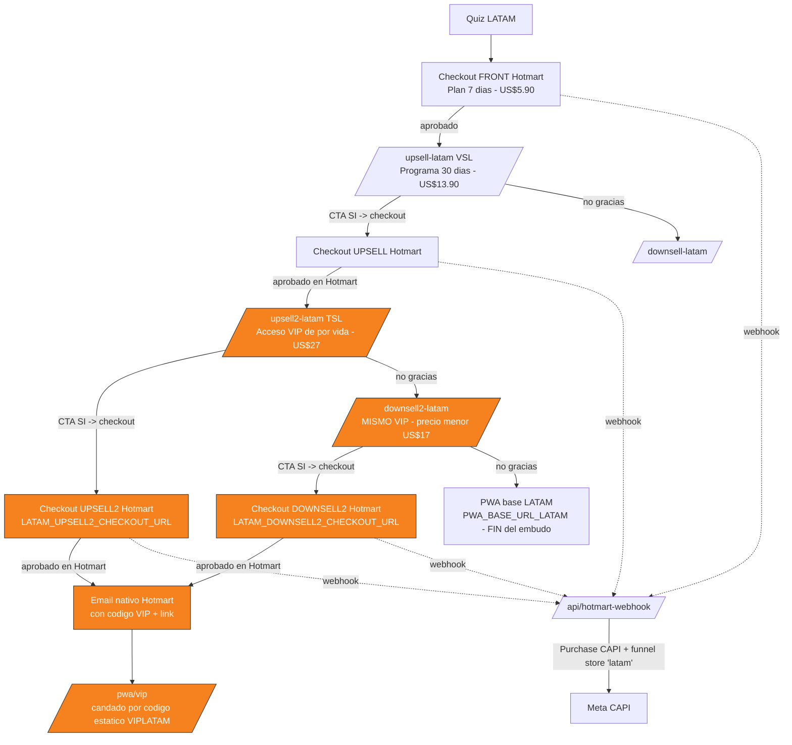
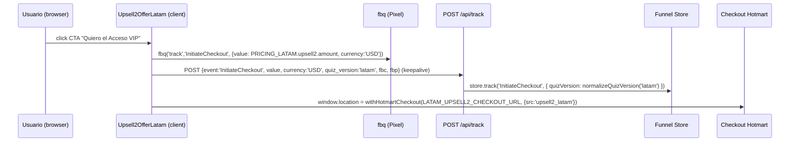
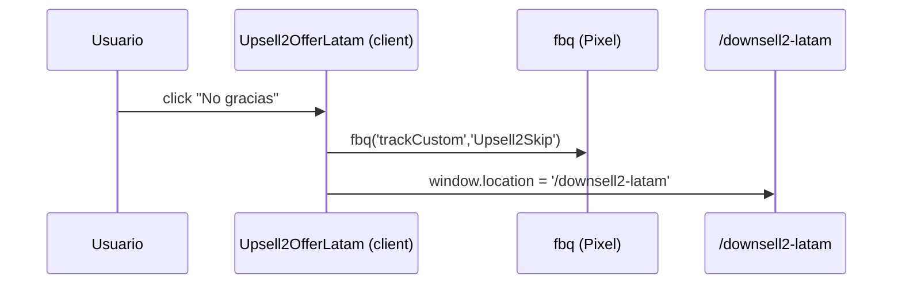
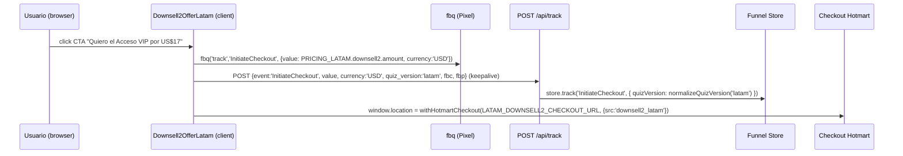
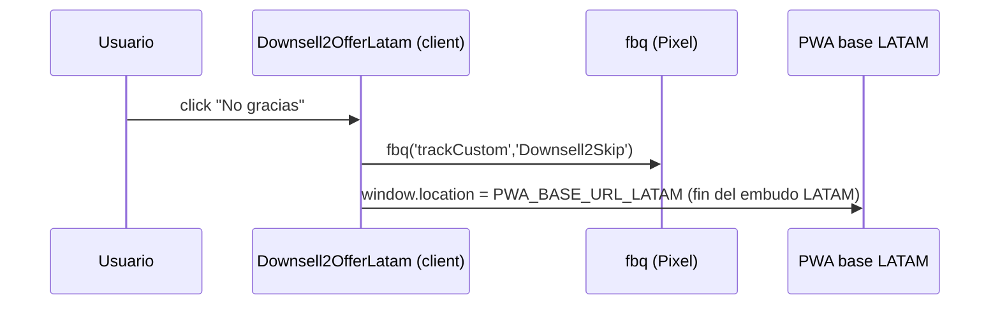
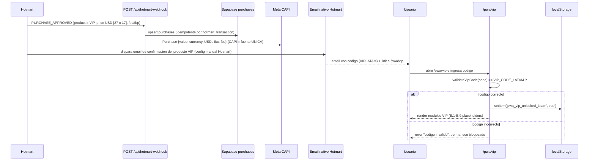
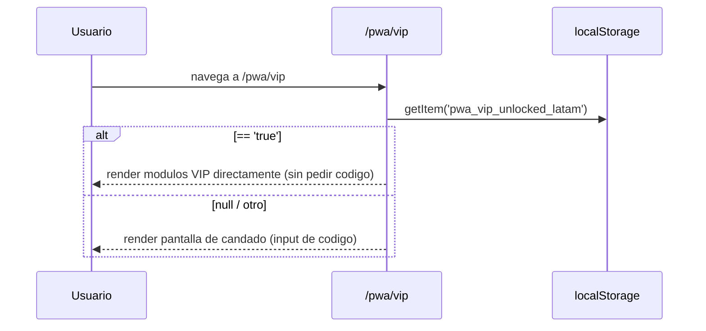

# Design Document: upsell2-latam-vip

## Overview

Este spec construye el **segundo upsell del embudo LATAM** (Hotmart, USD, español neutro "tú"): una página `/upsell2-latam` en formato **TSL (Text Sales Letter — texto largo, sin video)** a la que cae el comprador **después de aprobar el pago del upsell de 30 días (upsell 1)**. Vende un **"Acceso VIP de por vida"** (pago único, **US$27**, más caro que el upsell 1 de US$13.90). Si el comprador rechaza el upsell 2, cae en **`/downsell2-latam`**, una segunda chance que ofrece **el mismo producto VIP a un precio menor** (default **US$17**). Además agrega una **sección VIP dentro de la PWA existente** (`app/pwa/vip`), bloqueada por un **código estático único** validado contra configuración (sin base de datos, sin autenticación), con estado de desbloqueo persistido solo en `localStorage`. Tanto la compra del upsell 2 como la del downsell 2 desbloquean **la misma** sección VIP con **el mismo** código `VIPLATAM` (es el mismo producto VIP, solo cambia el precio).

El alcance es **solo LATAM**. El embudo argentino (Shopify, ARS) no se toca. El contenido literal del VIP (las 100 recetas, los PDFs, el texto de las masterclasses) se autoría por separado: este spec construye la **estructura/contenedor** de la sección VIP y sus placeholders, no el contenido final.

El diseño reutiliza patrones ya existentes y verificados en el repo:
- El patrón de oferta + tracking de `components/upsell/VslOfferBlockLatam.tsx` (fbq `InitiateCheckout` USD + `POST /api/track` con `quiz_version: 'latam'` + redirección a checkout Hotmart vía `withHotmartCheckout`).
- La configuración centralizada de precios y URLs en `lib/quiz-v2/config-latam.ts` (`PRICING_LATAM`).
- El webhook unificado `app/api/hotmart-webhook/route.ts` que ya dispara `Purchase` a Meta CAPI server-side en cada compra aprobada (sin filtrar por producto).
- Las convenciones de la PWA (`app/pwa/*`: client components, `localStorage`, design system sage/coral/cream).

---

## Architecture

### Flujo del embudo LATAM con el nuevo paso



> Los nodos naranjas son **nuevos**. El resto ya existe. El embudo LATAM termina en `PWA_BASE_URL_LATAM` (alcanzado por el "no gracias" del downsell 2).

### Decisión clave: dónde se "conecta" `/upsell2-latam`

La transición upsell 1 → upsell 2 **no la dispara nuestra app**: se configura **en el panel de Hotmart** como la página de oferta post-aprobación del producto upsell de 30 días. Nuestra app solo provee la página de destino (`/upsell2-latam`) y la URL de checkout del producto VIP. Esto se documenta como **paso operativo manual de Hotmart**.

En cambio, la transición upsell 2 → downsell 2 (`/upsell2-latam` "no gracias" → `/downsell2-latam`) **sí la controla nuestra app**: es una redirección client-side en `handleSkip` de `Upsell2OfferLatam`, no una configuración de Hotmart. El downsell 2 vende el **mismo producto VIP** que el upsell 2, pero apunta a una **URL de checkout distinta** (`LATAM_DOWNSELL2_CHECKOUT_URL`) configurada en Hotmart para el precio menor.

### Subsistemas tocados

| Subsistema | Cambio | Tipo |
|-----------|--------|------|
| `lib/quiz-v2/config-latam.ts` | Agregar `PRICING_LATAM.upsell2` (US$27), `PRICING_LATAM.downsell2` (US$17), `UPSELL2_PRODUCT_NAME_LATAM`, `LATAM_UPSELL2_CHECKOUT_URL`, `LATAM_DOWNSELL2_CHECKOUT_URL`, `VIP_CODE_LATAM` | Config |
| `app/upsell2-latam/page.tsx` | Nueva página TSL (server component shell) | Página |
| `components/upsell/Upsell2OfferLatam.tsx` (o secciones TSL) | Nuevo bloque de oferta TSL client component con tracking; `handleSkip` → `/downsell2-latam` | Componente |
| `app/downsell2-latam/page.tsx` | **NUEVO**: página de oferta del downsell 2 (mismo VIP, precio menor), siguiendo el patrón de `app/downsell-latam/page.tsx` | Página |
| `components/upsell/Downsell2OfferLatam.tsx` | **NUEVO**: bloque de oferta del downsell 2 con tracking (mismo patrón que `DownsellOfferLatam`, precio `downsell2`) | Componente |
| `app/pwa/vip/page.tsx` | Nueva sección VIP con candado por código + `localStorage` | Página PWA |
| `lib/pwa/vip-access.ts` | Helpers de validación de código + persistencia local | Lib |
| `app/api/hotmart-webhook/route.ts` | **Verificar** que captura upsell2 **y downsell2** como `latam` (no requiere cambio funcional si no filtra por producto) | Verificación |

---

## Sequence Diagrams

### 1. CTA "SÍ" en `/upsell2-latam` → checkout Hotmart (con tracking)



### 2. "No gracias" en `/upsell2-latam` → `/downsell2-latam`



### 2b. CTA "SÍ" en `/downsell2-latam` → checkout Hotmart (con tracking)



### 2c. "No gracias" en `/downsell2-latam` (fin del embudo)



### 3. Compra del VIP aprobada (upsell2 o downsell2) → Hotmart webhook → email con código → desbloqueo PWA



> Tanto el upsell 2 (US$27) como el downsell 2 (US$17) son el **mismo producto VIP**: ambos desbloquean la misma sección `/pwa/vip` con el mismo código `VIPLATAM`. Solo cambia el `value` en USD del `Purchase`.

### 4. Re-visita a `/pwa/vip` ya desbloqueada



---

## Components and Interfaces

### Component 1: `app/upsell2-latam/page.tsx` (TSL shell)

**Purpose**: Server component que arma la Text Sales Letter del Acceso VIP. Sin VSL/video. Renderiza secciones de copy largo y embebe el bloque de oferta client-side para los CTAs y el tracking.

**Responsibilities**:
- Exportar `metadata` con `robots: { index: false, follow: false }` (página de funnel, no indexable) — igual que `/upsell-latam`.
- Renderizar las secciones de TSL en orden: hook → problema/agitación → presentación de la oferta VIP → qué incluye (B.1–B.9) → prueba social → precio con ancla y descuento → garantía → FAQ → CTAs repetidos.
- Embeber `<Upsell2OfferLatam />` (client) para los CTAs con tracking.
- Renderizar `<UpsellPageTracker page="offer" />` para el `ViewContent` de la página (mismo patrón que `/upsell-latam`).

**Interface** (estructura de secciones, no API):
```typescript
// Server component — sin props.
export const metadata: Metadata; // robots noindex
export default function Upsell2LatamPage(): JSX.Element;
```

### Component 2: `components/upsell/Upsell2OfferLatam.tsx` (client)

**Purpose**: Fork conceptual de `VslOfferBlockLatam` adaptado a TSL: encapsula el precio (ancla + descuento calculado desde config), los CTAs "SÍ"/"No gracias" y **todo el tracking**. A diferencia de `VslOfferBlockLatam`, **no** tiene delay de revelado ni countdown atado al video (es texto: la oferta es visible desde el inicio), aunque puede conservar un contador de escasez opcional.

**Interface**:
```typescript
'use client';

interface Upsell2OfferLatamProps {
  /** Texto del CTA principal (opcional, default provisto). */
  ctaLabel?: string;
}

export function Upsell2OfferLatam(props: Upsell2OfferLatamProps): JSX.Element;
```

**Responsibilities**:
- `handleAccept()`: dispara `fbq('track','InitiateCheckout', { value: PRICING_LATAM.upsell2.amount, currency: 'USD', content_name, content_category:'Upsell2' })`, hace `POST /api/track` con `keepalive` incluyendo `quiz_version: 'latam'` + `fbc`/`fbp`, y redirige a `withHotmartCheckout(LATAM_UPSELL2_CHECKOUT_URL, { src: 'upsell2_latam' })`.
- `handleSkip()`: dispara `fbq('trackCustom','Upsell2Skip')` y redirige a **`/downsell2-latam`** (la segunda chance del embudo). Ya **no** redirige directo a la PWA.
- Manejar fallback defensivo si `LATAM_UPSELL2_CHECKOUT_URL` está vacío (no navegar, `console.warn`), igual que el patrón AR/LATAM actual.

### Component 2b: `app/downsell2-latam/page.tsx` (server shell) — NUEVO

**Purpose**: Server component que arma la página de oferta del **downsell 2** (segunda chance del embudo VIP). Sigue el patrón de `app/downsell-latam/page.tsx`: una oferta **más corta y directa** que la TSL del upsell 2 (igual que el downsell del upsell 1 es más corto que su upsell). Vende el **mismo producto VIP** que `/upsell2-latam` pero al precio menor `PRICING_LATAM.downsell2`.

**Responsibilities**:
- Exportar `metadata` con `robots: { index: false, follow: false }` (página de funnel, no indexable).
- Renderizar `<UpsellPageTracker page="checkout" />` para el evento de página (mismo patrón que `/downsell-latam`).
- Embeber `<Downsell2OfferLatam />` (client) para los CTAs con tracking.

**Interface**:
```typescript
// Server component — sin props.
export const metadata: Metadata; // robots noindex
export default function Downsell2LatamPage(): JSX.Element;
```

### Component 2c: `components/upsell/Downsell2OfferLatam.tsx` (client) — NUEVO

**Purpose**: Bloque de oferta del downsell 2. Fork conceptual de `DownsellOfferLatam` adaptado al producto VIP: encapsula el precio del downsell 2 (ancla = `upsell2.display`, precio final = `downsell2.display`), los CTAs "SÍ"/"No gracias" y **todo el tracking**. Hace el **mismo tracking que el upsell 2** pero con el precio `downsell2`.

**Interface**:
```typescript
'use client';

interface Downsell2OfferLatamProps {
  /** Texto del CTA principal (opcional, default provisto). */
  ctaLabel?: string;
}

export function Downsell2OfferLatam(props: Downsell2OfferLatamProps): JSX.Element;
```

**Responsibilities**:
- `handleAccept()`: dispara `fbq('track','InitiateCheckout', { value: PRICING_LATAM.downsell2.amount, currency: 'USD', content_name: UPSELL2_PRODUCT_NAME_LATAM, content_category:'Downsell2' })`, hace `POST /api/track` con `keepalive` incluyendo `quiz_version: 'latam'` + `fbc`/`fbp`, y redirige a `withHotmartCheckout(LATAM_DOWNSELL2_CHECKOUT_URL, { src: 'downsell2_latam' })`.
- `handleSkip()`: dispara `fbq('trackCustom','Downsell2Skip')` y redirige a `PWA_BASE_URL_LATAM` (**fin del embudo LATAM**).
- Manejar fallback defensivo si `LATAM_DOWNSELL2_CHECKOUT_URL` está vacío (no navegar, mostrar aviso "config pendiente"), igual que `DownsellOfferLatam`.

### Component 3: `app/pwa/vip/page.tsx` (client)

**Purpose**: Sección VIP dentro de la PWA existente. Pantalla de candado con input de código; si el código coincide con el valor de config, desbloquea y persiste en `localStorage`; ya desbloqueada, renderiza los módulos VIP (placeholders B.1–B.9).

**Interface**:
```typescript
'use client';
export default function PwaVipPage(): JSX.Element;
// Estados internos: 'locked' | 'unlocked'
```

**Responsibilities**:
- Al montar: leer `localStorage` (`pwa_vip_unlocked_latam`). Si `'true'` → estado `unlocked`.
- En `locked`: mostrar input de código + botón. Al enviar, validar contra `VIP_CODE_LATAM` vía `lib/pwa/vip-access.ts`. Si coincide: persistir y pasar a `unlocked`. Si no: mostrar error, permanecer `locked`.
- En `unlocked`: renderizar los 9 módulos VIP como contenedores/placeholders, siguiendo el design system de la PWA (cards sage/coral/cream, framer-motion como otras páginas).
- **No** llamar a ningún endpoint backend ni base de datos. **No** requerir autenticación.

### Component 4: `lib/pwa/vip-access.ts` (lib pura, client-safe)

**Purpose**: Lógica de validación de código y persistencia local, aislada y testeable.

**Interface**:
```typescript
/** Compara (normalizado) el código ingresado contra el código configurado. */
export function validateVipCode(input: string): boolean;

/** Marca la sección VIP como desbloqueada en este dispositivo. */
export function persistVipUnlocked(): void;

/** Lee el estado de desbloqueo desde localStorage. */
export function isVipUnlocked(): boolean;

/** Clave de localStorage (constante exportada para tests). */
export const VIP_UNLOCK_STORAGE_KEY = 'pwa_vip_unlocked_latam';
```

### Component 5: `app/api/hotmart-webhook/route.ts` (verificación, no rediseño)

**Purpose**: Confirmar que la compra del upsell 2 **y del downsell 2** se procesan igual que las demás. El handler `handleApproved` **no filtra por producto** para CAPI/Supabase, así que ambas variantes del VIP ya se capturan. El trabajo de este spec es **verificar** y documentar:
- El `Purchase` a CAPI usa `value`/`currency` del payload de Hotmart (que para el VIP será el precio en USD: US$27 para el upsell 2, US$17 para el downsell 2). CAPI server-side es la **fuente única** de `Purchase` (ver "Tracking & Deduplicación").
- La compra se registra en `purchases` (idempotente por `hotmart_transaction`).
- El mapeo de `plan` en el email de bienvenida usa `HOTMART_PRODUCT_ID_*`; si se quiere que el VIP entregue acceso por email **nativo de Hotmart**, no se requiere cambiar este handler (el email del código lo manda Hotmart, no Resend). Documentar que eventuales `HOTMART_PRODUCT_ID_UPSELL2` / `HOTMART_PRODUCT_ID_DOWNSELL2` son opcionales y fuera de alcance salvo que se quiera segmentar el plan.

---

## Data Models

### Modelo 1: Extensión de `PRICING_LATAM` y config (`lib/quiz-v2/config-latam.ts`)

```typescript
// Agregado a PRICING_LATAM (manteniendo el patrón actual front/upsell/downsell):
export const PRICING_LATAM = {
  front:    { amount: 5.90,  display: 'US$5.90',  displayOriginal: 'US$29.90' },
  upsell:   { amount: 13.90, display: 'US$13.90', displayOriginal: 'US$39.90' },
  downsell: { amount: 9.90,  display: 'US$9.90' },
  // Acceso VIP de por vida (pago unico, mas caro que el upsell).
  // DECISION CERRADA: monto definido en US$27, ancla US$97. Sigue siendo
  // configurable aca, pero el default queda fijado en 27 (ya no es placeholder).
  upsell2:  { amount: 27.00, display: 'US$27', displayOriginal: 'US$97' },
  // Downsell del upsell 2: MISMO producto VIP a precio MENOR (segunda chance).
  // Default propuesto US$17 (decision de negocio, configurable). Regla: < upsell2.
  downsell2:{ amount: 17.00, display: 'US$17', displayOriginal: 'US$97' },
} as const;

/** Nombre del producto VIP (LATAM). Compartido por upsell2 y downsell2. */
export const UPSELL2_PRODUCT_NAME_LATAM = 'Acceso VIP de por vida';

/** URL de checkout Hotmart del UPSELL 2 / VIP (LATAM). */
export const LATAM_UPSELL2_CHECKOUT_URL =
  process.env.NEXT_PUBLIC_LATAM_UPSELL2_CHECKOUT_URL || '';

/** URL de checkout Hotmart del DOWNSELL 2 (mismo producto VIP, precio menor). */
export const LATAM_DOWNSELL2_CHECKOUT_URL =
  process.env.NEXT_PUBLIC_LATAM_DOWNSELL2_CHECKOUT_URL || '';

/**
 * Codigo estatico que desbloquea la seccion VIP de la PWA.
 * NO es seguridad fuerte: es exclusividad percibida. Es compartible (trade-off aceptado).
 * Se entrega por el email nativo de Hotmart post-compra (tanto upsell2 como downsell2).
 */
export const VIP_CODE_LATAM =
  process.env.NEXT_PUBLIC_VIP_CODE_LATAM || 'VIPLATAM';
```

**Validation Rules**:
- `upsell2.amount` debe ser estrictamente mayor que `upsell.amount` (regla de negocio: el VIP es más caro que el upsell 1). Valor definido: `27.00 > 13.90` ✓.
- `downsell2.amount` debe ser estrictamente menor que `upsell2.amount` (regla de negocio: el downsell 2 es una bajada de precio del mismo VIP). Valor propuesto: `17.00 < 27.00` ✓.
- `LATAM_UPSELL2_CHECKOUT_URL` / `LATAM_DOWNSELL2_CHECKOUT_URL` vacíos → la UI muestra fallback de "config pendiente" y **no** navega (no rompe).
- `VIP_CODE_LATAM` nunca es vacío (siempre hay default `'VIPLATAM'`).

### Modelo 2: Estado de desbloqueo en `localStorage`

```typescript
// Clave: 'pwa_vip_unlocked_latam'
// Valor: 'true' cuando desbloqueado; ausente/cualquier otro = bloqueado.
type VipUnlockFlag = 'true' | null;
```

**Validation Rules**:
- Solo el valor exacto `'true'` cuenta como desbloqueado.
- Limpiar el navegador / cambiar de dispositivo borra el flag → re-ingresar el código (lo tiene en el email). Comportamiento esperado, no un bug.

### Modelo 3: Payload de tracking del CTA (reusa `/api/track`)

```typescript
// Cuerpo del POST /api/track al hacer click en el CTA del VIP (upsell 2):
interface Upsell2TrackBody {
  event: 'InitiateCheckout';
  value: number;        // PRICING_LATAM.upsell2.amount
  currency: 'USD';
  contentName: string;  // UPSELL2_PRODUCT_NAME_LATAM
  contentCategory: 'Upsell2';
  fbc?: string;
  fbp?: string;
  custom: { quiz_version: 'latam' };
}

// Cuerpo del POST /api/track al hacer click en el CTA del downsell 2:
// MISMA forma, con el precio menor y categoria 'Downsell2'.
interface Downsell2TrackBody {
  event: 'InitiateCheckout';
  value: number;        // PRICING_LATAM.downsell2.amount
  currency: 'USD';
  contentName: string;  // UPSELL2_PRODUCT_NAME_LATAM (mismo producto VIP)
  contentCategory: 'Downsell2';
  fbc?: string;
  fbp?: string;
  custom: { quiz_version: 'latam' };
}
```

> El endpoint `/api/track` normaliza `quiz_version` vía `normalizeQuizVersion` → `'latam'`, y lo registra en el funnel store. El `Purchase` real lo dispara el webhook server-side, no este evento.

---

## Key Functions with Formal Specifications

### `validateVipCode(input: string): boolean`

```typescript
function validateVipCode(input: string): boolean
```

**Preconditions:**
- `input` es un string (puede ser vacío o con espacios).

**Postconditions:**
- Devuelve `true` **si y solo si** `input.trim()` (case-insensitive) es igual a `VIP_CODE_LATAM.trim()` (case-insensitive).
- No realiza ninguna llamada de red ni acceso a base de datos / SQL.
- No muta `input` ni ningún estado global.

**Loop Invariants:** N/A (sin loops).

### `persistVipUnlocked(): void`

```typescript
function persistVipUnlocked(): void
```

**Preconditions:**
- Ejecuta en cliente (`typeof window !== 'undefined'`).

**Postconditions:**
- `localStorage.getItem(VIP_UNLOCK_STORAGE_KEY) === 'true'` después de ejecutar.
- Idempotente: llamarla N veces deja el mismo estado que llamarla una vez.
- Si `localStorage` no está disponible, falla de forma silenciosa (no lanza).

### `isVipUnlocked(): boolean`

```typescript
function isVipUnlocked(): boolean
```

**Preconditions:**
- Ninguna (server-safe: si no hay `window`, devuelve `false`).

**Postconditions:**
- Devuelve `true` **si y solo si** `localStorage.getItem(VIP_UNLOCK_STORAGE_KEY) === 'true'`.
- No muta estado.

### `handleAccept(): void` (en `Upsell2OfferLatam`)

```typescript
function handleAccept(): void
```

**Preconditions:**
- Ejecuta en cliente tras un click del usuario.

**Postconditions:**
- Si `window.fbq` existe, se invoca `fbq('track','InitiateCheckout', { value: PRICING_LATAM.upsell2.amount, currency: 'USD', ... })` exactamente una vez.
- Se hace `POST /api/track` (con `keepalive: true`) con `event:'InitiateCheckout'`, `value`, `currency:'USD'`, `quiz_version:'latam'`, y `fbc`/`fbp` leídos de cookies.
- Si `LATAM_UPSELL2_CHECKOUT_URL` es no-vacío, `window.location.href` se setea a `withHotmartCheckout(LATAM_UPSELL2_CHECKOUT_URL, { src:'upsell2_latam' })`; si es vacío, no navega y loguea warning.
- El fallo del tracking nunca bloquea la navegación (catch no-op).

### `handleSkip(): void` (en `Upsell2OfferLatam`)

```typescript
function handleSkip(): void
```

**Preconditions:**
- Ejecuta en cliente tras un click del usuario.

**Postconditions:**
- Si `window.fbq` existe, se invoca `fbq('trackCustom','Upsell2Skip')`.
- Se redirige a **`/downsell2-latam`** (la segunda chance del embudo). Ya **no** redirige directo a `PWA_BASE_URL_LATAM`.

### `handleAccept(): void` (en `Downsell2OfferLatam`)

```typescript
function handleAccept(): void
```

**Preconditions:**
- Ejecuta en cliente tras un click del usuario.

**Postconditions:**
- Si `window.fbq` existe, se invoca `fbq('track','InitiateCheckout', { value: PRICING_LATAM.downsell2.amount, currency: 'USD', content_name: UPSELL2_PRODUCT_NAME_LATAM, content_category: 'Downsell2' })` exactamente una vez.
- Se hace `POST /api/track` (con `keepalive: true`) con `event:'InitiateCheckout'`, `value: PRICING_LATAM.downsell2.amount`, `currency:'USD'`, `quiz_version:'latam'`, y `fbc`/`fbp` leídos de cookies.
- Si `LATAM_DOWNSELL2_CHECKOUT_URL` es no-vacío, `window.location.href` se setea a `withHotmartCheckout(LATAM_DOWNSELL2_CHECKOUT_URL, { src:'downsell2_latam' })`; si es vacío, no navega y muestra aviso "config pendiente".
- El fallo del tracking nunca bloquea la navegación (catch no-op).

### `handleSkip(): void` (en `Downsell2OfferLatam`)

```typescript
function handleSkip(): void
```

**Preconditions:**
- Ejecuta en cliente tras un click del usuario.

**Postconditions:**
- Si `window.fbq` existe, se invoca `fbq('trackCustom','Downsell2Skip')`.
- Se redirige a `PWA_BASE_URL_LATAM` (**fin del embudo LATAM**).

---

## Algorithmic Pseudocode

### Algoritmo: render de `/pwa/vip` (candado por código)

```typescript
// Al montar el componente:
function onMount(): State {
  if (isVipUnlocked()) return { mode: 'unlocked' };
  return { mode: 'locked', error: null };
}

// Al enviar el código:
function onSubmitCode(input: string, state: State): State {
  if (validateVipCode(input)) {
    persistVipUnlocked();
    return { mode: 'unlocked' };
  }
  return { mode: 'locked', error: 'Código inválido. Revisá el email de tu compra VIP.' };
}

// Render:
function render(state: State): JSX.Element {
  if (state.mode === 'unlocked') return <VipModules />;  // B.1–B.9 placeholders
  return <VipLockScreen error={state.error} onSubmit={onSubmitCode} />;
}
```

**Preconditions:** corre en cliente; `localStorage` puede o no estar disponible.
**Postconditions:** la sección VIP solo muestra `VipModules` cuando `validateVipCode` devolvió `true` alguna vez en este dispositivo (o el flag persistido es `'true'`); nunca se desbloquea con un código incorrecto.
**Loop Invariants:** N/A.

### Contenido del Acceso VIP — módulos placeholder (B.1–B.9)

`VipModules` renderiza, como **contenedores/placeholders** (no contenido final), todo lo NUEVO del VIP:

1. Acceso de por vida a la app + todo el contenido + actualizaciones futuras.
2. 🧮 Calculadora PRO (macros/agua/calorías antiinflamatorias por perfil).
3. 🍲 Recetario premium ampliado (50–100 recetas nuevas) + club mensual + estacionales.
4. 📖 Biblioteca de masterclasses **en texto** (sueño, estrés-cortisol, ejercicio bajo impacto, ayuno).
5. 🧭 Protocolo de mantenimiento anti-rebote.
6. 🗓️ Planner/diario imprimible premium (PDF).
7. 📄 Mini-guías PDF (bonos): "Deshinchá en 72h", "Antiinflamatorio en viajes", "Cena anti-rebote", "Snacks que desinflaman".
8. 🏅 Insignia/nivel VIP dentro de la app.
9. Garantía de actualizaciones de por vida.

> **Importante (documentado explícitamente):** el contenido literal (recetas, PDFs, texto de las masterclasses) se autoría por separado. Este spec construye solo la estructura/contenedor y los placeholders.

---

## Example Usage

```typescript
// app/upsell2-latam/page.tsx (shell TSL)
export const metadata = {
  title: 'Acceso VIP de por vida · Chau Hinchazón',
  robots: { index: false, follow: false },
};

export default function Upsell2LatamPage() {
  return (
    <main>
      <UpsellPageTracker page="offer" />
      {/* ...secciones de copy TSL: hook, agitación, oferta, qué incluye, prueba social... */}
      <Upsell2OfferLatam />
      {/* ...garantía, FAQ, CTA final... */}
    </main>
  );
}
```

```typescript
// CTA tracking (dentro de Upsell2OfferLatam.handleAccept)
fbq('track', 'InitiateCheckout', {
  value: PRICING_LATAM.upsell2.amount, // 27.00 (decision cerrada)
  currency: PRICING_CURRENCY_LATAM,    // 'USD'
  content_name: UPSELL2_PRODUCT_NAME_LATAM,
  content_category: 'Upsell2',
});
fetch('/api/track', {
  method: 'POST',
  keepalive: true,
  headers: { 'Content-Type': 'application/json' },
  body: JSON.stringify({
    event: 'InitiateCheckout',
    value: PRICING_LATAM.upsell2.amount,
    currency: PRICING_CURRENCY_LATAM,
    contentName: UPSELL2_PRODUCT_NAME_LATAM,
    contentCategory: 'Upsell2',
    custom: { quiz_version: 'latam' },
    fbc: meta.fbc,
    fbp: meta.fbp,
  }),
}).catch(() => {});
window.location.href = withHotmartCheckout(LATAM_UPSELL2_CHECKOUT_URL, { src: 'upsell2_latam' });
```

```typescript
// /pwa/vip desbloqueo
if (validateVipCode(userInput)) {
  persistVipUnlocked();
  // render VipModules
}
```

---

## Correctness Properties

*Una propiedad es un comportamiento que debe cumplirse en todas las ejecuciones válidas del sistema. Las referencias a requisitos (`Validates: Requirements X.Y`) mapean cada propiedad a los criterios de aceptación verificables de `requirements.md`.*

### Property 1: El CTA "SÍ" dispara InitiateCheckout en USD

*Para todo* click en el CTA principal de `/upsell2-latam` con `window.fbq` disponible, se dispara exactamente un evento `InitiateCheckout` con `value === PRICING_LATAM.upsell2.amount` y `currency === 'USD'`.

**Validates: Requirements 1.4**

### Property 2: El CTA registra el evento de funnel como 'latam'

*Para todo* click en el CTA principal, el `POST /api/track` incluye `quiz_version: 'latam'`, y `normalizeQuizVersion` lo mapea a `'latam'` en el funnel store (nunca a `'ar'` ni `'v1'`).

**Validates: Requirements 1.5**

### Property 3: La sección VIP no se desbloquea sin el código correcto

*Para todo* string que no sea igual (trim, case-insensitive) a `VIP_CODE_LATAM`, `validateVipCode` devuelve `false` y la sección VIP permanece en estado `locked`.

**Validates: Requirements 4.4**

### Property 4: El código correcto desbloquea y persiste (round-trip)

*Para todo* string igual (trim, case-insensitive) a `VIP_CODE_LATAM`, `validateVipCode` devuelve `true`; tras `persistVipUnlocked()`, `isVipUnlocked()` devuelve `true`.

**Validates: Requirements 4.3**

### Property 5: La validación no toca SQL ni red

*Para toda* invocación de `validateVipCode`, no se realiza ninguna llamada de red ni consulta a base de datos (validación puramente local contra configuración).

**Validates: Requirements 4.5, 4.9**

### Property 6: `isVipUnlocked` refleja exactamente el flag persistido

*Para todo* estado de `localStorage`, `isVipUnlocked()` devuelve `true` si y solo si la clave `pwa_vip_unlocked_latam` vale exactamente `'true'`.

**Validates: Requirements 4.6, 4.1**

### Property 7: El "no gracias" del upsell 2 redirige a `/downsell2-latam`

*Para todo* click en "No gracias" en `/upsell2-latam`, el usuario es redirigido a `/downsell2-latam` (la segunda chance del embudo) y nunca directo a `PWA_BASE_URL_LATAM`.

**Validates: Requirements 1.7**

### Property 8: El webhook captura la compra del VIP (upsell 2 o downsell 2) como 'latam'

*Para toda* compra aprobada del producto VIP (sea por el upsell 2 a US$27 o por el downsell 2 a US$17) recibida en `/api/hotmart-webhook`, se dispara `Purchase` a CAPI con `value`/`currency` del payload (USD) y `fbc`/`fbp` cuando están presentes, y la compra se registra (idempotente por `hotmart_transaction`) sin filtrar por producto.

**Validates: Requirements 5.1, 5.2, 5.3, 5.4**

### Property 9: Idempotencia del desbloqueo

*Para toda* secuencia de llamadas a `persistVipUnlocked()`, el estado resultante de `localStorage` es el mismo que tras una sola llamada (el flag vale `'true'`).

**Validates: Requirements 4.7**

### Property 10: El CTA "SÍ" del downsell 2 dispara InitiateCheckout en USD con el precio del downsell 2

*Para todo* click en el CTA principal de `/downsell2-latam` con `window.fbq` disponible, se dispara exactamente un evento `InitiateCheckout` con `value === PRICING_LATAM.downsell2.amount` y `currency === 'USD'`.

**Validates: Requirements 2.3**

### Property 11: El CTA del downsell 2 registra el evento de funnel como 'latam'

*Para todo* click en el CTA principal de `/downsell2-latam`, el `POST /api/track` incluye `quiz_version: 'latam'`, y `normalizeQuizVersion` lo mapea a `'latam'` en el funnel store (nunca a `'ar'` ni `'v1'`).

**Validates: Requirements 2.4**

### Property 12: El "no gracias" del downsell 2 redirige a la PWA (fin del embudo)

*Para todo* click en "No gracias" en `/downsell2-latam`, el usuario es redirigido a `PWA_BASE_URL_LATAM` (fin del embudo LATAM).

**Validates: Requirements 2.6**

### Property 13: El downsell 2 cuesta menos que el upsell 2

*Para toda* configuración válida de precios, `PRICING_LATAM.downsell2.amount < PRICING_LATAM.upsell2.amount` (el downsell 2 es siempre una bajada de precio del mismo producto VIP).

**Validates: Requirements 3.5**

---

## Error Handling

### Escenario 1: `LATAM_UPSELL2_CHECKOUT_URL` / `LATAM_DOWNSELL2_CHECKOUT_URL` no configuradas
**Condición**: env var vacía en dev/staging.
**Respuesta**: el `handleAccept` correspondiente no navega; muestra aviso "config pendiente" / loguea warning (`'[latam/upsell2] NEXT_PUBLIC_LATAM_UPSELL2_CHECKOUT_URL no configurada'` o el equivalente del downsell 2).
**Recuperación**: configurar la env var; mismo patrón defensivo que el upsell/downsell 1.

### Escenario 2: Código VIP incorrecto
**Condición**: el usuario ingresa un código que no coincide.
**Respuesta**: mensaje de error visible ("Código inválido. Revisá el email de tu compra VIP."); la sección permanece bloqueada.
**Recuperación**: el usuario reingresa el código del email.

### Escenario 3: `localStorage` no disponible (modo privado / bloqueado)
**Condición**: `localStorage` lanza al leer/escribir.
**Respuesta**: helpers atrapan el error; `isVipUnlocked` devuelve `false`, `persistVipUnlocked` no lanza.
**Recuperación**: el usuario reingresa el código en cada visita (degradación aceptable).

### Escenario 4: Fallo del `POST /api/track`
**Condición**: red caída o ad-blocker.
**Respuesta**: `.catch(() => {})` no-op; la navegación al checkout sigue.
**Recuperación**: el `Purchase` server-side del webhook sigue siendo la fuente de verdad de conversión.

### Escenario 5: Doble conteo de conversiones
**Condición**: riesgo teórico si se activara el pixel nativo de Hotmart además del CAPI server-side.
**Respuesta**: **decisión cerrada** — el pixel nativo de Hotmart queda **desactivado** y CAPI es la fuente única de `Purchase`, así que el doble conteo no ocurre. Ver "Tracking & Deduplicación" abajo.

---

## Tracking & Deduplicación (Decisión D — CERRADA)

**Decisión tomada: CAPI server-side es la ÚNICA fuente de `Purchase`. El pixel nativo de Hotmart queda explícitamente desactivado / fuera de alcance.**

- Las conversiones de Hotmart (incluidos el upsell 2 y el downsell 2) se trackean a Meta vía **CAPI server-side** en `app/api/hotmart-webhook` (`sendCapiEvent({ event_name: 'Purchase', ... })`), tomando `fbc`/`fbp` del payload. Tanto el upsell 2 como el downsell 2 entran por el mismo camino sin cambios funcionales (solo cambia el `value` en USD: 27 vs 17).
- El evento del CTA (`InitiateCheckout`) es de **intención**, no de conversión; se manda con `quiz_version:'latam'` y se registra en el funnel store. Aplica igual al upsell 2 y al downsell 2 (con su respectivo precio).
- **No se activa el pixel nativo de Hotmart** para `Purchase`. Al haber una sola fuente (CAPI), **no existe riesgo de doble conteo** y no hace falta deduplicación.
- **Opción futura (no implementada en este spec):** si algún día se decidiera prender el pixel nativo de Hotmart, recién entonces habría que implementar **deduplicación por `event_id`** compartido entre pixel y CAPI (`CapiEvent.event_id` ya está soportado en `lib/tracking.ts`), emitiendo desde el webhook un `event_id` determinístico derivado de `hotmart_transaction`. Mientras el pixel nativo siga desactivado, esto **no aplica**.

---

## Testing Strategy

### Unit Testing
- `validateVipCode`: casos correcto/incorrecto, espacios, mayúsculas/minúsculas, vacío.
- `isVipUnlocked` / `persistVipUnlocked`: round-trip, idempotencia, `localStorage` ausente.
- `Upsell2OfferLatam`: mocks de `window.fbq` y `fetch`; verificar payload de `InitiateCheckout` (value/currency/`quiz_version`), redirección a `withHotmartCheckout`, rama de URL vacía, y que `handleSkip` redirige a `/downsell2-latam`.
- `Downsell2OfferLatam`: mocks de `window.fbq` y `fetch`; verificar payload de `InitiateCheckout` con `value === downsell2.amount`/`currency:'USD'`/`quiz_version:'latam'`, redirección a `withHotmartCheckout(LATAM_DOWNSELL2_CHECKOUT_URL, ...)`, rama de URL vacía, y que `handleSkip` redirige a `PWA_BASE_URL_LATAM`.
- Reusar el patrón de `app/api/track/route.test.ts` para verificar que `normalizeQuizVersion('latam') === 'latam'`.

### Property-Based Testing
**Property Test Library**: `fast-check` con Vitest (alinear con el harness de tests existente del repo — confirmar en `package.json`).
- Properties 3, 4, 5, 6, 9 (candado/persistencia) son ideales para PBT: generar strings arbitrarios y verificar la lógica de validación/persistencia con un `localStorage` mockeado.
- Properties 1, 2, 10, 11 (tracking del CTA del upsell 2 y del downsell 2) se testean con mocks de `fbq`/`fetch` y entradas variadas de cookies.
- Property 13 (regla de precios `downsell2 < upsell2`) se verifica directamente sobre la config.
- Mínimo 100 iteraciones por property test. Tag: `Feature: upsell2-latam-vip, Property {n}: {texto}`.

### Integration / Smoke
- Property 8 (webhook captura del VIP, upsell 2 y downsell 2) → test de integración con 1–3 payloads representativos de `PURCHASE_APPROVED` del producto VIP a US$27 y a US$17 (no PBT: es comportamiento de servicio externo, behavior no varía por input).
- Render smoke de `/upsell2-latam`, `/downsell2-latam` y `/pwa/vip` (bloqueada/desbloqueada).

---

## Security Considerations

- El candado por **código estático** NO es un control de seguridad fuerte: es **exclusividad percibida**. El código es **compartible** — trade-off aceptado explícitamente por negocio.
- No se persiste en backend "puso el código sí/no": **no hay tabla SQL, no hay autenticación**. El estado vive solo en `localStorage` del dispositivo.
- El código se entrega por el **email nativo de Hotmart** post-pago (configuración manual en el panel de Hotmart del producto VIP: email de confirmación con código + link a `/pwa/vip`). Nuestro backend no envía ese email.
- `VIP_CODE_LATAM` está en `NEXT_PUBLIC_*`, por lo que es visible en el bundle del cliente. Es esperado dado el modelo de amenaza (exclusividad, no secreto).

## Performance Considerations

- `/upsell2-latam` es una TSL estática (texto + un client component liviano); sin VSL/video reduce peso vs `/upsell-latam`.
- `/pwa/vip` no hace fetch al backend para el candado (validación local) → render instantáneo.

## Dependencies

- **Existentes (reuso)**: `lib/quiz-v2/config-latam.ts`, `lib/cookies.ts` (`getMetaCookies`, `withHotmartCheckout`), `app/api/track/route.ts` + `normalizeQuizVersion`, `app/api/hotmart-webhook/route.ts`, `lib/tracking.ts` (`sendCapiEvent`), `components/upsell/UpsellPageTracker`, design system PWA (sage/coral/cream, framer-motion).
- **Nuevas env vars**: `NEXT_PUBLIC_LATAM_UPSELL2_CHECKOUT_URL`, `NEXT_PUBLIC_LATAM_DOWNSELL2_CHECKOUT_URL`, `NEXT_PUBLIC_VIP_CODE_LATAM` (opcional; default `VIPLATAM`).
- **Configuración externa (operativa, manual)**: en el panel de Hotmart — (a) URL de oferta post-aprobación del upsell 1 = `/upsell2-latam`; (b) producto VIP con email de confirmación que entrega el código + link a `/pwa/vip`; (c) checkout del downsell 2 (precio menor) apuntado por `LATAM_DOWNSELL2_CHECKOUT_URL`, entregando el mismo email/código del VIP. El pixel nativo de Hotmart se deja **desactivado** (CAPI es la fuente única).
- **Testing**: `fast-check` + Vitest (confirmar versión en `package.json`).

---

## Decisiones Cerradas

Las decisiones que antes estaban abiertas quedan **definidas** así:

1. **Monto del VIP** (`PRICING_LATAM.upsell2`): **US$27** (ancla US$97). Ya no es placeholder; es el valor definido. Sigue siendo configurable en config, pero el default queda fijado en 27. Cumple la regla `> US$13.90` (upsell 1).
2. **Destino del "No gracias" del upsell 2**: ahora va a **`/downsell2-latam`** (segunda chance), no directo a la PWA.
3. **Precio del downsell 2** (`PRICING_LATAM.downsell2`): default propuesto **US$17** (ancla US$97). Es decisión de negocio configurable; regla obligatoria: `downsell2.amount < upsell2.amount`.
4. **Destino del "No gracias" del downsell 2**: `PWA_BASE_URL_LATAM` (fin del embudo LATAM).
5. **Deduplicación de `Purchase`**: **CAPI server-side como fuente única**; el pixel nativo de Hotmart queda desactivado. La dedupe por `event_id` queda como opción futura solo si algún día se prende el pixel nativo.

## Fuera de Alcance (trabajo futuro)

- Contenido literal del VIP (recetas, PDFs, texto de masterclasses).
- `/upsell2` y `/downsell2` para Argentina (Shopify/ARS).
- Geo-routing.
- Base de datos o autenticación para el candado VIP.
- **Pixel nativo de Hotmart para `Purchase`** (queda explícitamente desactivado; CAPI es la fuente única). Solo se reconsideraría junto con la deduplicación por `event_id`.
